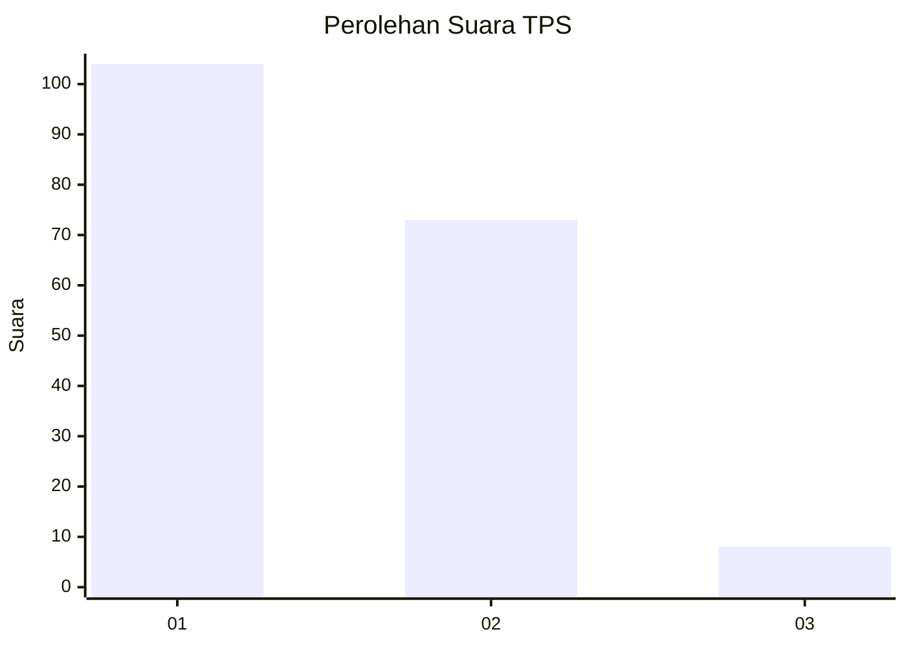
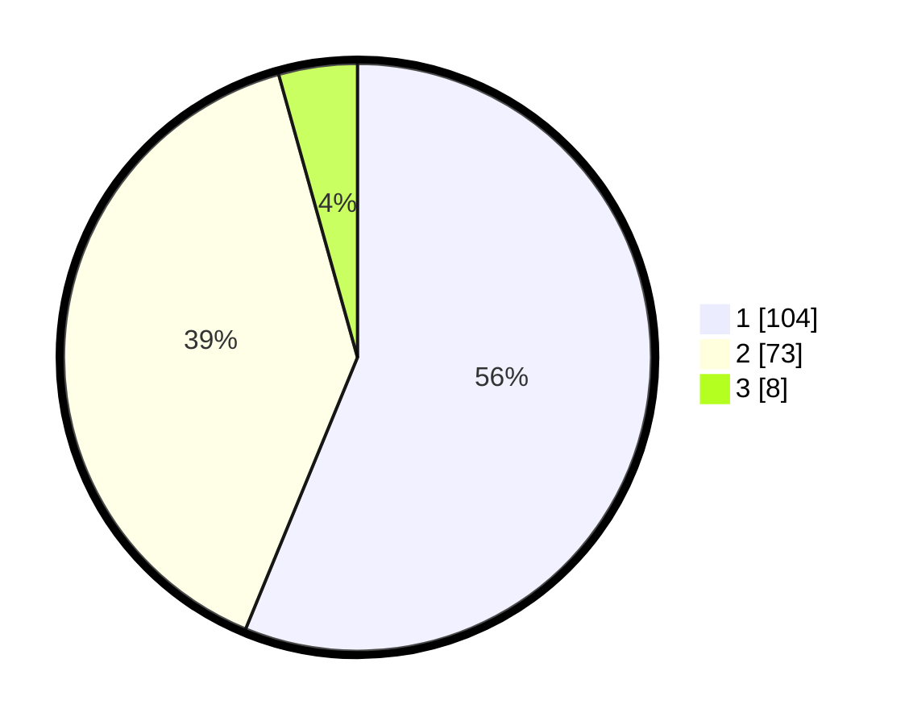

# Hasil

## Grafik

## Tabel

| No. | Nama Paslon    | Suara | Suara (raw) | Persentase |
|:--- |:-------------- | -----:| -----------:| ----------:|
| 1   | ANIES MUHAIMIN | 104   | [104][p-1]  | 56,22      |
| 2   | PRABOWO GIBRAN | 73    | [73][p-2]   | 39,46      |
| 3   | GANJAR MAHFUD  | 8     | [8][p-3]    | 4,32       |

[p-1]: https://github.com/gigit-pemilu/pemilu-2024-32-jawa-barat/blob/main/pilpres/hitung-suara/sub/32-jawa-barat/sub/05-garut/sub/03-wanaraja/sub/2001-wanaraja/sub/005-tps/sub/paslon-1.txt
[p-2]: https://github.com/gigit-pemilu/pemilu-2024-32-jawa-barat/blob/main/pilpres/hitung-suara/sub/32-jawa-barat/sub/05-garut/sub/03-wanaraja/sub/2001-wanaraja/sub/005-tps/sub/paslon-2.txt
[p-3]: https://github.com/gigit-pemilu/pemilu-2024-32-jawa-barat/blob/main/pilpres/hitung-suara/sub/32-jawa-barat/sub/05-garut/sub/03-wanaraja/sub/2001-wanaraja/sub/005-tps/sub/paslon-3.txt

## Foto C Plano

https://sirekap-obj-formc.kpu.go.id/a084/pemilu/ppwp/32/05/03/20/01/3205032001005-20240215-015457--ef0b4950-e9a9-47ce-9990-9e581c6ea35f.jpg

https://sirekap-obj-formc.kpu.go.id/a084/pemilu/ppwp/32/05/03/20/01/3205032001005-20240215-021618--3cfbad79-c969-4676-aaaa-9226ef550ce9.jpg

https://sirekap-obj-formc.kpu.go.id/a084/pemilu/ppwp/32/05/03/20/01/3205032001005-20240215-021048--347e37d8-cc39-4bea-ae97-21caf8379890.jpg

## Metadata

| Key        | Value               |
| ---------- | ------------------- |
| Time Stamp | 2024-02-15 20:30:46 |

