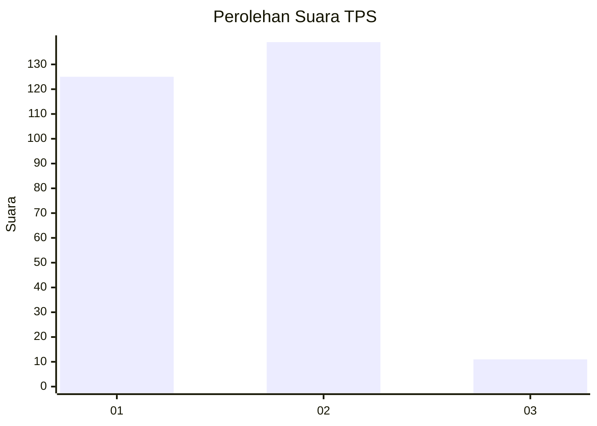
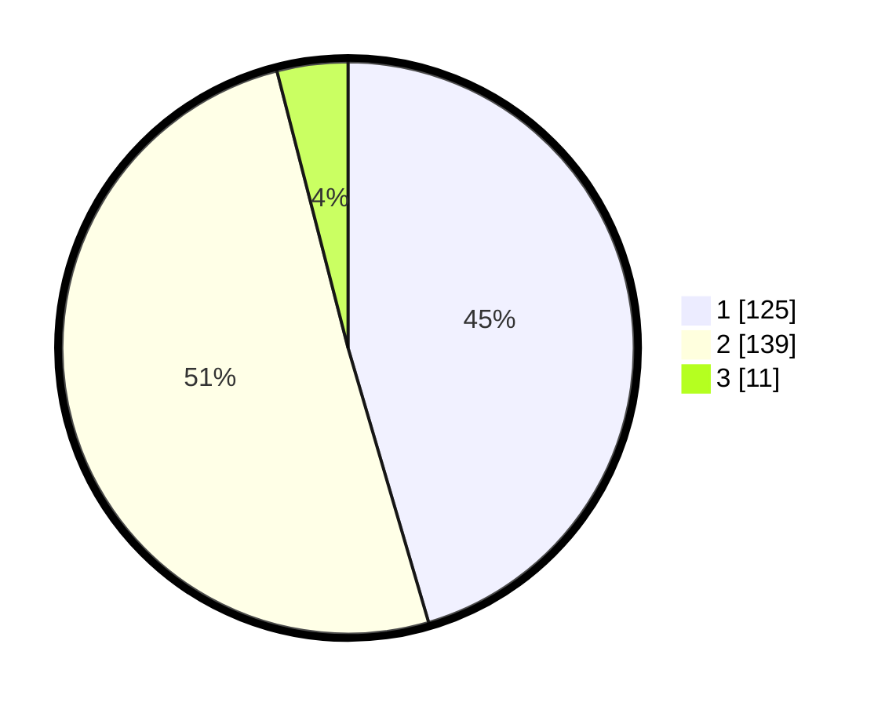

# Hasil

## Grafik

## Tabel

| No. | Nama Paslon    | Suara | Suara (raw) | Persentase |
|:--- |:-------------- | -----:| -----------:| ----------:|
| 1   | ANIES MUHAIMIN | 125   | [125][p-1]  | 45,45      |
| 2   | PRABOWO GIBRAN | 139   | [139][p-2]  | 50,55      |
| 3   | GANJAR MAHFUD  | 11    | [11][p-3]   | 4,00       |

[p-1]: https://github.com/gigit-pemilu/pemilu-2024-32-jawa-barat/blob/main/pilpres/hitung-suara/sub/32-jawa-barat/sub/05-garut/sub/03-wanaraja/sub/2015-sindangmekar/sub/005-tps/sub/paslon-1.txt
[p-2]: https://github.com/gigit-pemilu/pemilu-2024-32-jawa-barat/blob/main/pilpres/hitung-suara/sub/32-jawa-barat/sub/05-garut/sub/03-wanaraja/sub/2015-sindangmekar/sub/005-tps/sub/paslon-2.txt
[p-3]: https://github.com/gigit-pemilu/pemilu-2024-32-jawa-barat/blob/main/pilpres/hitung-suara/sub/32-jawa-barat/sub/05-garut/sub/03-wanaraja/sub/2015-sindangmekar/sub/005-tps/sub/paslon-3.txt

## Foto C Plano

https://sirekap-obj-formc.kpu.go.id/ad33/pemilu/ppwp/32/05/03/20/15/3205032015005-20240214-215758--4399b1b6-f5de-4180-b59e-05ae9c61e3c8.jpg

https://sirekap-obj-formc.kpu.go.id/ad33/pemilu/ppwp/32/05/03/20/15/3205032015005-20240214-210541--09664064-3009-4c2b-8ba5-8778a6be112f.jpg

https://sirekap-obj-formc.kpu.go.id/ad33/pemilu/ppwp/32/05/03/20/15/3205032015005-20240214-210734--2ad25114-55db-4f35-bc73-c3e984b7fd52.jpg

## Metadata

| Key        | Value               |
| ---------- | ------------------- |
| Time Stamp | 2024-02-15 23:29:50 |

