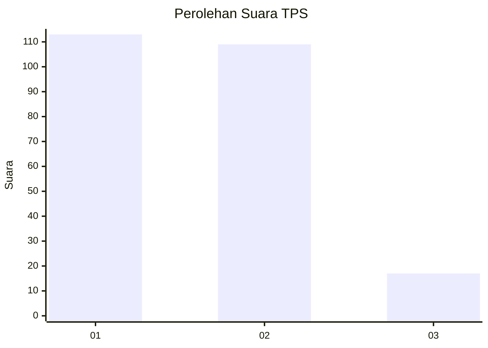
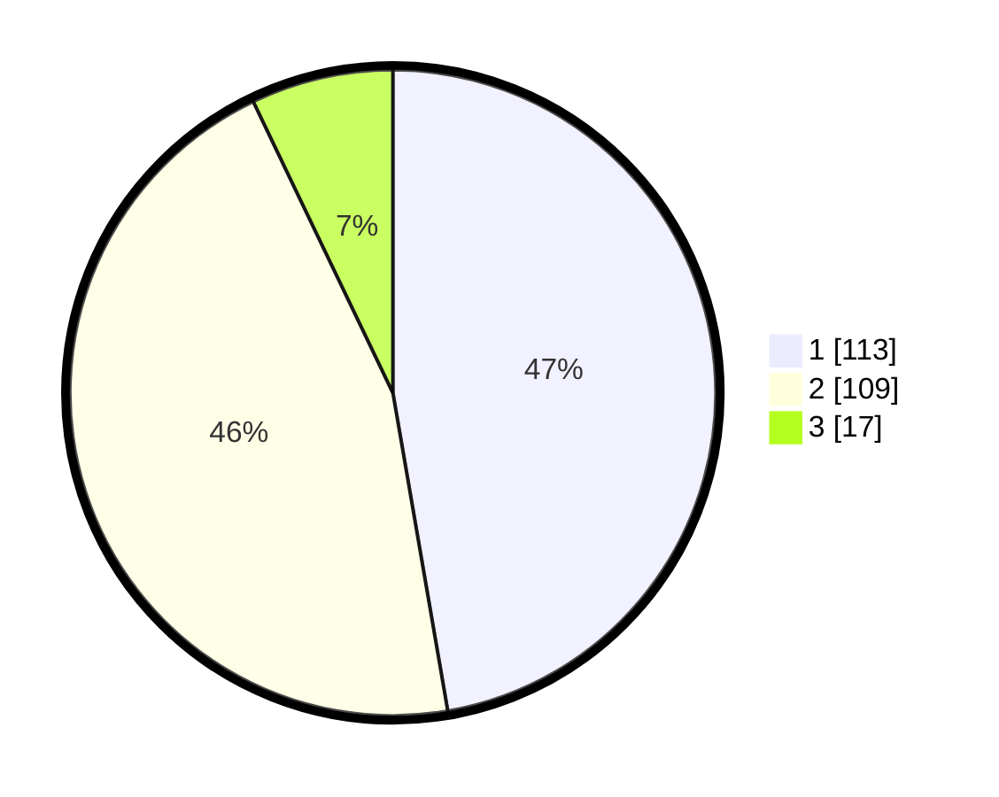

# Hasil

## Grafik

## Tabel

| No. | Nama Paslon    | Suara | Suara (raw) | Persentase |
|:--- |:-------------- | -----:| -----------:| ----------:|
| 1   | ANIES MUHAIMIN | 113   | [113][p-1]  | 47,28      |
| 2   | PRABOWO GIBRAN | 109   | [109][p-2]  | 45,61      |
| 3   | GANJAR MAHFUD  | 17    | [17][p-3]   | 7,11       |

[p-1]: https://github.com/gigit-pemilu/pemilu-2024/blob/main/pilpres/hitung-suara/sub/32-jawa-barat/sub/05-garut/sub/04-tarogong-kaler/sub/1012-pananjung/sub/001-tps/sub/paslon-1.txt
[p-2]: https://github.com/gigit-pemilu/pemilu-2024/blob/main/pilpres/hitung-suara/sub/32-jawa-barat/sub/05-garut/sub/04-tarogong-kaler/sub/1012-pananjung/sub/001-tps/sub/paslon-2.txt
[p-3]: https://github.com/gigit-pemilu/pemilu-2024/blob/main/pilpres/hitung-suara/sub/32-jawa-barat/sub/05-garut/sub/04-tarogong-kaler/sub/1012-pananjung/sub/001-tps/sub/paslon-3.txt

## Foto C Plano

https://sirekap-obj-formc.kpu.go.id/baaf/pemilu/ppwp/32/05/04/10/12/3205041012001-20240218-070935--b60ce49f-4d8d-40c2-8a3d-f38c8d81b1ec.jpg

https://sirekap-obj-formc.kpu.go.id/baaf/pemilu/ppwp/32/05/04/10/12/3205041012001-20240218-071130--6dea0d29-3751-4291-8678-153cc4b2344a.jpg

https://sirekap-obj-formc.kpu.go.id/baaf/pemilu/ppwp/32/05/04/10/12/3205041012001-20240218-071233--ea4836c6-cc20-487e-81a1-69f7c4d6be6a.jpg

## Metadata

| Key        | Value               |
| ---------- | ------------------- |
| Time Stamp | 2024-02-19 06:16:00 |

