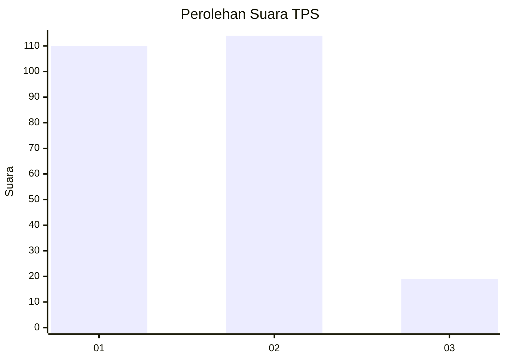
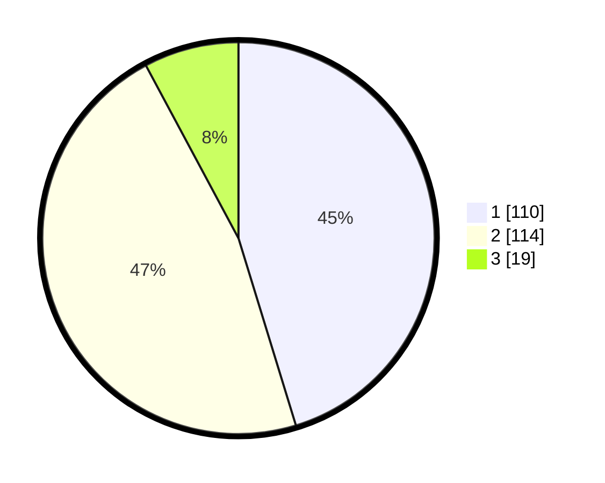

# Hasil

## Grafik

## Tabel

| No. | Nama Paslon    | Suara | Suara (raw) | Persentase |
|:--- |:-------------- | -----:| -----------:| ----------:|
| 1   | ANIES MUHAIMIN | 110   | [110][p-1]  | 45,27      |
| 2   | PRABOWO GIBRAN | 114   | [114][p-2]  | 46,91      |
| 3   | GANJAR MAHFUD  | 19    | [19][p-3]   | 7,82       |

[p-1]: https://github.com/gigit-pemilu/pemilu-2024-32-jawa-barat/blob/main/pilpres/hitung-suara/sub/32-jawa-barat/sub/05-garut/sub/04-tarogong-kaler/sub/1012-pananjung/sub/003-tps/sub/paslon-1.txt
[p-2]: https://github.com/gigit-pemilu/pemilu-2024-32-jawa-barat/blob/main/pilpres/hitung-suara/sub/32-jawa-barat/sub/05-garut/sub/04-tarogong-kaler/sub/1012-pananjung/sub/003-tps/sub/paslon-2.txt
[p-3]: https://github.com/gigit-pemilu/pemilu-2024-32-jawa-barat/blob/main/pilpres/hitung-suara/sub/32-jawa-barat/sub/05-garut/sub/04-tarogong-kaler/sub/1012-pananjung/sub/003-tps/sub/paslon-3.txt

## Foto C Plano

https://sirekap-obj-formc.kpu.go.id/491a/pemilu/ppwp/32/05/04/10/12/3205041012003-20240214-225520--4c527c0a-1f18-48a4-8adf-ed66d6e992b8.jpg

https://sirekap-obj-formc.kpu.go.id/491a/pemilu/ppwp/32/05/04/10/12/3205041012003-20240215-001227--9f9f52ba-f957-4d81-8adb-1815d9dccbbc.jpg

https://sirekap-obj-formc.kpu.go.id/491a/pemilu/ppwp/32/05/04/10/12/3205041012003-20240214-225712--7dd99ed2-7b3e-4995-9a64-e18ac43db427.jpg

## Metadata

| Key        | Value               |
| ---------- | ------------------- |
| Time Stamp | 2024-02-16 01:00:27 |

