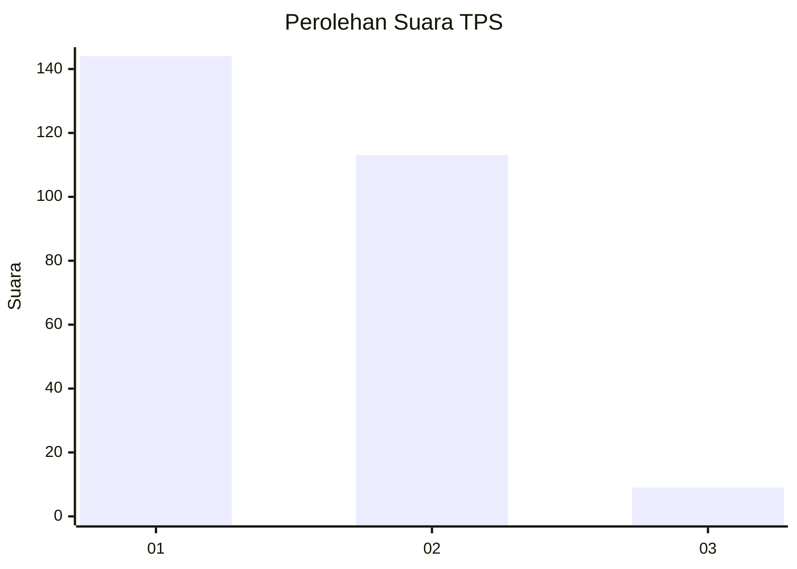
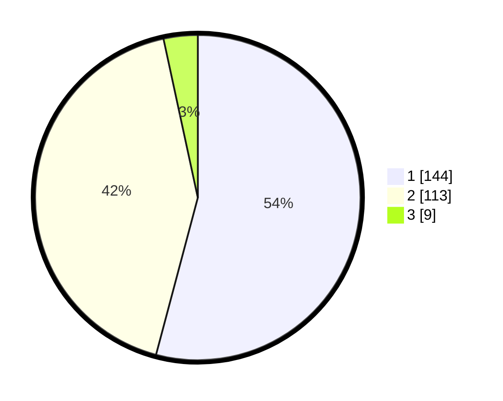

# Hasil

## Grafik

## Tabel

| No. | Nama Paslon    | Suara | Suara (raw) | Persentase |
|:--- |:-------------- | -----:| -----------:| ----------:|
| 1   | ANIES MUHAIMIN | 144   | [144][p-1]  | 54,14      |
| 2   | PRABOWO GIBRAN | 113   | [113][p-2]  | 42,48      |
| 3   | GANJAR MAHFUD  | 9     | [9][p-3]    | 3,38       |

[p-1]: https://github.com/gigit-pemilu/pemilu-2024-32-jawa-barat/blob/main/pilpres/hitung-suara/sub/32-jawa-barat/sub/05-garut/sub/04-tarogong-kaler/sub/2007-tanjung-kamuning/sub/003-tps/sub/paslon-1.txt
[p-2]: https://github.com/gigit-pemilu/pemilu-2024-32-jawa-barat/blob/main/pilpres/hitung-suara/sub/32-jawa-barat/sub/05-garut/sub/04-tarogong-kaler/sub/2007-tanjung-kamuning/sub/003-tps/sub/paslon-2.txt
[p-3]: https://github.com/gigit-pemilu/pemilu-2024-32-jawa-barat/blob/main/pilpres/hitung-suara/sub/32-jawa-barat/sub/05-garut/sub/04-tarogong-kaler/sub/2007-tanjung-kamuning/sub/003-tps/sub/paslon-3.txt

## Foto C Plano

https://sirekap-obj-formc.kpu.go.id/3469/pemilu/ppwp/32/05/04/20/07/3205042007003-20240216-150307--c30aa213-0df5-473f-820f-556f0c2862db.jpg

https://sirekap-obj-formc.kpu.go.id/3469/pemilu/ppwp/32/05/04/20/07/3205042007003-20240216-145733--cbb307e9-dc49-48f0-bc7a-c566e952af90.jpg

https://sirekap-obj-formc.kpu.go.id/3469/pemilu/ppwp/32/05/04/20/07/3205042007003-20240216-150627--04418126-d2fa-4f26-ba5a-148b298229f8.jpg

## Metadata

| Key        | Value               |
| ---------- | ------------------- |
| Time Stamp | 2024-02-19 06:16:00 |

