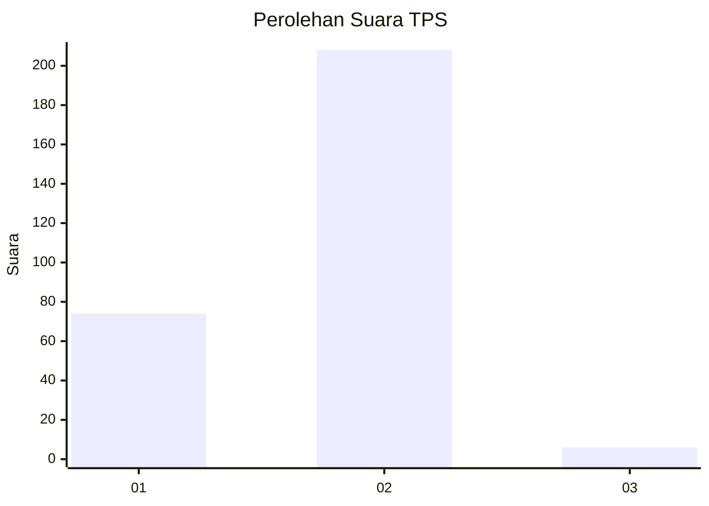
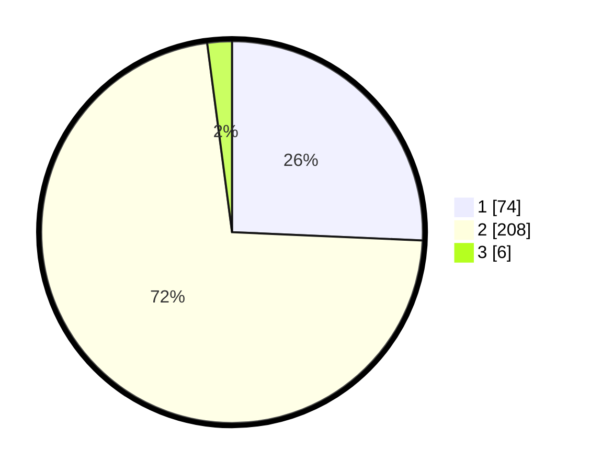

# Hasil

## Grafik

## Tabel

| No. | Nama Paslon    | Suara | Suara (raw) | Persentase |
|:--- |:-------------- | -----:| -----------:| ----------:|
| 1   | ANIES MUHAIMIN | 74    | [74][p-1]   | 25,69      |
| 2   | PRABOWO GIBRAN | 208   | [208][p-2]  | 72,22      |
| 3   | GANJAR MAHFUD  | 6     | [6][p-3]    | 2,08       |

[p-1]: https://github.com/gigit-pemilu/pemilu-2024-32-jawa-barat/blob/main/pilpres/hitung-suara/sub/32-jawa-barat/sub/05-garut/sub/06-banyuresmi/sub/2005-sukaraja/sub/003-tps/sub/paslon-1.txt
[p-2]: https://github.com/gigit-pemilu/pemilu-2024-32-jawa-barat/blob/main/pilpres/hitung-suara/sub/32-jawa-barat/sub/05-garut/sub/06-banyuresmi/sub/2005-sukaraja/sub/003-tps/sub/paslon-2.txt
[p-3]: https://github.com/gigit-pemilu/pemilu-2024-32-jawa-barat/blob/main/pilpres/hitung-suara/sub/32-jawa-barat/sub/05-garut/sub/06-banyuresmi/sub/2005-sukaraja/sub/003-tps/sub/paslon-3.txt

## Foto C Plano

https://sirekap-obj-formc.kpu.go.id/cfc7/pemilu/ppwp/32/05/06/20/05/3205062005003-20240215-005437--cd10c571-a29e-4b84-8d9c-8baefa794d89.jpg

https://sirekap-obj-formc.kpu.go.id/cfc7/pemilu/ppwp/32/05/06/20/05/3205062005003-20240215-010436--a68e1099-7b76-4fc2-a313-71ac2c0cb761.jpg

https://sirekap-obj-formc.kpu.go.id/cfc7/pemilu/ppwp/32/05/06/20/05/3205062005003-20240215-010501--ab548e80-2095-4ca9-88e3-ca5663e72361.jpg

## Metadata

| Key        | Value               |
| ---------- | ------------------- |
| Time Stamp | 2024-02-15 15:00:29 |

