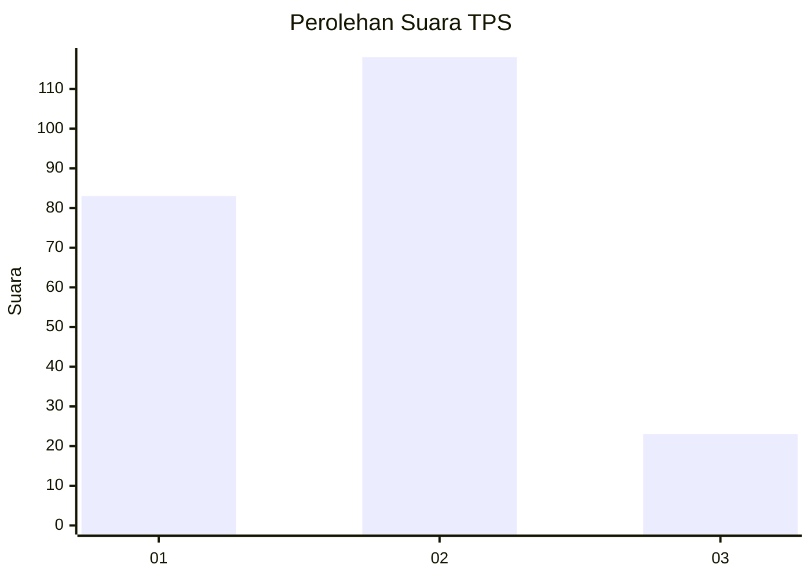
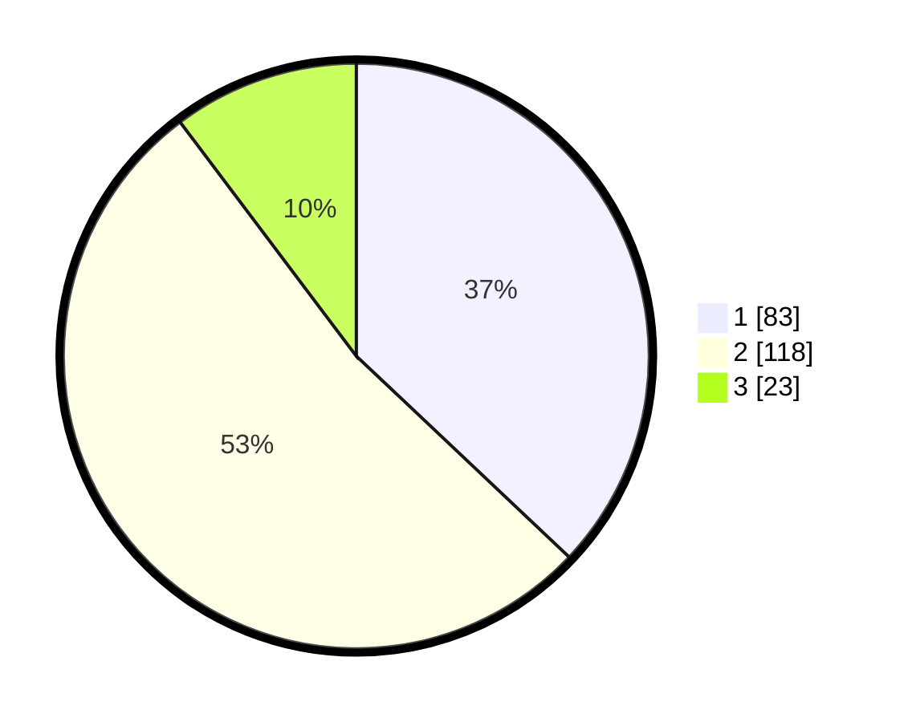

# Hasil

## Grafik

## Tabel

| No. | Nama Paslon    | Suara | Suara (raw) | Persentase |
|:--- |:-------------- | -----:| -----------:| ----------:|
| 1   | ANIES MUHAIMIN | 83    | [83][p-1]   | 37,05      |
| 2   | PRABOWO GIBRAN | 118   | [118][p-2]  | 52,68      |
| 3   | GANJAR MAHFUD  | 23    | [23][p-3]   | 10,27      |

[p-1]: https://github.com/gigit-pemilu/pemilu-2024-32-jawa-barat/blob/main/pilpres/hitung-suara/sub/32-jawa-barat/sub/05-garut/sub/07-samarang/sub/2001-samarang/sub/001-tps/sub/paslon-1.txt
[p-2]: https://github.com/gigit-pemilu/pemilu-2024-32-jawa-barat/blob/main/pilpres/hitung-suara/sub/32-jawa-barat/sub/05-garut/sub/07-samarang/sub/2001-samarang/sub/001-tps/sub/paslon-2.txt
[p-3]: https://github.com/gigit-pemilu/pemilu-2024-32-jawa-barat/blob/main/pilpres/hitung-suara/sub/32-jawa-barat/sub/05-garut/sub/07-samarang/sub/2001-samarang/sub/001-tps/sub/paslon-3.txt

## Foto C Plano

https://sirekap-obj-formc.kpu.go.id/adff/pemilu/ppwp/32/05/07/20/01/3205072001001-20240215-142608--add61564-bf30-49e8-9cb1-392632c2023b.jpg

https://sirekap-obj-formc.kpu.go.id/adff/pemilu/ppwp/32/05/07/20/01/3205072001001-20240215-142617--c0e4b53e-25e5-4b56-b0cf-ea99f930c7cf.jpg

https://sirekap-obj-formc.kpu.go.id/adff/pemilu/ppwp/32/05/07/20/01/3205072001001-20240215-142621--0aa04cce-bc02-411f-8b4a-4485bc403ac7.jpg

## Metadata

| Key        | Value               |
| ---------- | ------------------- |
| Time Stamp | 2024-02-15 18:30:25 |

