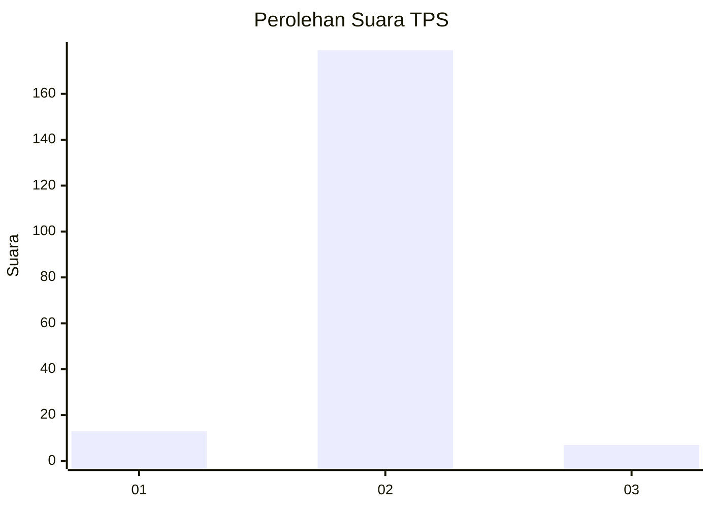
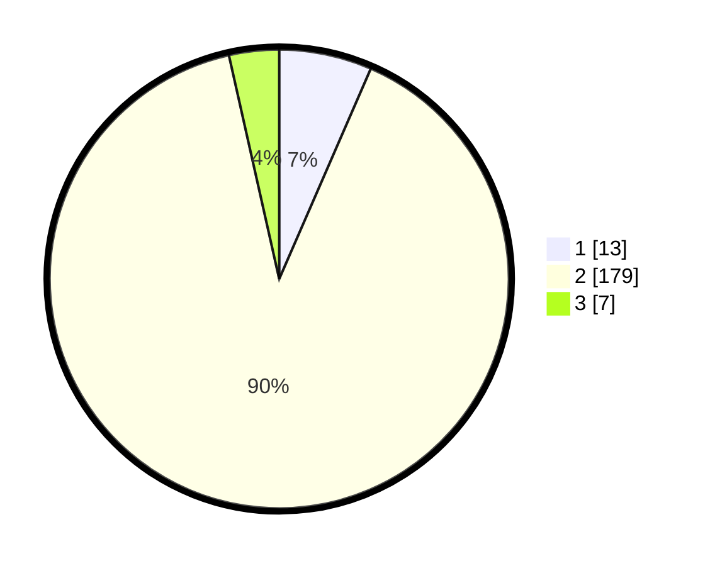

# Hasil

## Grafik

## Tabel

| No. | Nama Paslon    | Suara | Suara (raw) | Persentase |
|:--- |:-------------- | -----:| -----------:| ----------:|
| 1   | ANIES MUHAIMIN | 13    | [13][p-1]   | 6,53       |
| 2   | PRABOWO GIBRAN | 179   | [179][p-2]  | 89,95      |
| 3   | GANJAR MAHFUD  | 7     | [7][p-3]    | 3,52       |

[p-1]: https://github.com/gigit-pemilu/pemilu-2024/blob/main/pilpres/hitung-suara/sub/32-jawa-barat/sub/05-garut/sub/07-samarang/sub/2001-samarang/sub/004-tps/sub/paslon-1.txt
[p-2]: https://github.com/gigit-pemilu/pemilu-2024/blob/main/pilpres/hitung-suara/sub/32-jawa-barat/sub/05-garut/sub/07-samarang/sub/2001-samarang/sub/004-tps/sub/paslon-2.txt
[p-3]: https://github.com/gigit-pemilu/pemilu-2024/blob/main/pilpres/hitung-suara/sub/32-jawa-barat/sub/05-garut/sub/07-samarang/sub/2001-samarang/sub/004-tps/sub/paslon-3.txt

## Foto C Plano

https://sirekap-obj-formc.kpu.go.id/cad0/pemilu/ppwp/32/05/07/20/01/3205072001004-20240215-013246--5c7b0425-8cde-4b9d-a057-7f8f99cde9f8.jpg

https://sirekap-obj-formc.kpu.go.id/cad0/pemilu/ppwp/32/05/07/20/01/3205072001004-20240214-224235--dcc19df4-9474-4111-9141-8e65abe508ef.jpg

https://sirekap-obj-formc.kpu.go.id/cad0/pemilu/ppwp/32/05/07/20/01/3205072001004-20240214-202838--a4978b91-f4a9-443e-b453-8d37e6abcd13.jpg

## Metadata

| Key        | Value               |
| ---------- | ------------------- |
| Time Stamp | 2024-02-15 22:30:27 |

