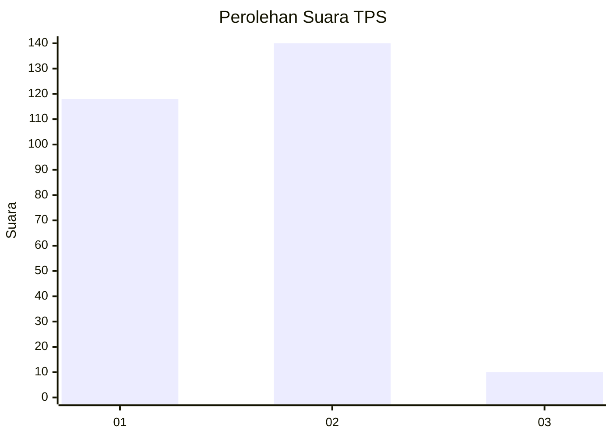
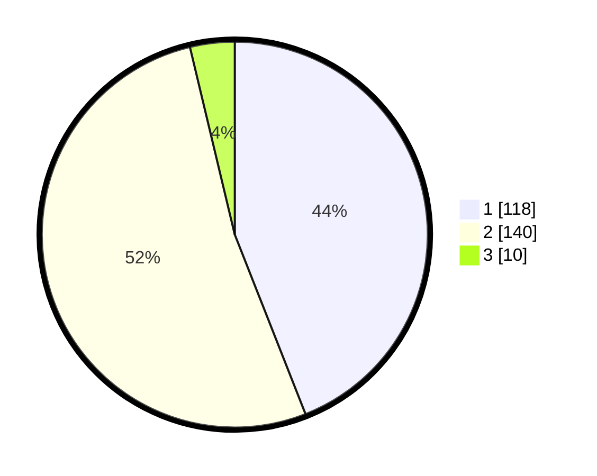

# Hasil

## Grafik

## Tabel

| No. | Nama Paslon    | Suara | Suara (raw) | Persentase |
|:--- |:-------------- | -----:| -----------:| ----------:|
| 1   | ANIES MUHAIMIN | 118   | [118][p-1]  | 44,03      |
| 2   | PRABOWO GIBRAN | 140   | [140][p-2]  | 52,24      |
| 3   | GANJAR MAHFUD  | 10    | [10][p-3]   | 3,73       |

[p-1]: https://github.com/gigit-pemilu/pemilu-2024-32-jawa-barat/blob/main/pilpres/hitung-suara/sub/32-jawa-barat/sub/05-garut/sub/07-samarang/sub/2002-cintarakyat/sub/006-tps/sub/paslon-1.txt
[p-2]: https://github.com/gigit-pemilu/pemilu-2024-32-jawa-barat/blob/main/pilpres/hitung-suara/sub/32-jawa-barat/sub/05-garut/sub/07-samarang/sub/2002-cintarakyat/sub/006-tps/sub/paslon-2.txt
[p-3]: https://github.com/gigit-pemilu/pemilu-2024-32-jawa-barat/blob/main/pilpres/hitung-suara/sub/32-jawa-barat/sub/05-garut/sub/07-samarang/sub/2002-cintarakyat/sub/006-tps/sub/paslon-3.txt

## Foto C Plano

https://sirekap-obj-formc.kpu.go.id/8a3b/pemilu/ppwp/32/05/07/20/02/3205072002006-20240215-045732--57c5e021-1660-4e48-8ba4-96659c61b987.jpg

https://sirekap-obj-formc.kpu.go.id/8a3b/pemilu/ppwp/32/05/07/20/02/3205072002006-20240215-004633--ea496416-c177-48ea-82ea-36f57a0c016e.jpg

https://sirekap-obj-formc.kpu.go.id/8a3b/pemilu/ppwp/32/05/07/20/02/3205072002006-20240215-045903--a85a36dd-90fe-4482-9619-38f911ecc4c9.jpg

## Metadata

| Key        | Value               |
| ---------- | ------------------- |
| Time Stamp | 2024-02-15 22:40:13 |

