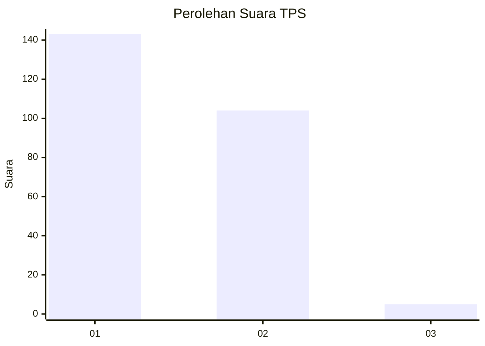
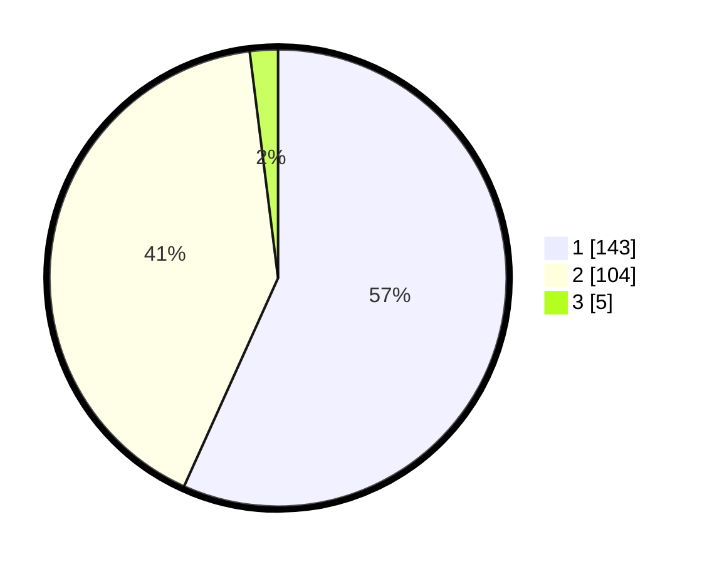

# Hasil

## Grafik

## Tabel

| No. | Nama Paslon    | Suara | Suara (raw) | Persentase |
|:--- |:-------------- | -----:| -----------:| ----------:|
| 1   | ANIES MUHAIMIN | 143   | [143][p-1]  | 56,75      |
| 2   | PRABOWO GIBRAN | 104   | [104][p-2]  | 41,27      |
| 3   | GANJAR MAHFUD  | 5     | [5][p-3]    | 1,98       |

[p-1]: https://github.com/gigit-pemilu/pemilu-2024-32-jawa-barat/blob/main/pilpres/hitung-suara/sub/32-jawa-barat/sub/05-garut/sub/07-samarang/sub/2003-sukarasa/sub/011-tps/sub/paslon-1.txt
[p-2]: https://github.com/gigit-pemilu/pemilu-2024-32-jawa-barat/blob/main/pilpres/hitung-suara/sub/32-jawa-barat/sub/05-garut/sub/07-samarang/sub/2003-sukarasa/sub/011-tps/sub/paslon-2.txt
[p-3]: https://github.com/gigit-pemilu/pemilu-2024-32-jawa-barat/blob/main/pilpres/hitung-suara/sub/32-jawa-barat/sub/05-garut/sub/07-samarang/sub/2003-sukarasa/sub/011-tps/sub/paslon-3.txt

## Foto C Plano

https://sirekap-obj-formc.kpu.go.id/70e4/pemilu/ppwp/32/05/07/20/03/3205072003011-20240214-212431--1cf4b690-1a3c-4028-869f-934f91b20f7b.jpg

https://sirekap-obj-formc.kpu.go.id/70e4/pemilu/ppwp/32/05/07/20/03/3205072003011-20240214-225753--86b355cb-c5cf-43c7-a7af-1d3e9857b5a9.jpg

https://sirekap-obj-formc.kpu.go.id/70e4/pemilu/ppwp/32/05/07/20/03/3205072003011-20240214-231421--f3a8531f-7d7a-4404-abe1-9ab5f982c323.jpg

## Metadata

| Key        | Value               |
| ---------- | ------------------- |
| Time Stamp | 2024-02-15 18:30:25 |

