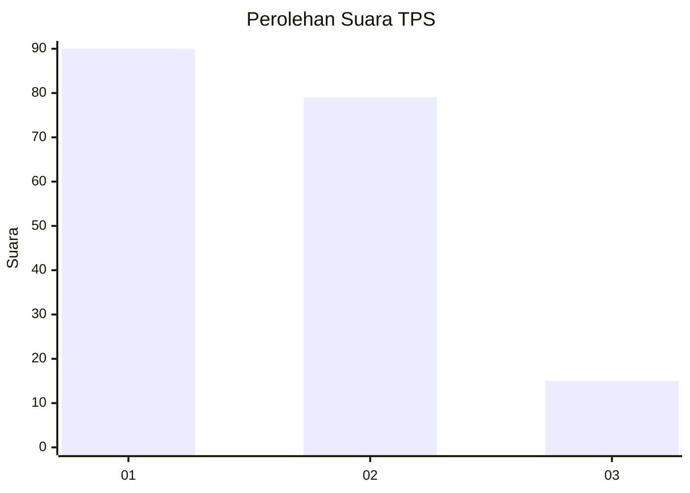
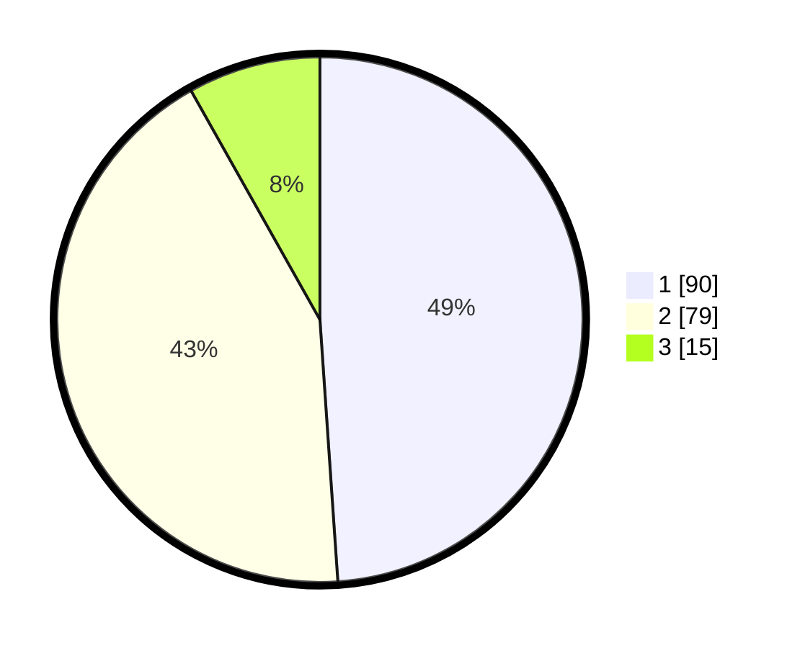

# Hasil

## Grafik

## Tabel

| No. | Nama Paslon    | Suara | Suara (raw) | Persentase |
|:--- |:-------------- | -----:| -----------:| ----------:|
| 1   | ANIES MUHAIMIN | 90    | [90][p-1]   | 48,91      |
| 2   | PRABOWO GIBRAN | 79    | [79][p-2]   | 42,93      |
| 3   | GANJAR MAHFUD  | 15    | [15][p-3]   | 8,15       |

[p-1]: https://github.com/gigit-pemilu/pemilu-2024/blob/main/pilpres/hitung-suara/sub/32-jawa-barat/sub/05-garut/sub/08-pasirwangi/sub/2002-pasirkiamis/sub/006-tps/sub/paslon-1.txt
[p-2]: https://github.com/gigit-pemilu/pemilu-2024/blob/main/pilpres/hitung-suara/sub/32-jawa-barat/sub/05-garut/sub/08-pasirwangi/sub/2002-pasirkiamis/sub/006-tps/sub/paslon-2.txt
[p-3]: https://github.com/gigit-pemilu/pemilu-2024/blob/main/pilpres/hitung-suara/sub/32-jawa-barat/sub/05-garut/sub/08-pasirwangi/sub/2002-pasirkiamis/sub/006-tps/sub/paslon-3.txt

## Foto C Plano

https://sirekap-obj-formc.kpu.go.id/d1f7/pemilu/ppwp/32/05/08/20/02/3205082002006-20240215-041924--d57f0a95-5b34-4165-9bb0-747612aaa0eb.jpg

https://sirekap-obj-formc.kpu.go.id/d1f7/pemilu/ppwp/32/05/08/20/02/3205082002006-20240216-141404--5c32fde4-f20c-44d3-bf8f-b59fd5a540b7.jpg

https://sirekap-obj-formc.kpu.go.id/d1f7/pemilu/ppwp/32/05/08/20/02/3205082002006-20240216-141403--b70cab18-1da1-40bd-8236-80eab337cee7.jpg

## Metadata

| Key        | Value               |
| ---------- | ------------------- |
| Time Stamp | 2024-02-16 16:25:10 |

