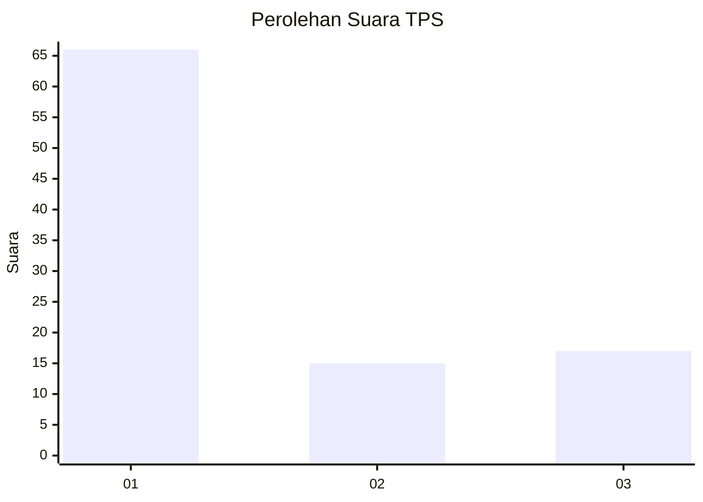
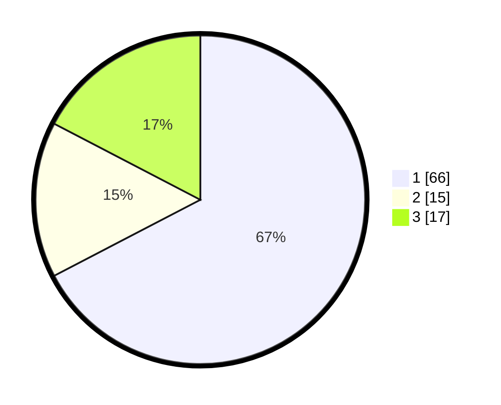

# Hasil

## Grafik

## Tabel

| No. | Nama Paslon    | Suara | Suara (raw) | Persentase |
|:--- |:-------------- | -----:| -----------:| ----------:|
| 1   | ANIES MUHAIMIN | 66    | [66][p-1]   | 67,35      |
| 2   | PRABOWO GIBRAN | 15    | [15][p-2]   | 15,31      |
| 3   | GANJAR MAHFUD  | 17    | [17][p-3]   | 17,35      |

[p-1]: https://github.com/gigit-pemilu/pemilu-2024-32-jawa-barat/blob/main/pilpres/hitung-suara/sub/32-jawa-barat/sub/05-garut/sub/08-pasirwangi/sub/2002-pasirkiamis/sub/014-tps/sub/paslon-1.txt
[p-2]: https://github.com/gigit-pemilu/pemilu-2024-32-jawa-barat/blob/main/pilpres/hitung-suara/sub/32-jawa-barat/sub/05-garut/sub/08-pasirwangi/sub/2002-pasirkiamis/sub/014-tps/sub/paslon-2.txt
[p-3]: https://github.com/gigit-pemilu/pemilu-2024-32-jawa-barat/blob/main/pilpres/hitung-suara/sub/32-jawa-barat/sub/05-garut/sub/08-pasirwangi/sub/2002-pasirkiamis/sub/014-tps/sub/paslon-3.txt

## Foto C Plano

https://sirekap-obj-formc.kpu.go.id/e0c8/pemilu/ppwp/32/05/08/20/02/3205082002014-20240215-031924--b2989bd1-cac0-45b1-a29d-0de13332e6cf.jpg

https://sirekap-obj-formc.kpu.go.id/e0c8/pemilu/ppwp/32/05/08/20/02/3205082002014-20240219-122017--218b2c68-5011-46a2-aff8-79b86d80d6a5.jpg

https://sirekap-obj-formc.kpu.go.id/e0c8/pemilu/ppwp/32/05/08/20/02/3205082002014-20240215-040320--8b58b172-0ac4-4769-a81a-c312a2434ec7.jpg

## Metadata

| Key        | Value               |
| ---------- | ------------------- |
| Time Stamp | 2024-02-19 15:00:00 |

