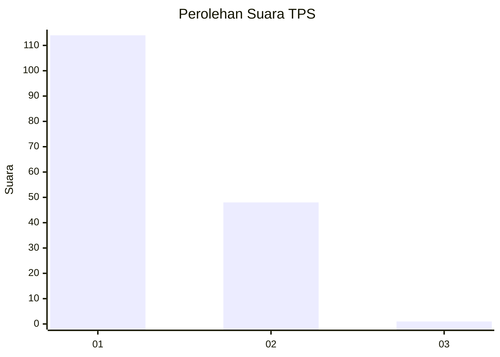
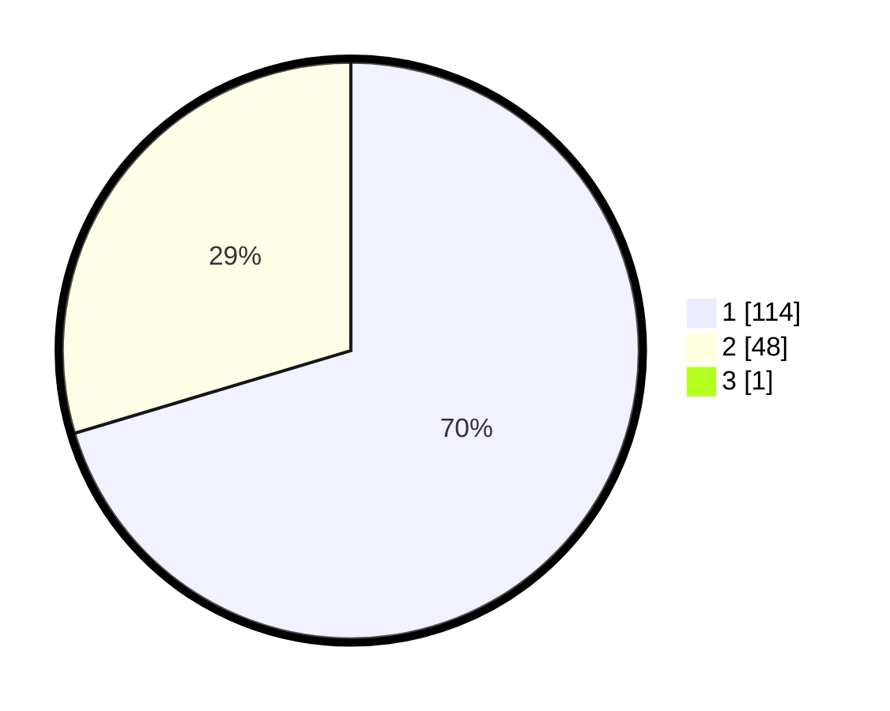

# Hasil

## Grafik

## Tabel

| No. | Nama Paslon    | Suara | Suara (raw) | Persentase |
|:--- |:-------------- | -----:| -----------:| ----------:|
| 1   | ANIES MUHAIMIN | 114   | [114][p-1]  | 69,94      |
| 2   | PRABOWO GIBRAN | 48    | [48][p-2]   | 29,45      |
| 3   | GANJAR MAHFUD  | 1     | [1][p-3]    | 0,61       |

[p-1]: https://github.com/gigit-pemilu/pemilu-2024/blob/main/pilpres/hitung-suara/sub/32-jawa-barat/sub/05-garut/sub/08-pasirwangi/sub/2012-padamulya/sub/011-tps/sub/paslon-1.txt
[p-2]: https://github.com/gigit-pemilu/pemilu-2024/blob/main/pilpres/hitung-suara/sub/32-jawa-barat/sub/05-garut/sub/08-pasirwangi/sub/2012-padamulya/sub/011-tps/sub/paslon-2.txt
[p-3]: https://github.com/gigit-pemilu/pemilu-2024/blob/main/pilpres/hitung-suara/sub/32-jawa-barat/sub/05-garut/sub/08-pasirwangi/sub/2012-padamulya/sub/011-tps/sub/paslon-3.txt

## Foto C Plano

https://sirekap-obj-formc.kpu.go.id/6a8c/pemilu/ppwp/32/05/08/20/12/3205082012011-20240215-021235--b0d94476-4a19-487f-9c4c-71acd4ed5e4f.jpg

https://sirekap-obj-formc.kpu.go.id/6a8c/pemilu/ppwp/32/05/08/20/12/3205082012011-20240215-022626--00430e83-2a1f-4b0c-a67c-2ce6a02f4629.jpg

https://sirekap-obj-formc.kpu.go.id/6a8c/pemilu/ppwp/32/05/08/20/12/3205082012011-20240215-022852--862ceeb7-7f38-4bf1-a5f8-20019fc90008.jpg

## Metadata

| Key        | Value               |
| ---------- | ------------------- |
| Time Stamp | 2024-02-15 15:00:29 |

