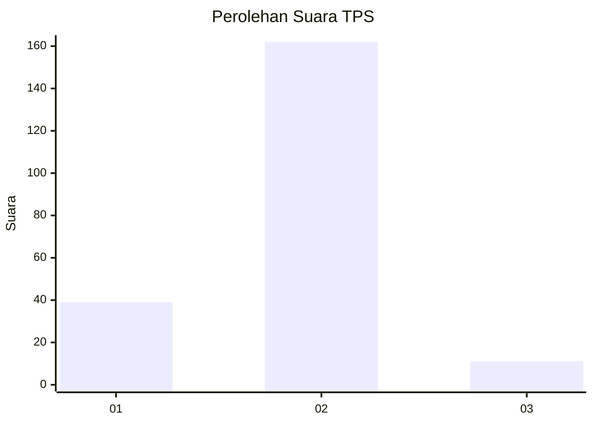
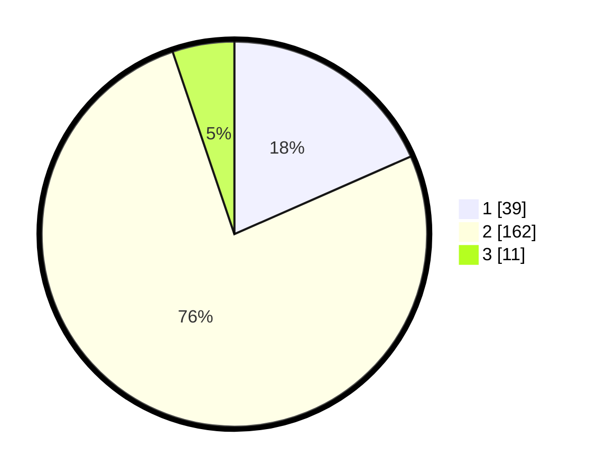

# Hasil

## Grafik

## Tabel

| No. | Nama Paslon    | Suara | Suara (raw) | Persentase |
|:--- |:-------------- | -----:| -----------:| ----------:|
| 1   | ANIES MUHAIMIN | 39    | [39][p-1]   | 18,40      |
| 2   | PRABOWO GIBRAN | 162   | [162][p-2]  | 76,42      |
| 3   | GANJAR MAHFUD  | 11    | [11][p-3]   | 5,19       |

[p-1]: https://github.com/gigit-pemilu/pemilu-2024-32-jawa-barat/blob/main/pilpres/hitung-suara/sub/32-jawa-barat/sub/05-garut/sub/10-kadungora/sub/2001-kadungora/sub/003-tps/sub/paslon-1.txt
[p-2]: https://github.com/gigit-pemilu/pemilu-2024-32-jawa-barat/blob/main/pilpres/hitung-suara/sub/32-jawa-barat/sub/05-garut/sub/10-kadungora/sub/2001-kadungora/sub/003-tps/sub/paslon-2.txt
[p-3]: https://github.com/gigit-pemilu/pemilu-2024-32-jawa-barat/blob/main/pilpres/hitung-suara/sub/32-jawa-barat/sub/05-garut/sub/10-kadungora/sub/2001-kadungora/sub/003-tps/sub/paslon-3.txt

## Foto C Plano

https://sirekap-obj-formc.kpu.go.id/3c2b/pemilu/ppwp/32/05/10/20/01/3205102001003-20240215-035006--285f49e7-51af-42bf-abf2-699f10d58a7c.jpg

https://sirekap-obj-formc.kpu.go.id/3c2b/pemilu/ppwp/32/05/10/20/01/3205102001003-20240215-035249--7afd8fed-03e6-4783-be80-e1f0998c293a.jpg

https://sirekap-obj-formc.kpu.go.id/3c2b/pemilu/ppwp/32/05/10/20/01/3205102001003-20240216-130702--b212cc4b-d8fb-4841-9450-dd4313e0f710.jpg

## Metadata

| Key        | Value               |
| ---------- | ------------------- |
| Time Stamp | 2024-02-16 13:30:32 |

