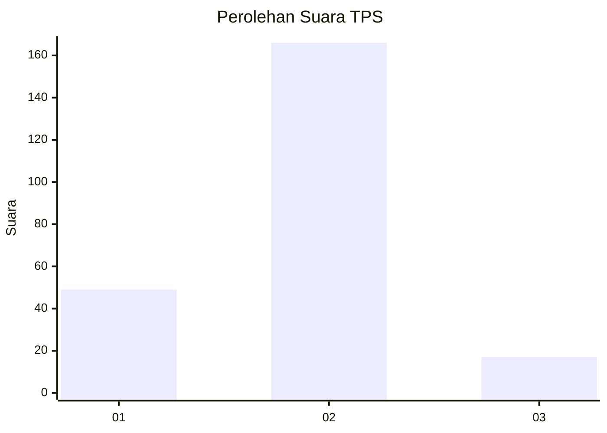
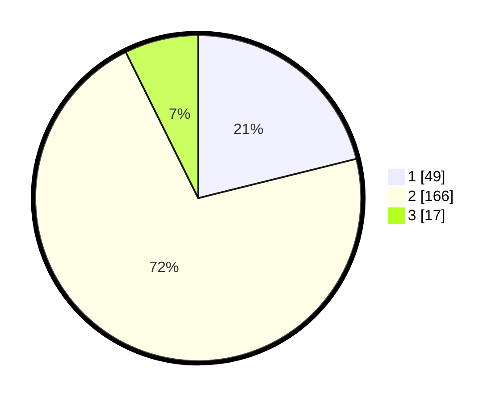

# Hasil

## Grafik

## Tabel

| No. | Nama Paslon    | Suara | Suara (raw) | Persentase |
|:--- |:-------------- | -----:| -----------:| ----------:|
| 1   | ANIES MUHAIMIN | 49    | [49][p-1]   | 21,12      |
| 2   | PRABOWO GIBRAN | 166   | [166][p-2]  | 71,55      |
| 3   | GANJAR MAHFUD  | 17    | [17][p-3]   | 7,33       |

[p-1]: https://github.com/gigit-pemilu/pemilu-2024/blob/main/pilpres/hitung-suara/sub/32-jawa-barat/sub/05-garut/sub/11-leuwigoong/sub/2001-leuwigoong/sub/003-tps/sub/paslon-1.txt
[p-2]: https://github.com/gigit-pemilu/pemilu-2024/blob/main/pilpres/hitung-suara/sub/32-jawa-barat/sub/05-garut/sub/11-leuwigoong/sub/2001-leuwigoong/sub/003-tps/sub/paslon-2.txt
[p-3]: https://github.com/gigit-pemilu/pemilu-2024/blob/main/pilpres/hitung-suara/sub/32-jawa-barat/sub/05-garut/sub/11-leuwigoong/sub/2001-leuwigoong/sub/003-tps/sub/paslon-3.txt

## Foto C Plano

https://sirekap-obj-formc.kpu.go.id/fa74/pemilu/ppwp/32/05/11/20/01/3205112001003-20240215-024140--4c7346d7-2a37-471d-a278-8d26124f5081.jpg

https://sirekap-obj-formc.kpu.go.id/fa74/pemilu/ppwp/32/05/11/20/01/3205112001003-20240215-204036--f8cee268-73e4-4e58-95de-27b98dee6568.jpg

https://sirekap-obj-formc.kpu.go.id/fa74/pemilu/ppwp/32/05/11/20/01/3205112001003-20240215-204903--2f1781d3-12e1-42bd-8121-091bbf9d6f39.jpg

## Metadata

| Key        | Value               |
| ---------- | ------------------- |
| Time Stamp | 2024-02-19 22:00:00 |

