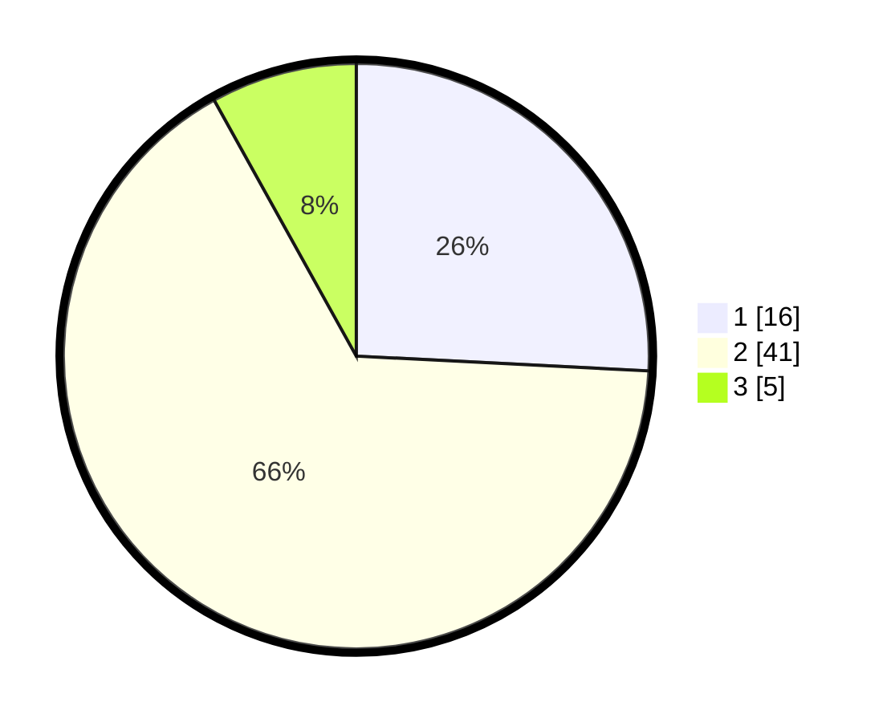

# Hasil

## Grafik

## Tabel

| No. | Nama Paslon    | Suara | Suara (raw) | Persentase |
|:--- |:-------------- | -----:| -----------:| ----------:|
| 1   | ANIES MUHAIMIN | 16    | [16][p-1]   | 25,81      |
| 2   | PRABOWO GIBRAN | 41    | [41][p-2]   | 66,13      |
| 3   | GANJAR MAHFUD  | 5     | [5][p-3]    | 8,06       |

[p-1]: https://github.com/gigit-pemilu/pemilu-2024-32-jawa-barat/blob/main/pilpres/hitung-suara/sub/32-jawa-barat/sub/05-garut/sub/11-leuwigoong/sub/2002-karanganyar/sub/015-tps/sub/paslon-1.txt
[p-2]: https://github.com/gigit-pemilu/pemilu-2024-32-jawa-barat/blob/main/pilpres/hitung-suara/sub/32-jawa-barat/sub/05-garut/sub/11-leuwigoong/sub/2002-karanganyar/sub/015-tps/sub/paslon-2.txt
[p-3]: https://github.com/gigit-pemilu/pemilu-2024-32-jawa-barat/blob/main/pilpres/hitung-suara/sub/32-jawa-barat/sub/05-garut/sub/11-leuwigoong/sub/2002-karanganyar/sub/015-tps/sub/paslon-3.txt

## Foto C Plano

https://sirekap-obj-formc.kpu.go.id/1608/pemilu/ppwp/32/05/11/20/02/3205112002015-20240214-224342--b32699a0-b12c-4cb2-b256-383b25d96dec.jpg

https://sirekap-obj-formc.kpu.go.id/1608/pemilu/ppwp/32/05/11/20/02/3205112002015-20240214-224441--106ded66-acb6-4f76-9a47-2cd6c51c0dc5.jpg

https://sirekap-obj-formc.kpu.go.id/1608/pemilu/ppwp/32/05/11/20/02/3205112002015-20240214-224557--8231325c-8461-45b2-9f73-8bffce8a159e.jpg

## Metadata

| Key        | Value               |
| ---------- | ------------------- |
| Time Stamp | 2024-02-17 18:00:00 |

