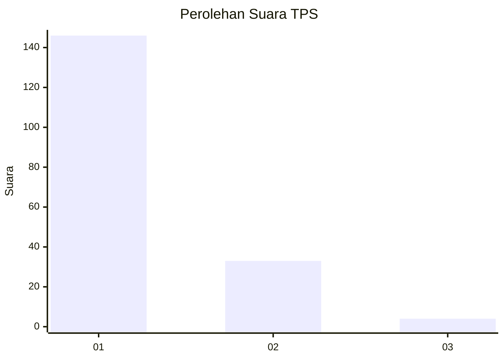
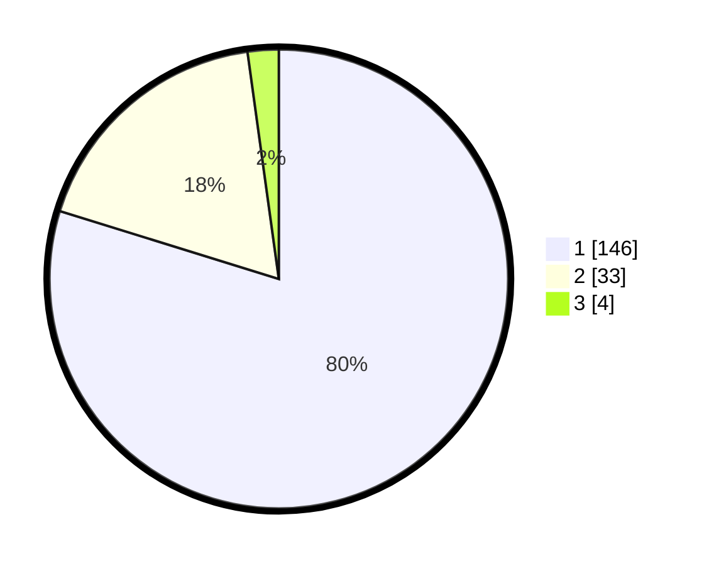

# Hasil

## Grafik

## Tabel

| No. | Nama Paslon    | Suara | Suara (raw) | Persentase |
|:--- |:-------------- | -----:| -----------:| ----------:|
| 1   | ANIES MUHAIMIN | 146   | [146][p-1]  | 79,78      |
| 2   | PRABOWO GIBRAN | 33    | [33][p-2]   | 18,03      |
| 3   | GANJAR MAHFUD  | 4     | [4][p-3]    | 2,19       |

[p-1]: https://github.com/gigit-pemilu/pemilu-2024-32-jawa-barat/blob/main/pilpres/hitung-suara/sub/32-jawa-barat/sub/05-garut/sub/11-leuwigoong/sub/2003-margacinta/sub/013-tps/sub/paslon-1.txt
[p-2]: https://github.com/gigit-pemilu/pemilu-2024-32-jawa-barat/blob/main/pilpres/hitung-suara/sub/32-jawa-barat/sub/05-garut/sub/11-leuwigoong/sub/2003-margacinta/sub/013-tps/sub/paslon-2.txt
[p-3]: https://github.com/gigit-pemilu/pemilu-2024-32-jawa-barat/blob/main/pilpres/hitung-suara/sub/32-jawa-barat/sub/05-garut/sub/11-leuwigoong/sub/2003-margacinta/sub/013-tps/sub/paslon-3.txt

## Foto C Plano

https://sirekap-obj-formc.kpu.go.id/cdde/pemilu/ppwp/32/05/11/20/03/3205112003013-20240215-194859--c795005a-d6db-4610-933a-24f9135e43db.jpg

https://sirekap-obj-formc.kpu.go.id/cdde/pemilu/ppwp/32/05/11/20/03/3205112003013-20240215-215112--e45547e2-97c8-4d7f-88fc-a8fc3bb3a093.jpg

https://sirekap-obj-formc.kpu.go.id/cdde/pemilu/ppwp/32/05/11/20/03/3205112003013-20240215-195028--845bd347-3c84-4e20-bfef-ab6d050d869e.jpg

## Metadata

| Key        | Value               |
| ---------- | ------------------- |
| Time Stamp | 2024-02-16 08:30:27 |

