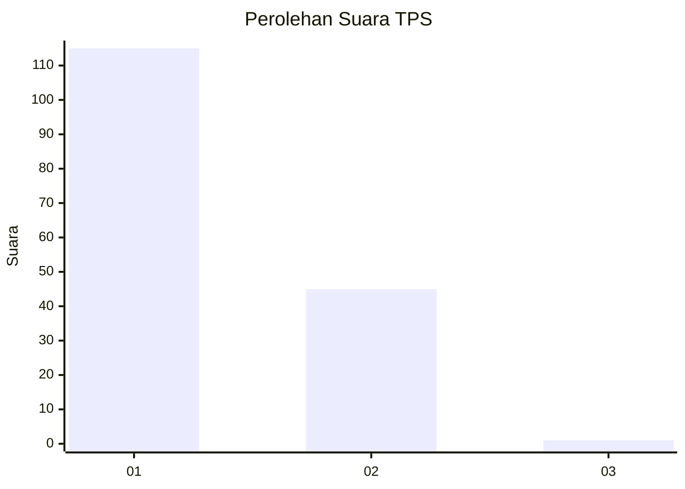
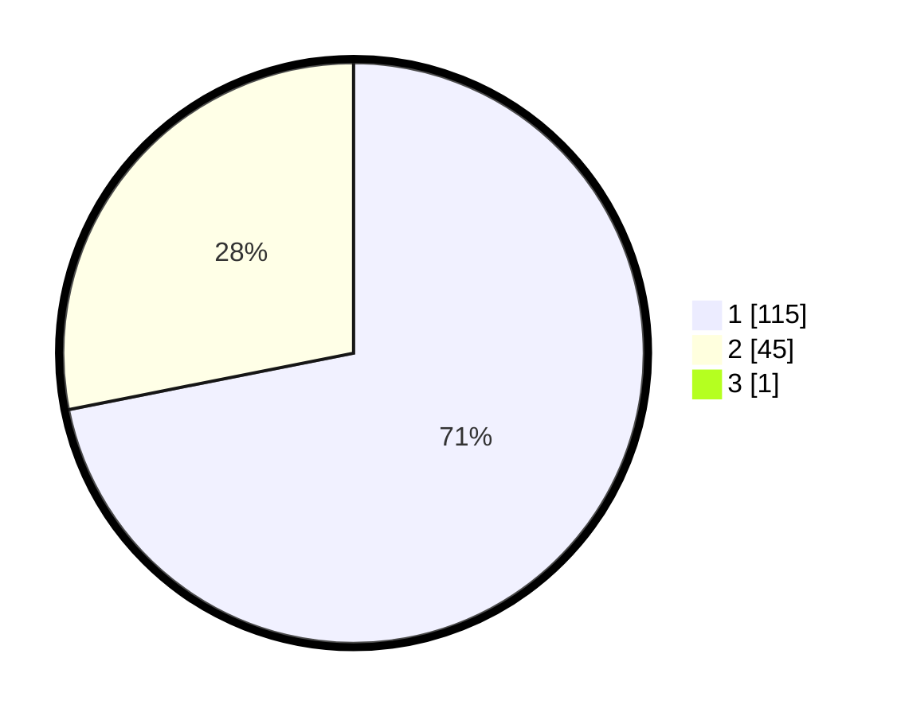

# Hasil

## Grafik

## Tabel

| No. | Nama Paslon    | Suara | Suara (raw) | Persentase |
|:--- |:-------------- | -----:| -----------:| ----------:|
| 1   | ANIES MUHAIMIN | 115   | [115][p-1]  | 71,43      |
| 2   | PRABOWO GIBRAN | 45    | [45][p-2]   | 27,95      |
| 3   | GANJAR MAHFUD  | 1     | [1][p-3]    | 0,62       |

[p-1]: https://github.com/gigit-pemilu/pemilu-2024-32-jawa-barat/blob/main/pilpres/hitung-suara/sub/32-jawa-barat/sub/05-garut/sub/11-leuwigoong/sub/2006-tambak-sari/sub/004-tps/sub/paslon-1.txt
[p-2]: https://github.com/gigit-pemilu/pemilu-2024-32-jawa-barat/blob/main/pilpres/hitung-suara/sub/32-jawa-barat/sub/05-garut/sub/11-leuwigoong/sub/2006-tambak-sari/sub/004-tps/sub/paslon-2.txt
[p-3]: https://github.com/gigit-pemilu/pemilu-2024-32-jawa-barat/blob/main/pilpres/hitung-suara/sub/32-jawa-barat/sub/05-garut/sub/11-leuwigoong/sub/2006-tambak-sari/sub/004-tps/sub/paslon-3.txt

## Foto C Plano

https://sirekap-obj-formc.kpu.go.id/7631/pemilu/ppwp/32/05/11/20/06/3205112006004-20240215-015154--5580d770-169f-4b25-bdaf-8717bc0177a5.jpg

https://sirekap-obj-formc.kpu.go.id/7631/pemilu/ppwp/32/05/11/20/06/3205112006004-20240215-015300--4805e1eb-a08e-4861-b249-786dc5149931.jpg

https://sirekap-obj-formc.kpu.go.id/7631/pemilu/ppwp/32/05/11/20/06/3205112006004-20240215-015418--5410fb45-cf1b-40a4-9ef1-e069d8a8cd8c.jpg

## Metadata

| Key        | Value               |
| ---------- | ------------------- |
| Time Stamp | 2024-02-20 00:00:00 |

