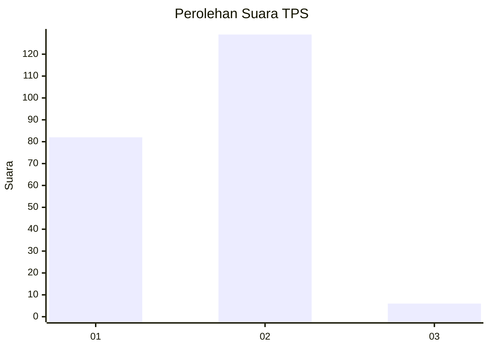
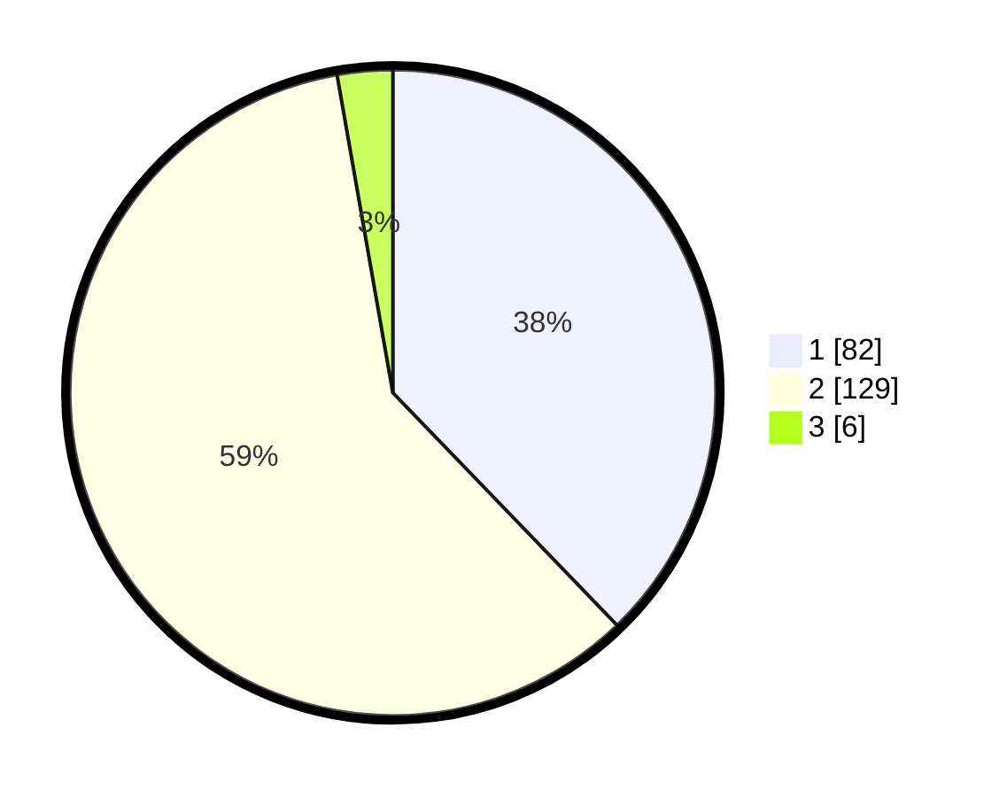

# Hasil

## Grafik

## Tabel

| No. | Nama Paslon    | Suara | Suara (raw) | Persentase |
|:--- |:-------------- | -----:| -----------:| ----------:|
| 1   | ANIES MUHAIMIN | 82    | [82][p-1]   | 37,79      |
| 2   | PRABOWO GIBRAN | 129   | [129][p-2]  | 59,45      |
| 3   | GANJAR MAHFUD  | 6     | [6][p-3]    | 2,76       |

[p-1]: https://github.com/gigit-pemilu/pemilu-2024-32-jawa-barat/blob/main/pilpres/hitung-suara/sub/32-jawa-barat/sub/05-garut/sub/12-cibatu/sub/2001-cibatu/sub/001-tps/sub/paslon-1.txt
[p-2]: https://github.com/gigit-pemilu/pemilu-2024-32-jawa-barat/blob/main/pilpres/hitung-suara/sub/32-jawa-barat/sub/05-garut/sub/12-cibatu/sub/2001-cibatu/sub/001-tps/sub/paslon-2.txt
[p-3]: https://github.com/gigit-pemilu/pemilu-2024-32-jawa-barat/blob/main/pilpres/hitung-suara/sub/32-jawa-barat/sub/05-garut/sub/12-cibatu/sub/2001-cibatu/sub/001-tps/sub/paslon-3.txt

## Foto C Plano

https://sirekap-obj-formc.kpu.go.id/114d/pemilu/ppwp/32/05/12/20/01/3205122001001-20240215-025347--faf3f536-4516-4f53-8dd6-a5bb2fc11b78.jpg

https://sirekap-obj-formc.kpu.go.id/114d/pemilu/ppwp/32/05/12/20/01/3205122001001-20240214-195214--b63b82c9-e844-4e6a-8b5d-b385ea3302c7.jpg

https://sirekap-obj-formc.kpu.go.id/114d/pemilu/ppwp/32/05/12/20/01/3205122001001-20240214-195357--fab2c469-8402-410d-832f-b7a24ced6ee5.jpg

## Metadata

| Key        | Value               |
| ---------- | ------------------- |
| Time Stamp | 2024-02-15 12:00:28 |

