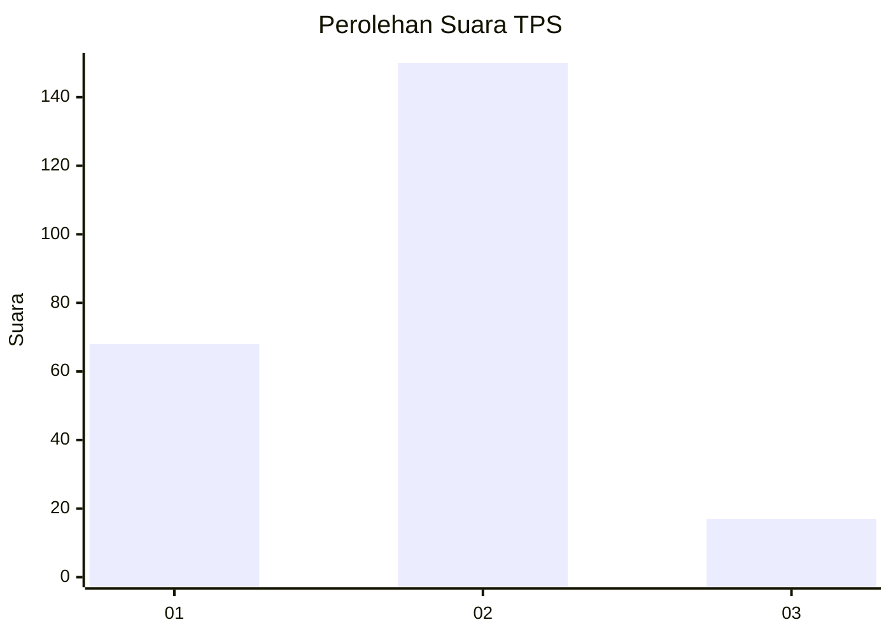
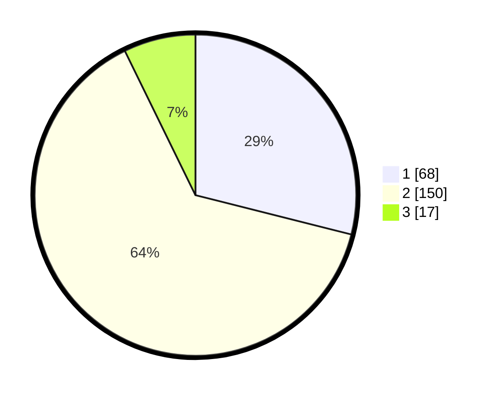

# Hasil

## Grafik

## Tabel

| No. | Nama Paslon    | Suara | Suara (raw) | Persentase |
|:--- |:-------------- | -----:| -----------:| ----------:|
| 1   | ANIES MUHAIMIN | 68    | [68][p-1]   | 28,94      |
| 2   | PRABOWO GIBRAN | 150   | [150][p-2]  | 63,83      |
| 3   | GANJAR MAHFUD  | 17    | [17][p-3]   | 7,23       |

[p-1]: https://github.com/gigit-pemilu/pemilu-2024/blob/main/pilpres/hitung-suara/sub/32-jawa-barat/sub/05-garut/sub/12-cibatu/sub/2001-cibatu/sub/006-tps/sub/paslon-1.txt
[p-2]: https://github.com/gigit-pemilu/pemilu-2024/blob/main/pilpres/hitung-suara/sub/32-jawa-barat/sub/05-garut/sub/12-cibatu/sub/2001-cibatu/sub/006-tps/sub/paslon-2.txt
[p-3]: https://github.com/gigit-pemilu/pemilu-2024/blob/main/pilpres/hitung-suara/sub/32-jawa-barat/sub/05-garut/sub/12-cibatu/sub/2001-cibatu/sub/006-tps/sub/paslon-3.txt

## Foto C Plano

https://sirekap-obj-formc.kpu.go.id/7e3c/pemilu/ppwp/32/05/12/20/01/3205122001006-20240214-155600--fac60a1b-2cde-4d89-b9fd-0b449b759f21.jpg

https://sirekap-obj-formc.kpu.go.id/7e3c/pemilu/ppwp/32/05/12/20/01/3205122001006-20240214-155426--dafdb072-d584-4f3c-9e8c-1529e75ac82b.jpg

https://sirekap-obj-formc.kpu.go.id/7e3c/pemilu/ppwp/32/05/12/20/01/3205122001006-20240214-155531--396bf3e1-a3f6-426b-9667-d44e4cf456d6.jpg

## Metadata

| Key        | Value               |
| ---------- | ------------------- |
| Time Stamp | 2024-02-15 15:00:29 |

