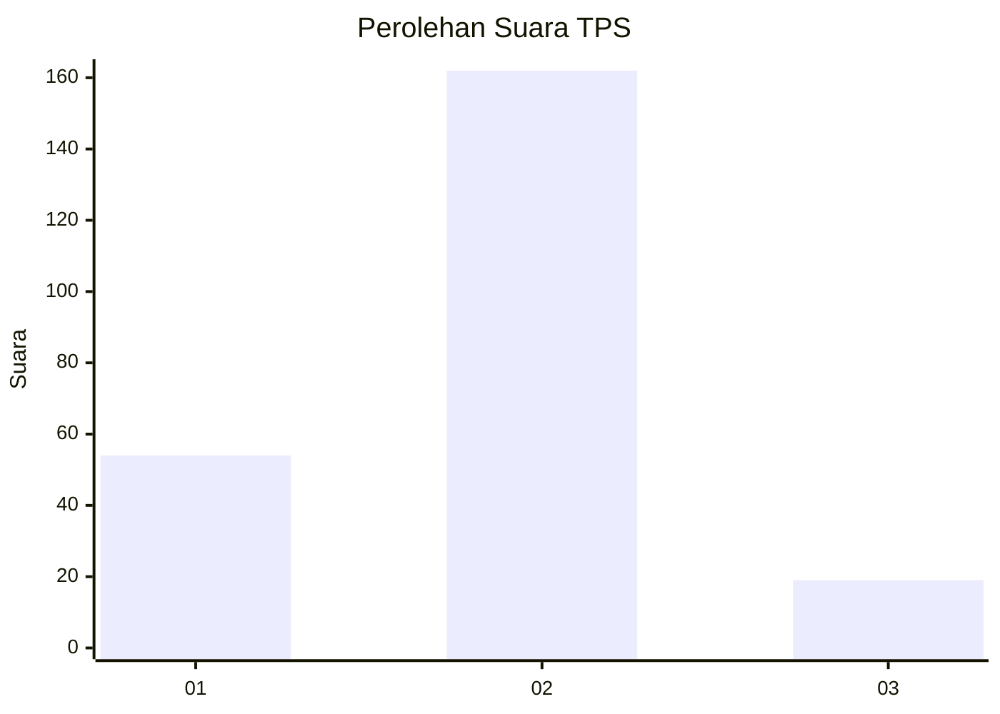
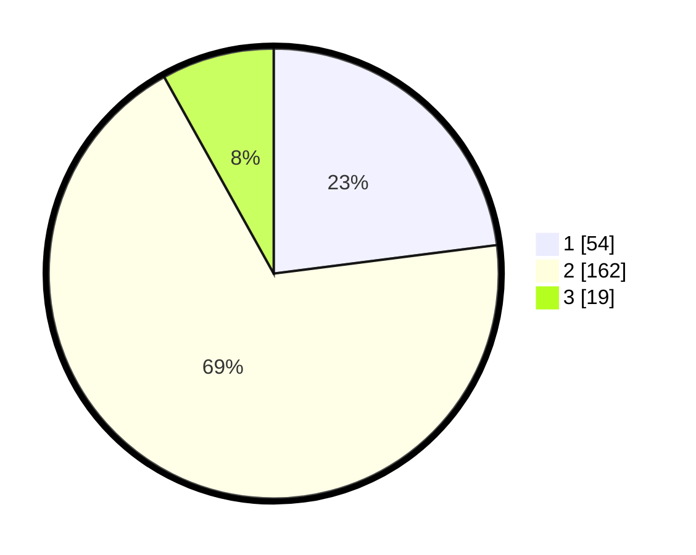

# Hasil

## Grafik

## Tabel

| No. | Nama Paslon    | Suara | Suara (raw) | Persentase |
|:--- |:-------------- | -----:| -----------:| ----------:|
| 1   | ANIES MUHAIMIN | 54    | [54][p-1]   | 22,98      |
| 2   | PRABOWO GIBRAN | 162   | [162][p-2]  | 68,94      |
| 3   | GANJAR MAHFUD  | 19    | [19][p-3]   | 8,09       |

[p-1]: https://github.com/gigit-pemilu/pemilu-2024/blob/main/pilpres/hitung-suara/sub/32-jawa-barat/sub/05-garut/sub/12-cibatu/sub/2004-sindangsuka/sub/010-tps/sub/paslon-1.txt
[p-2]: https://github.com/gigit-pemilu/pemilu-2024/blob/main/pilpres/hitung-suara/sub/32-jawa-barat/sub/05-garut/sub/12-cibatu/sub/2004-sindangsuka/sub/010-tps/sub/paslon-2.txt
[p-3]: https://github.com/gigit-pemilu/pemilu-2024/blob/main/pilpres/hitung-suara/sub/32-jawa-barat/sub/05-garut/sub/12-cibatu/sub/2004-sindangsuka/sub/010-tps/sub/paslon-3.txt

## Foto C Plano

https://sirekap-obj-formc.kpu.go.id/4a4a/pemilu/ppwp/32/05/12/20/04/3205122004010-20240214-235748--fa533ae5-000f-4a76-ad01-d8aaad83e62c.jpg

https://sirekap-obj-formc.kpu.go.id/4a4a/pemilu/ppwp/32/05/12/20/04/3205122004010-20240215-000002--f89a6923-e8c8-4f8c-a638-bf66f2181830.jpg

https://sirekap-obj-formc.kpu.go.id/4a4a/pemilu/ppwp/32/05/12/20/04/3205122004010-20240215-000034--7b315e0b-d8a0-4bff-982c-65859a01dc2f.jpg

## Metadata

| Key        | Value               |
| ---------- | ------------------- |
| Time Stamp | 2024-02-15 15:00:29 |

