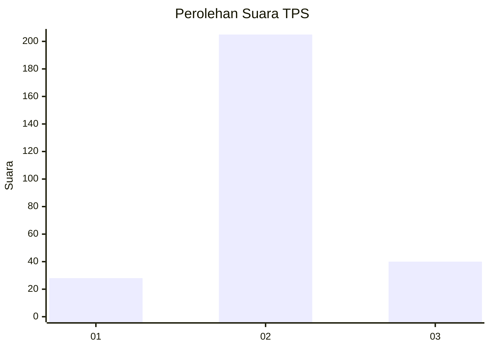

# Hasil

## Grafik

## Tabel

| No. | Nama Paslon    | Suara | Suara (raw) | Persentase |
|:--- |:-------------- | -----:| -----------:| ----------:|
| 1   | ANIES MUHAIMIN | 28    | [28][p-1]   | 10,26      |
| 2   | PRABOWO GIBRAN | 205   | [205][p-2]  | 75,09      |
| 3   | GANJAR MAHFUD  | 40    | [40][p-3]   | 14,65      |

[p-1]: https://github.com/gigit-pemilu/pemilu-2024-32-jawa-barat/blob/main/pilpres/hitung-suara/sub/32-jawa-barat/sub/05-garut/sub/12-cibatu/sub/2005-kertajaya/sub/013-tps/sub/paslon-1.txt
[p-2]: https://github.com/gigit-pemilu/pemilu-2024-32-jawa-barat/blob/main/pilpres/hitung-suara/sub/32-jawa-barat/sub/05-garut/sub/12-cibatu/sub/2005-kertajaya/sub/013-tps/sub/paslon-2.txt
[p-3]: https://github.com/gigit-pemilu/pemilu-2024-32-jawa-barat/blob/main/pilpres/hitung-suara/sub/32-jawa-barat/sub/05-garut/sub/12-cibatu/sub/2005-kertajaya/sub/013-tps/sub/paslon-3.txt

## Foto C Plano

https://sirekap-obj-formc.kpu.go.id/88cb/pemilu/ppwp/32/05/12/20/05/3205122005013-20240215-150627--930a7a1f-2100-4a65-bd5e-310c58fe1d0a.jpg

https://sirekap-obj-formc.kpu.go.id/88cb/pemilu/ppwp/32/05/12/20/05/3205122005013-20240215-150639--843b2090-1102-4618-a6ab-8a746783cf6a.jpg

https://sirekap-obj-formc.kpu.go.id/88cb/pemilu/ppwp/32/05/12/20/05/3205122005013-20240215-150646--bfbd2ec1-0512-439b-82f0-96f87004fc4b.jpg

## Metadata

| Key        | Value               |
| ---------- | ------------------- |
| Time Stamp | 2024-02-16 10:00:28 |

