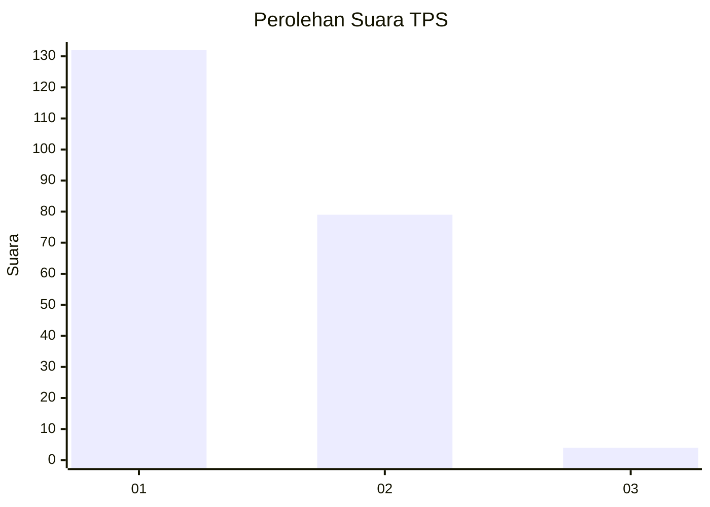
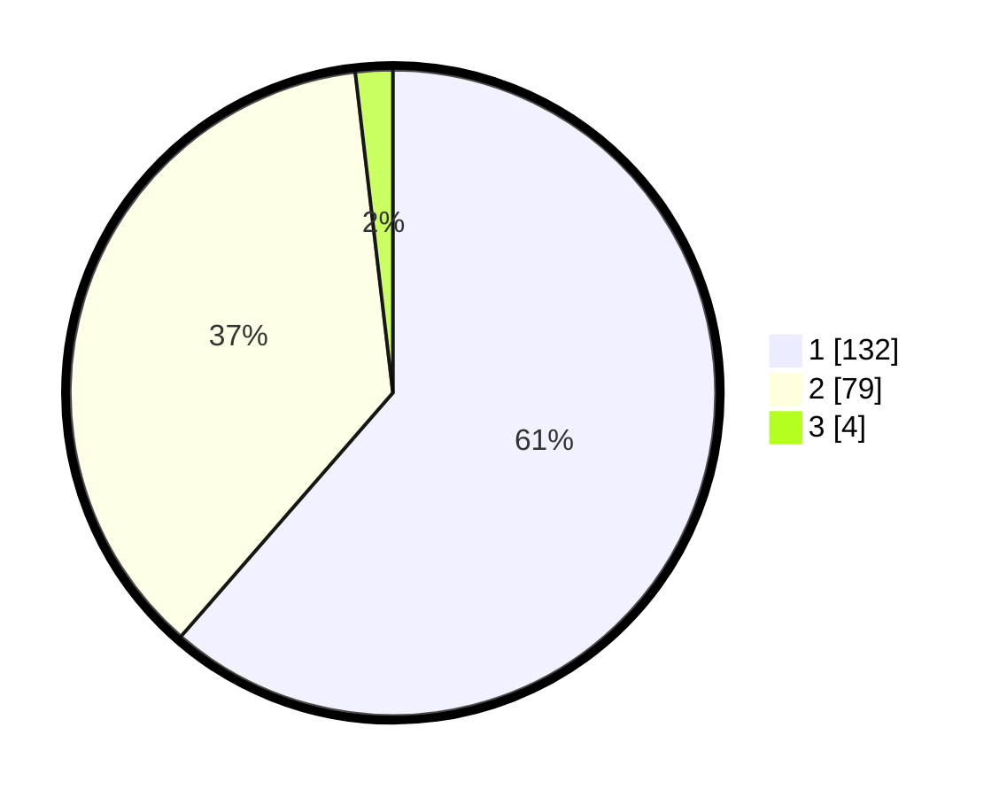

# Hasil

## Grafik

## Tabel

| No. | Nama Paslon    | Suara | Suara (raw) | Persentase |
|:--- |:-------------- | -----:| -----------:| ----------:|
| 1   | ANIES MUHAIMIN | 132   | [132][p-1]  | 61,40      |
| 2   | PRABOWO GIBRAN | 79    | [79][p-2]   | 36,74      |
| 3   | GANJAR MAHFUD  | 4     | [4][p-3]    | 1,86       |

[p-1]: https://github.com/gigit-pemilu/pemilu-2024-32-jawa-barat/blob/main/pilpres/hitung-suara/sub/32-jawa-barat/sub/05-garut/sub/13-kersamanah/sub/2001-kersamanah/sub/007-tps/sub/paslon-1.txt
[p-2]: https://github.com/gigit-pemilu/pemilu-2024-32-jawa-barat/blob/main/pilpres/hitung-suara/sub/32-jawa-barat/sub/05-garut/sub/13-kersamanah/sub/2001-kersamanah/sub/007-tps/sub/paslon-2.txt
[p-3]: https://github.com/gigit-pemilu/pemilu-2024-32-jawa-barat/blob/main/pilpres/hitung-suara/sub/32-jawa-barat/sub/05-garut/sub/13-kersamanah/sub/2001-kersamanah/sub/007-tps/sub/paslon-3.txt

## Foto C Plano

https://sirekap-obj-formc.kpu.go.id/7d6c/pemilu/ppwp/32/05/13/20/01/3205132001007-20240214-222630--77659445-3770-4447-97e5-51ff744e8cf3.jpg

https://sirekap-obj-formc.kpu.go.id/7d6c/pemilu/ppwp/32/05/13/20/01/3205132001007-20240214-222747--f0843591-659e-43b4-92ba-e2f03a82e8d4.jpg

https://sirekap-obj-formc.kpu.go.id/7d6c/pemilu/ppwp/32/05/13/20/01/3205132001007-20240214-222822--80398995-72f3-4d2f-8d77-a37f84d318cd.jpg

## Metadata

| Key        | Value               |
| ---------- | ------------------- |
| Time Stamp | 2024-02-19 06:16:00 |

