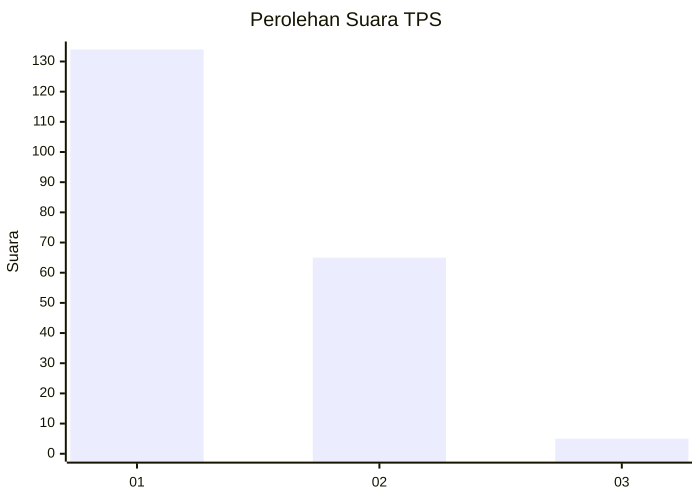
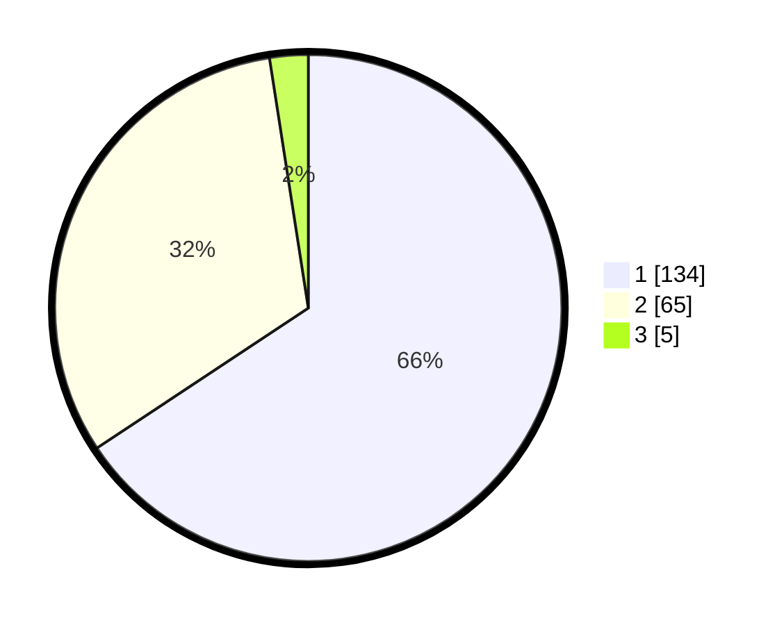

# Hasil

## Grafik

## Tabel

| No. | Nama Paslon    | Suara | Suara (raw) | Persentase |
|:--- |:-------------- | -----:| -----------:| ----------:|
| 1   | ANIES MUHAIMIN | 134   | [134][p-1]  | 65,69      |
| 2   | PRABOWO GIBRAN | 65    | [65][p-2]   | 31,86      |
| 3   | GANJAR MAHFUD  | 5     | [5][p-3]    | 2,45       |

[p-1]: https://github.com/gigit-pemilu/pemilu-2024/blob/main/pilpres/hitung-suara/sub/32-jawa-barat/sub/05-garut/sub/13-kersamanah/sub/2001-kersamanah/sub/025-tps/sub/paslon-1.txt
[p-2]: https://github.com/gigit-pemilu/pemilu-2024/blob/main/pilpres/hitung-suara/sub/32-jawa-barat/sub/05-garut/sub/13-kersamanah/sub/2001-kersamanah/sub/025-tps/sub/paslon-2.txt
[p-3]: https://github.com/gigit-pemilu/pemilu-2024/blob/main/pilpres/hitung-suara/sub/32-jawa-barat/sub/05-garut/sub/13-kersamanah/sub/2001-kersamanah/sub/025-tps/sub/paslon-3.txt

## Foto C Plano

https://sirekap-obj-formc.kpu.go.id/be5f/pemilu/ppwp/32/05/13/20/01/3205132001025-20240215-015037--e9698954-7d3c-42d2-a063-360c86ee9be4.jpg

https://sirekap-obj-formc.kpu.go.id/be5f/pemilu/ppwp/32/05/13/20/01/3205132001025-20240216-121802--56dd3472-4e56-4861-a456-6991058a706a.jpg

https://sirekap-obj-formc.kpu.go.id/be5f/pemilu/ppwp/32/05/13/20/01/3205132001025-20240214-193706--e904fc14-bfcf-4120-8450-94da3a37e006.jpg

## Metadata

| Key        | Value               |
| ---------- | ------------------- |
| Time Stamp | 2024-02-16 21:01:00 |

