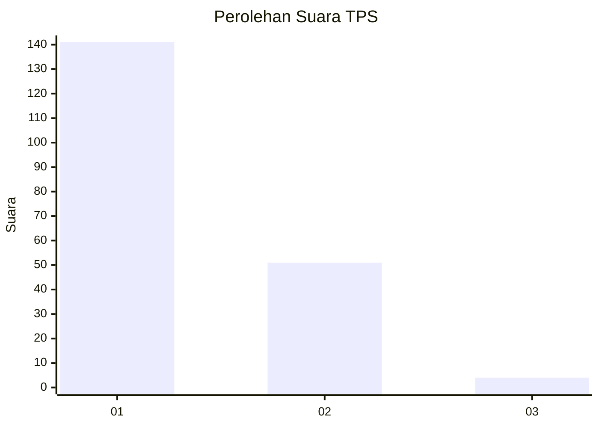
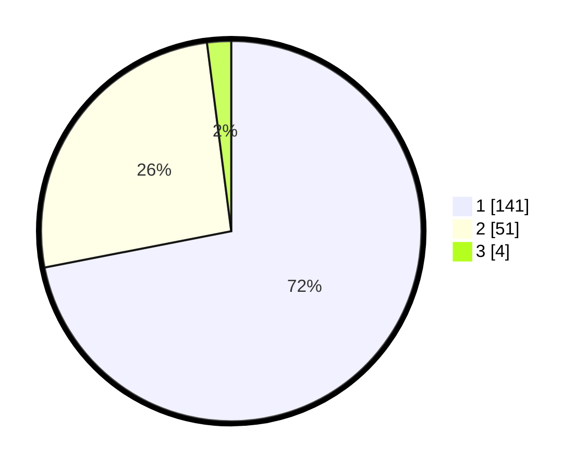

# Hasil

## Grafik

## Tabel

| No. | Nama Paslon    | Suara | Suara (raw) | Persentase |
|:--- |:-------------- | -----:| -----------:| ----------:|
| 1   | ANIES MUHAIMIN | 141   | [141][p-1]  | 71,94      |
| 2   | PRABOWO GIBRAN | 51    | [51][p-2]   | 26,02      |
| 3   | GANJAR MAHFUD  | 4     | [4][p-3]    | 2,04       |

[p-1]: https://github.com/gigit-pemilu/pemilu-2024-32-jawa-barat/blob/main/pilpres/hitung-suara/sub/32-jawa-barat/sub/05-garut/sub/13-kersamanah/sub/2006-mekarraya/sub/004-tps/sub/paslon-1.txt
[p-2]: https://github.com/gigit-pemilu/pemilu-2024-32-jawa-barat/blob/main/pilpres/hitung-suara/sub/32-jawa-barat/sub/05-garut/sub/13-kersamanah/sub/2006-mekarraya/sub/004-tps/sub/paslon-2.txt
[p-3]: https://github.com/gigit-pemilu/pemilu-2024-32-jawa-barat/blob/main/pilpres/hitung-suara/sub/32-jawa-barat/sub/05-garut/sub/13-kersamanah/sub/2006-mekarraya/sub/004-tps/sub/paslon-3.txt

## Foto C Plano

https://sirekap-obj-formc.kpu.go.id/1247/pemilu/ppwp/32/05/13/20/06/3205132006004-20240215-011550--5160b0d6-7948-4146-9f54-a662537f9077.jpg

https://sirekap-obj-formc.kpu.go.id/1247/pemilu/ppwp/32/05/13/20/06/3205132006004-20240215-012112--a15ad953-e122-450e-9b2e-194b113783cb.jpg

https://sirekap-obj-formc.kpu.go.id/1247/pemilu/ppwp/32/05/13/20/06/3205132006004-20240215-011917--8aa513ec-d7c3-4dfa-bcb7-689d95dfa623.jpg

## Metadata

| Key        | Value               |
| ---------- | ------------------- |
| Time Stamp | 2024-02-24 22:31:28 |

