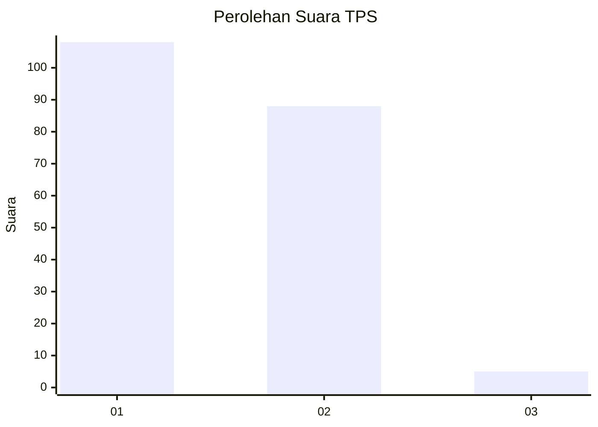
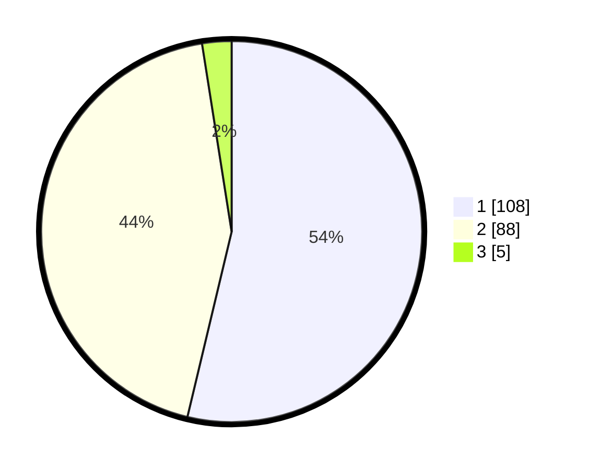

# Hasil

## Grafik

## Tabel

| No. | Nama Paslon    | Suara | Suara (raw) | Persentase |
|:--- |:-------------- | -----:| -----------:| ----------:|
| 1   | ANIES MUHAIMIN | 108   | [108][p-1]  | 53,73      |
| 2   | PRABOWO GIBRAN | 88    | [88][p-2]   | 43,78      |
| 3   | GANJAR MAHFUD  | 5     | [5][p-3]    | 2,49       |

[p-1]: https://github.com/gigit-pemilu/pemilu-2024/blob/main/pilpres/hitung-suara/sub/32-jawa-barat/sub/05-garut/sub/14-malangbong/sub/2001-malangbong/sub/005-tps/sub/paslon-1.txt
[p-2]: https://github.com/gigit-pemilu/pemilu-2024/blob/main/pilpres/hitung-suara/sub/32-jawa-barat/sub/05-garut/sub/14-malangbong/sub/2001-malangbong/sub/005-tps/sub/paslon-2.txt
[p-3]: https://github.com/gigit-pemilu/pemilu-2024/blob/main/pilpres/hitung-suara/sub/32-jawa-barat/sub/05-garut/sub/14-malangbong/sub/2001-malangbong/sub/005-tps/sub/paslon-3.txt

## Foto C Plano

https://sirekap-obj-formc.kpu.go.id/c0c1/pemilu/ppwp/32/05/14/20/01/3205142001005-20240214-192951--3e7a1fae-4b23-4f00-8feb-b9cd6aba6a6a.jpg

https://sirekap-obj-formc.kpu.go.id/c0c1/pemilu/ppwp/32/05/14/20/01/3205142001005-20240214-193014--aadbb6aa-4766-49ac-96a6-71250630e864.jpg

https://sirekap-obj-formc.kpu.go.id/c0c1/pemilu/ppwp/32/05/14/20/01/3205142001005-20240214-193058--fd48babc-42b1-4840-8278-444b35daee11.jpg

## Metadata

| Key        | Value               |
| ---------- | ------------------- |
| Time Stamp | 2024-02-16 22:01:00 |

