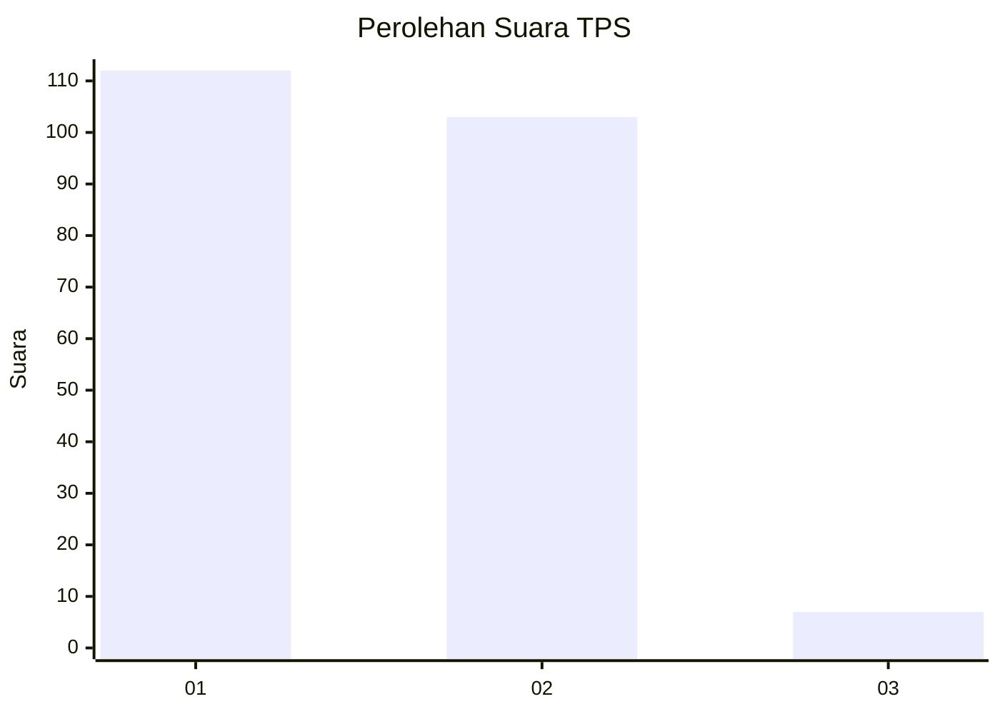
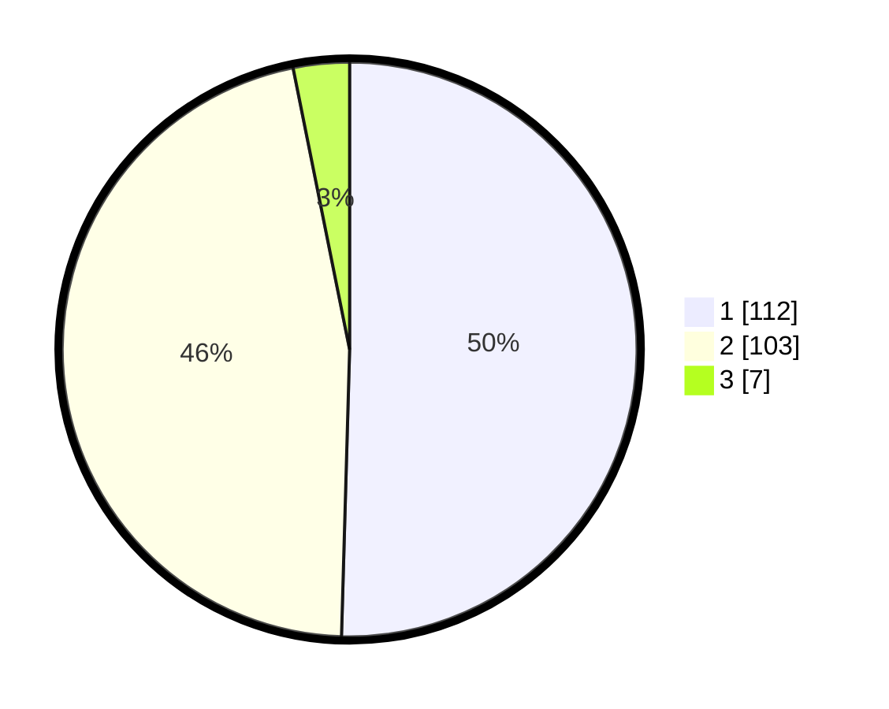

# Hasil

## Grafik

## Tabel

| No. | Nama Paslon    | Suara | Suara (raw) | Persentase |
|:--- |:-------------- | -----:| -----------:| ----------:|
| 1   | ANIES MUHAIMIN | 112   | [112][p-1]  | 50,45      |
| 2   | PRABOWO GIBRAN | 103   | [103][p-2]  | 46,40      |
| 3   | GANJAR MAHFUD  | 7     | [7][p-3]    | 3,15       |

[p-1]: https://github.com/gigit-pemilu/pemilu-2024/blob/main/pilpres/hitung-suara/sub/32-jawa-barat/sub/05-garut/sub/14-malangbong/sub/2001-malangbong/sub/011-tps/sub/paslon-1.txt
[p-2]: https://github.com/gigit-pemilu/pemilu-2024/blob/main/pilpres/hitung-suara/sub/32-jawa-barat/sub/05-garut/sub/14-malangbong/sub/2001-malangbong/sub/011-tps/sub/paslon-2.txt
[p-3]: https://github.com/gigit-pemilu/pemilu-2024/blob/main/pilpres/hitung-suara/sub/32-jawa-barat/sub/05-garut/sub/14-malangbong/sub/2001-malangbong/sub/011-tps/sub/paslon-3.txt

## Foto C Plano

https://sirekap-obj-formc.kpu.go.id/49a2/pemilu/ppwp/32/05/14/20/01/3205142001011-20240219-192209--5fe82bde-2331-4885-b056-aff1bc81e8a5.jpg

https://sirekap-obj-formc.kpu.go.id/49a2/pemilu/ppwp/32/05/14/20/01/3205142001011-20240219-192527--7f6276db-2ed9-4a18-90c0-91a1cfe8c656.jpg

https://sirekap-obj-formc.kpu.go.id/49a2/pemilu/ppwp/32/05/14/20/01/3205142001011-20240219-191805--66a9711c-8235-4c30-884f-69fcc64df568.jpg

## Metadata

| Key        | Value               |
| ---------- | ------------------- |
| Time Stamp | 2024-02-20 18:00:00 |

