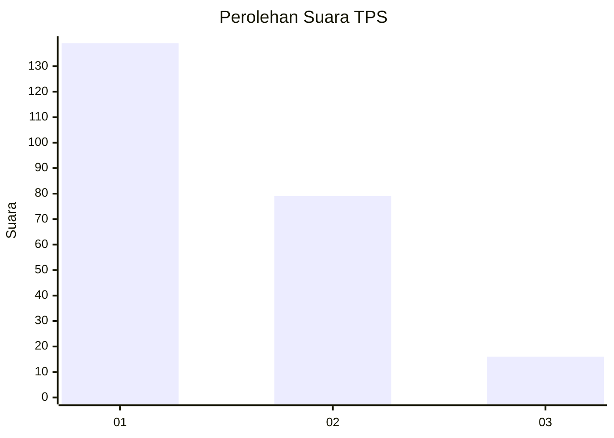
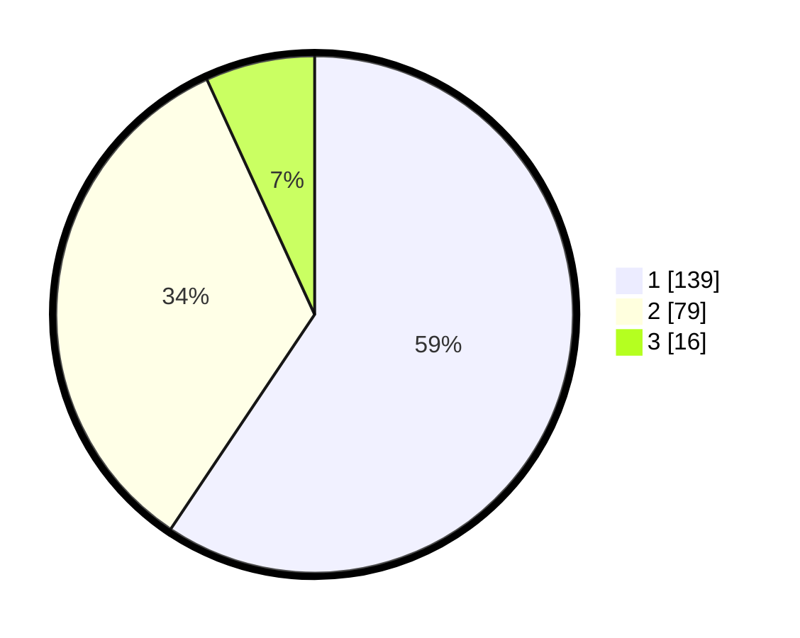

# Hasil

## Grafik

## Tabel

| No. | Nama Paslon    | Suara | Suara (raw) | Persentase |
|:--- |:-------------- | -----:| -----------:| ----------:|
| 1   | ANIES MUHAIMIN | 139   | [139][p-1]  | 59,40      |
| 2   | PRABOWO GIBRAN | 79    | [79][p-2]   | 33,76      |
| 3   | GANJAR MAHFUD  | 16    | [16][p-3]   | 6,84       |

[p-1]: https://github.com/gigit-pemilu/pemilu-2024-32-jawa-barat/blob/main/pilpres/hitung-suara/sub/32-jawa-barat/sub/05-garut/sub/14-malangbong/sub/2013-sukaratu/sub/001-tps/sub/paslon-1.txt
[p-2]: https://github.com/gigit-pemilu/pemilu-2024-32-jawa-barat/blob/main/pilpres/hitung-suara/sub/32-jawa-barat/sub/05-garut/sub/14-malangbong/sub/2013-sukaratu/sub/001-tps/sub/paslon-2.txt
[p-3]: https://github.com/gigit-pemilu/pemilu-2024-32-jawa-barat/blob/main/pilpres/hitung-suara/sub/32-jawa-barat/sub/05-garut/sub/14-malangbong/sub/2013-sukaratu/sub/001-tps/sub/paslon-3.txt

## Foto C Plano

https://sirekap-obj-formc.kpu.go.id/f409/pemilu/ppwp/32/05/14/20/13/3205142013001-20240219-155931--cff4c0de-b09d-4c56-9530-d4f88222a836.jpg

https://sirekap-obj-formc.kpu.go.id/f409/pemilu/ppwp/32/05/14/20/13/3205142013001-20240219-155238--e352abf8-e813-413b-9b3e-a980fb47480c.jpg

https://sirekap-obj-formc.kpu.go.id/f409/pemilu/ppwp/32/05/14/20/13/3205142013001-20240219-155444--0c675163-70f6-4fd6-8117-928d4d0185f3.jpg

## Metadata

| Key        | Value               |
| ---------- | ------------------- |
| Time Stamp | 2024-02-20 19:00:00 |

