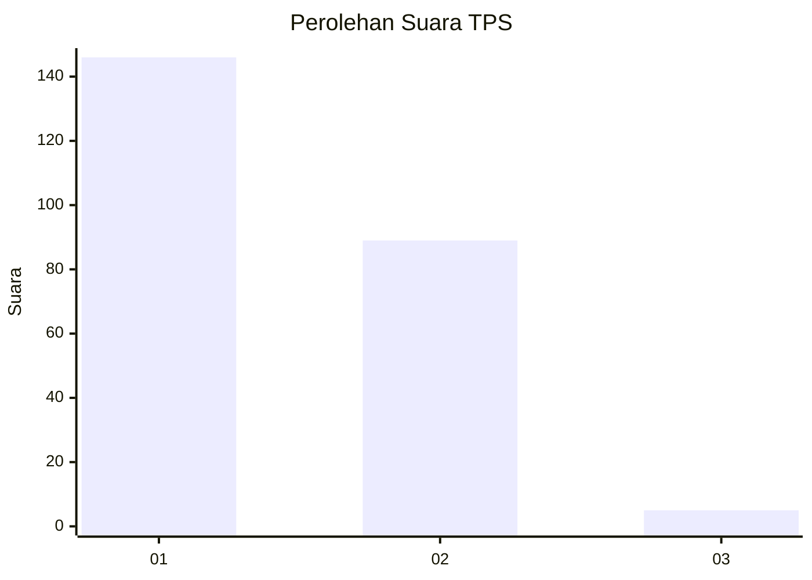
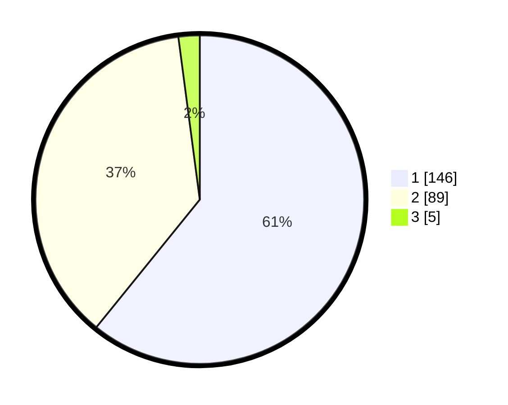

# Hasil

## Grafik

## Tabel

| No. | Nama Paslon    | Suara | Suara (raw) | Persentase |
|:--- |:-------------- | -----:| -----------:| ----------:|
| 1   | ANIES MUHAIMIN | 146   | [146][p-1]  | 60,83      |
| 2   | PRABOWO GIBRAN | 89    | [89][p-2]   | 37,08      |
| 3   | GANJAR MAHFUD  | 5     | [5][p-3]    | 2,08       |

[p-1]: https://github.com/gigit-pemilu/pemilu-2024/blob/main/pilpres/hitung-suara/sub/32-jawa-barat/sub/05-garut/sub/14-malangbong/sub/2013-sukaratu/sub/003-tps/sub/paslon-1.txt
[p-2]: https://github.com/gigit-pemilu/pemilu-2024/blob/main/pilpres/hitung-suara/sub/32-jawa-barat/sub/05-garut/sub/14-malangbong/sub/2013-sukaratu/sub/003-tps/sub/paslon-2.txt
[p-3]: https://github.com/gigit-pemilu/pemilu-2024/blob/main/pilpres/hitung-suara/sub/32-jawa-barat/sub/05-garut/sub/14-malangbong/sub/2013-sukaratu/sub/003-tps/sub/paslon-3.txt

## Foto C Plano

https://sirekap-obj-formc.kpu.go.id/5e30/pemilu/ppwp/32/05/14/20/13/3205142013003-20240219-172239--b8c9e70f-dd3e-4989-9914-e619ca56e4dd.jpg

https://sirekap-obj-formc.kpu.go.id/5e30/pemilu/ppwp/32/05/14/20/13/3205142013003-20240219-172244--d98a783c-a540-40e1-9cca-e434034d972b.jpg

https://sirekap-obj-formc.kpu.go.id/5e30/pemilu/ppwp/32/05/14/20/13/3205142013003-20240219-172247--d33fd2a3-f2f2-4e94-8d80-7cbc61fec959.jpg

## Metadata

| Key        | Value               |
| ---------- | ------------------- |
| Time Stamp | 2024-02-20 18:00:00 |

