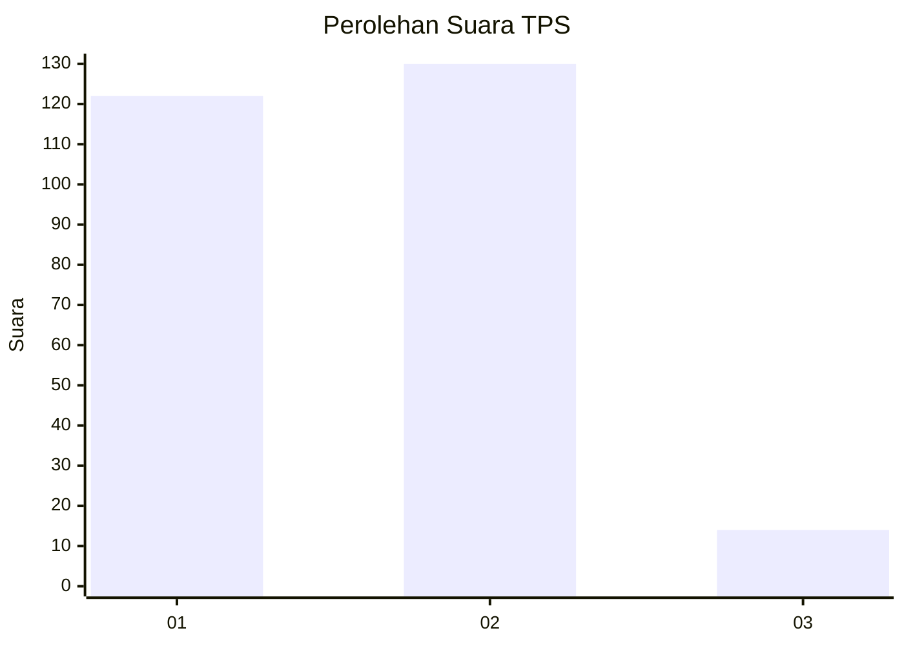
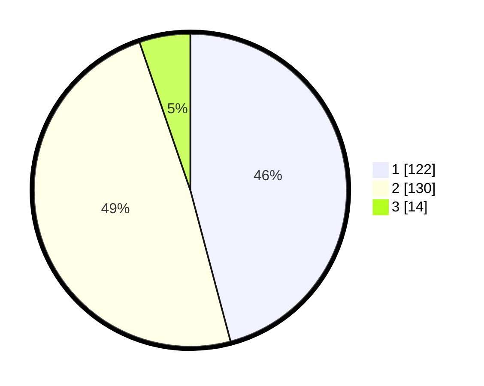

# Hasil

## Grafik

## Tabel

| No. | Nama Paslon    | Suara | Suara (raw) | Persentase |
|:--- |:-------------- | -----:| -----------:| ----------:|
| 1   | ANIES MUHAIMIN | 122   | [122][p-1]  | 45,86      |
| 2   | PRABOWO GIBRAN | 130   | [130][p-2]  | 48,87      |
| 3   | GANJAR MAHFUD  | 14    | [14][p-3]   | 5,26       |

[p-1]: https://github.com/gigit-pemilu/pemilu-2024/blob/main/pilpres/hitung-suara/sub/32-jawa-barat/sub/05-garut/sub/14-malangbong/sub/2023-mekarmulya/sub/004-tps/sub/paslon-1.txt
[p-2]: https://github.com/gigit-pemilu/pemilu-2024/blob/main/pilpres/hitung-suara/sub/32-jawa-barat/sub/05-garut/sub/14-malangbong/sub/2023-mekarmulya/sub/004-tps/sub/paslon-2.txt
[p-3]: https://github.com/gigit-pemilu/pemilu-2024/blob/main/pilpres/hitung-suara/sub/32-jawa-barat/sub/05-garut/sub/14-malangbong/sub/2023-mekarmulya/sub/004-tps/sub/paslon-3.txt

## Foto C Plano

https://sirekap-obj-formc.kpu.go.id/e098/pemilu/ppwp/32/05/14/20/23/3205142023004-20240219-181339--53c12ab4-1d05-4d2a-aa55-ce96f1c152b5.jpg

https://sirekap-obj-formc.kpu.go.id/e098/pemilu/ppwp/32/05/14/20/23/3205142023004-20240219-181618--67f80a47-b95e-4790-906f-c8432873d70d.jpg

https://sirekap-obj-formc.kpu.go.id/e098/pemilu/ppwp/32/05/14/20/23/3205142023004-20240219-162128--58510771-6f07-474e-bf15-a31a8ed2212a.jpg

## Metadata

| Key        | Value               |
| ---------- | ------------------- |
| Time Stamp | 2024-02-20 19:00:00 |

