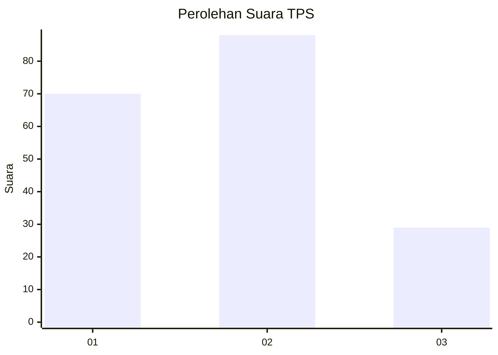
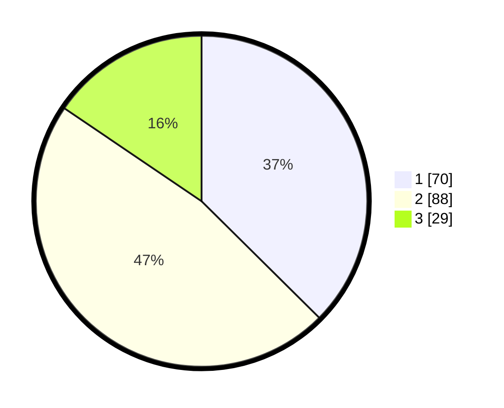

# Hasil

## Grafik

## Tabel

| No. | Nama Paslon    | Suara | Suara (raw) | Persentase |
|:--- |:-------------- | -----:| -----------:| ----------:|
| 1   | ANIES MUHAIMIN | 70    | [70][p-1]   | 37,43      |
| 2   | PRABOWO GIBRAN | 88    | [88][p-2]   | 47,06      |
| 3   | GANJAR MAHFUD  | 29    | [29][p-3]   | 15,51      |

[p-1]: https://github.com/gigit-pemilu/pemilu-2024/blob/main/pilpres/hitung-suara/sub/32-jawa-barat/sub/05-garut/sub/15-sukawening/sub/2001-sukawening/sub/004-tps/sub/paslon-1.txt
[p-2]: https://github.com/gigit-pemilu/pemilu-2024/blob/main/pilpres/hitung-suara/sub/32-jawa-barat/sub/05-garut/sub/15-sukawening/sub/2001-sukawening/sub/004-tps/sub/paslon-2.txt
[p-3]: https://github.com/gigit-pemilu/pemilu-2024/blob/main/pilpres/hitung-suara/sub/32-jawa-barat/sub/05-garut/sub/15-sukawening/sub/2001-sukawening/sub/004-tps/sub/paslon-3.txt

## Foto C Plano

https://sirekap-obj-formc.kpu.go.id/b29d/pemilu/ppwp/32/05/15/20/01/3205152001004-20240215-014755--11f0643c-2e04-46b7-8903-ef737657fded.jpg

https://sirekap-obj-formc.kpu.go.id/b29d/pemilu/ppwp/32/05/15/20/01/3205152001004-20240215-065228--12339473-d140-4785-8d03-f204526b6714.jpg

https://sirekap-obj-formc.kpu.go.id/b29d/pemilu/ppwp/32/05/15/20/01/3205152001004-20240215-065335--36ef8a32-e0a2-4239-9652-d6064729248f.jpg

## Metadata

| Key        | Value               |
| ---------- | ------------------- |
| Time Stamp | 2024-02-15 21:30:27 |

