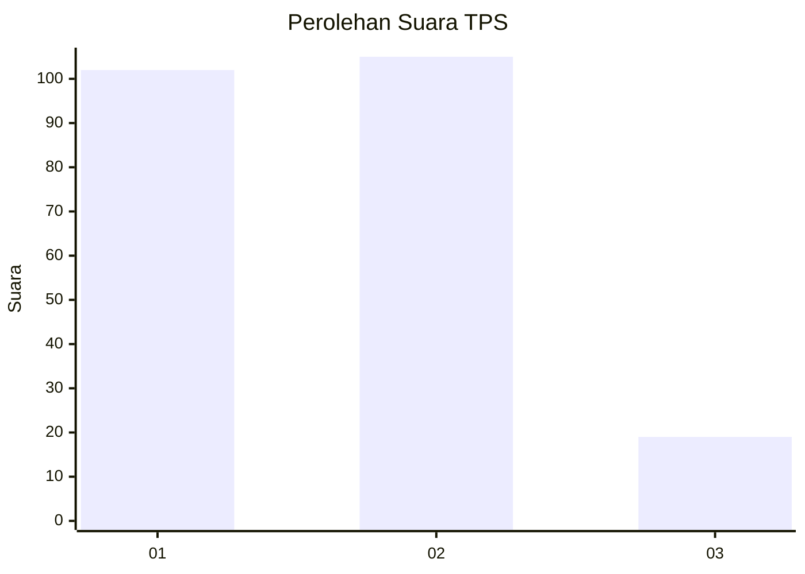
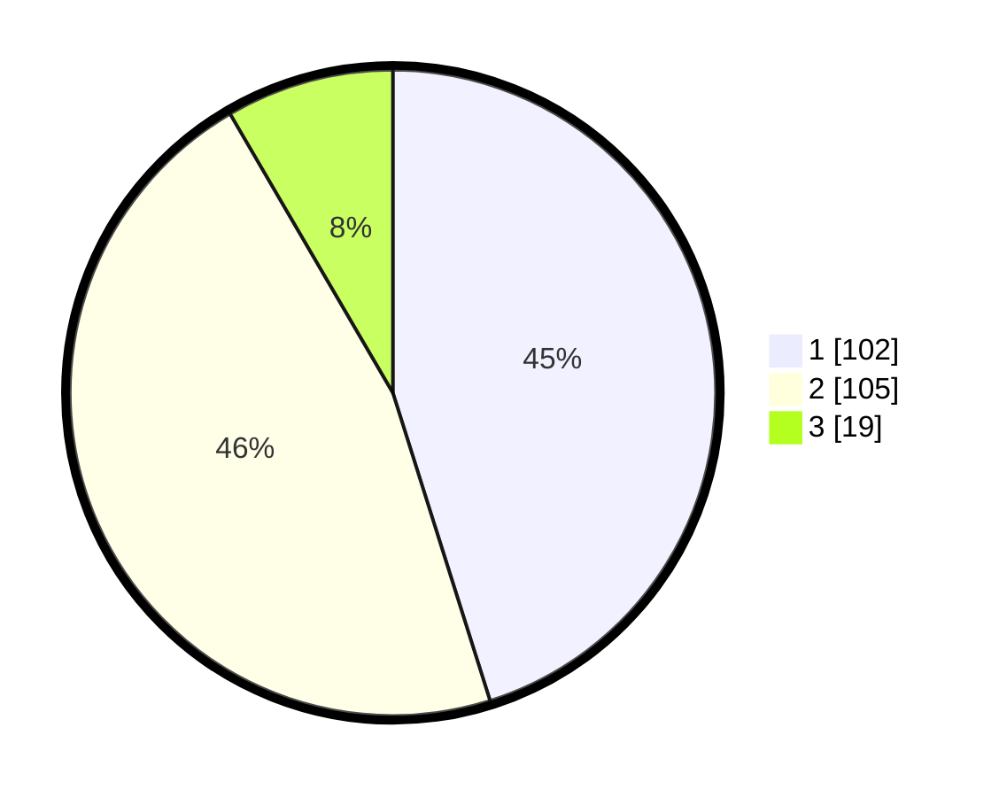

# Hasil

## Grafik

## Tabel

| No. | Nama Paslon    | Suara | Suara (raw) | Persentase |
|:--- |:-------------- | -----:| -----------:| ----------:|
| 1   | ANIES MUHAIMIN | 102   | [102][p-1]  | 45,13      |
| 2   | PRABOWO GIBRAN | 105   | [105][p-2]  | 46,46      |
| 3   | GANJAR MAHFUD  | 19    | [19][p-3]   | 8,41       |

[p-1]: https://github.com/gigit-pemilu/pemilu-2024/blob/main/pilpres/hitung-suara/sub/32-jawa-barat/sub/05-garut/sub/15-sukawening/sub/2001-sukawening/sub/006-tps/sub/paslon-1.txt
[p-2]: https://github.com/gigit-pemilu/pemilu-2024/blob/main/pilpres/hitung-suara/sub/32-jawa-barat/sub/05-garut/sub/15-sukawening/sub/2001-sukawening/sub/006-tps/sub/paslon-2.txt
[p-3]: https://github.com/gigit-pemilu/pemilu-2024/blob/main/pilpres/hitung-suara/sub/32-jawa-barat/sub/05-garut/sub/15-sukawening/sub/2001-sukawening/sub/006-tps/sub/paslon-3.txt

## Foto C Plano

https://sirekap-obj-formc.kpu.go.id/fb05/pemilu/ppwp/32/05/15/20/01/3205152001006-20240215-032404--43c115d1-eb6d-436d-9f54-42570569cb7a.jpg

https://sirekap-obj-formc.kpu.go.id/fb05/pemilu/ppwp/32/05/15/20/01/3205152001006-20240215-032740--a6bfe761-886e-469d-bab8-727bf945d7c4.jpg

https://sirekap-obj-formc.kpu.go.id/fb05/pemilu/ppwp/32/05/15/20/01/3205152001006-20240215-033013--9f734ea3-cae8-4f1f-854c-c207a7e31ec9.jpg

## Metadata

| Key        | Value               |
| ---------- | ------------------- |
| Time Stamp | 2024-02-15 21:30:27 |

