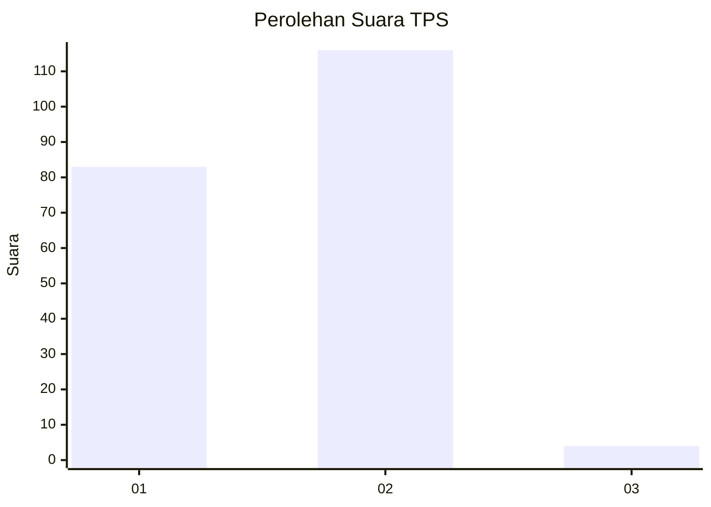
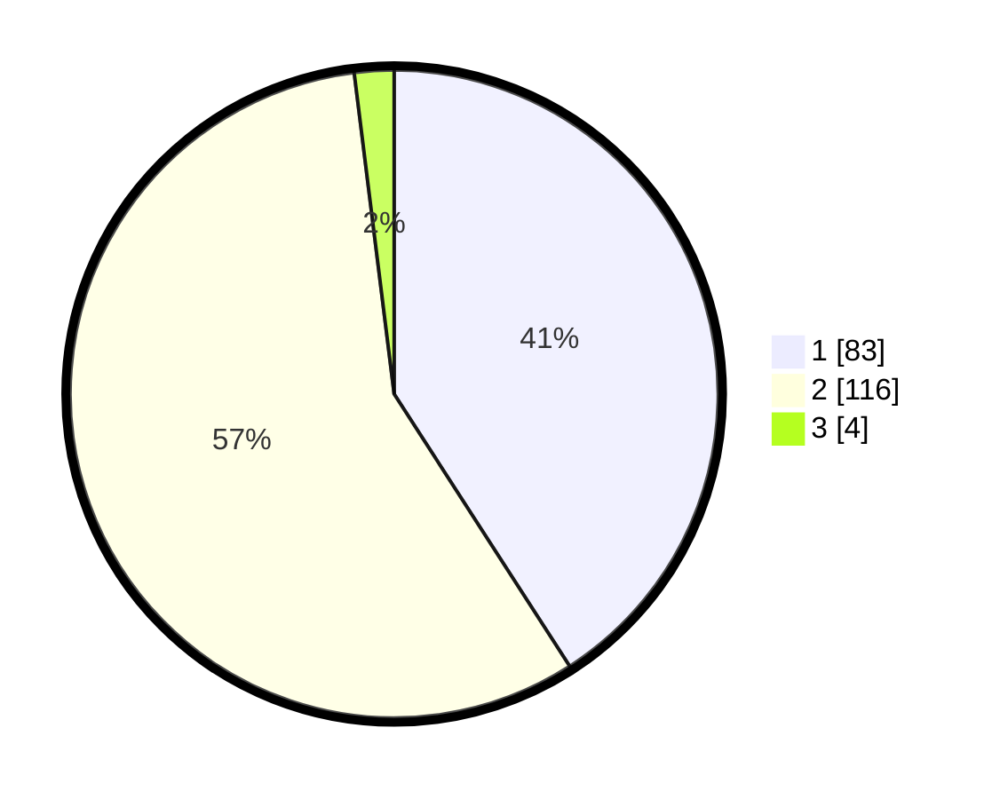

# Hasil

## Grafik

## Tabel

| No. | Nama Paslon    | Suara | Suara (raw) | Persentase |
|:--- |:-------------- | -----:| -----------:| ----------:|
| 1   | ANIES MUHAIMIN | 83    | [83][p-1]   | 40,89      |
| 2   | PRABOWO GIBRAN | 116   | [116][p-2]  | 57,14      |
| 3   | GANJAR MAHFUD  | 4     | [4][p-3]    | 1,97       |

[p-1]: https://github.com/gigit-pemilu/pemilu-2024-32-jawa-barat/blob/main/pilpres/hitung-suara/sub/32-jawa-barat/sub/05-garut/sub/16-karangtengah/sub/2001-caringin/sub/001-tps/sub/paslon-1.txt
[p-2]: https://github.com/gigit-pemilu/pemilu-2024-32-jawa-barat/blob/main/pilpres/hitung-suara/sub/32-jawa-barat/sub/05-garut/sub/16-karangtengah/sub/2001-caringin/sub/001-tps/sub/paslon-2.txt
[p-3]: https://github.com/gigit-pemilu/pemilu-2024-32-jawa-barat/blob/main/pilpres/hitung-suara/sub/32-jawa-barat/sub/05-garut/sub/16-karangtengah/sub/2001-caringin/sub/001-tps/sub/paslon-3.txt

## Foto C Plano

https://sirekap-obj-formc.kpu.go.id/44cb/pemilu/ppwp/32/05/16/20/01/3205162001001-20240214-231500--328c5952-eec6-481f-9ae6-be49b2f02fb9.jpg

https://sirekap-obj-formc.kpu.go.id/44cb/pemilu/ppwp/32/05/16/20/01/3205162001001-20240214-231737--fd8a07cf-cbf2-478b-8759-72facba3ec17.jpg

https://sirekap-obj-formc.kpu.go.id/44cb/pemilu/ppwp/32/05/16/20/01/3205162001001-20240215-041151--f4d00848-0b47-4ed4-bbf4-272f8f57cac2.jpg

## Metadata

| Key        | Value               |
| ---------- | ------------------- |
| Time Stamp | 2024-02-15 15:00:29 |

