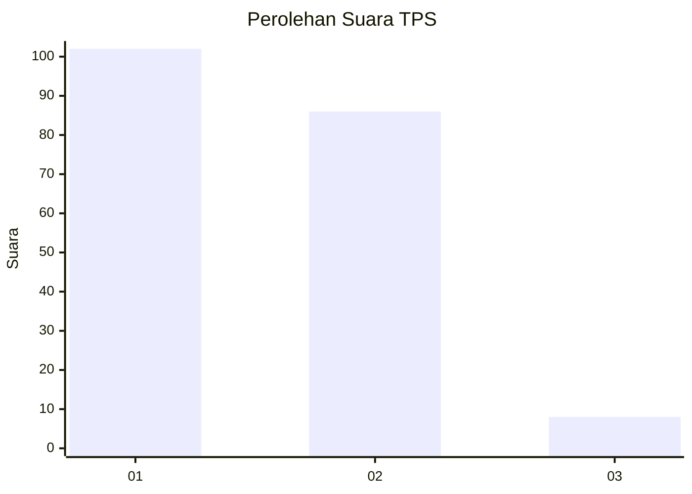
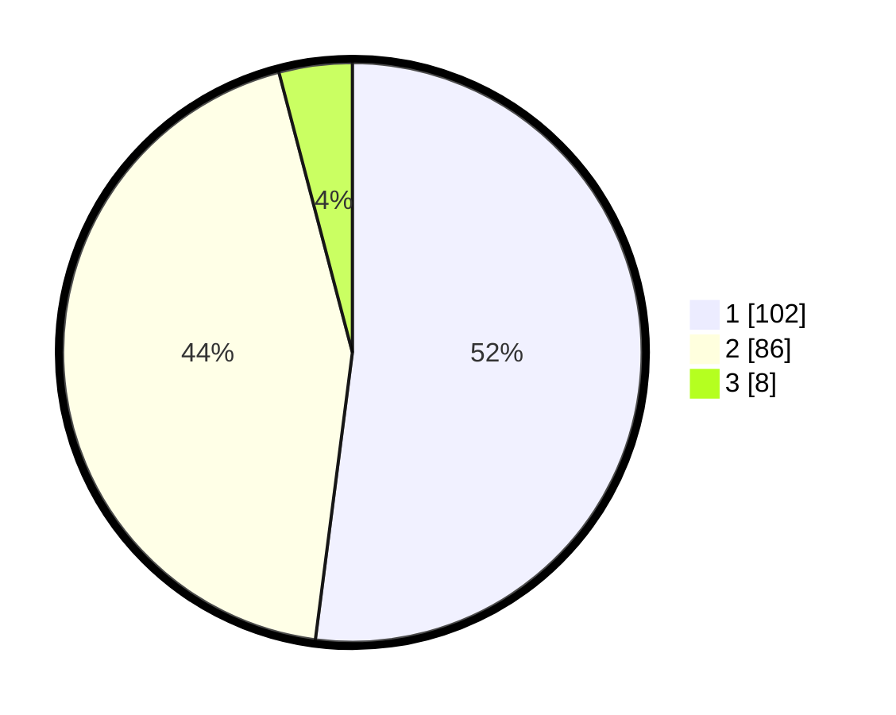

# Hasil

## Grafik

## Tabel

| No. | Nama Paslon    | Suara | Suara (raw) | Persentase |
|:--- |:-------------- | -----:| -----------:| ----------:|
| 1   | ANIES MUHAIMIN | 102   | [102][p-1]  | 52,04      |
| 2   | PRABOWO GIBRAN | 86    | [86][p-2]   | 43,88      |
| 3   | GANJAR MAHFUD  | 8     | [8][p-3]    | 4,08       |

[p-1]: https://github.com/gigit-pemilu/pemilu-2024/blob/main/pilpres/hitung-suara/sub/32-jawa-barat/sub/05-garut/sub/16-karangtengah/sub/2001-caringin/sub/003-tps/sub/paslon-1.txt
[p-2]: https://github.com/gigit-pemilu/pemilu-2024/blob/main/pilpres/hitung-suara/sub/32-jawa-barat/sub/05-garut/sub/16-karangtengah/sub/2001-caringin/sub/003-tps/sub/paslon-2.txt
[p-3]: https://github.com/gigit-pemilu/pemilu-2024/blob/main/pilpres/hitung-suara/sub/32-jawa-barat/sub/05-garut/sub/16-karangtengah/sub/2001-caringin/sub/003-tps/sub/paslon-3.txt

## Foto C Plano

https://sirekap-obj-formc.kpu.go.id/8653/pemilu/ppwp/32/05/16/20/01/3205162001003-20240215-013428--cfe3e9eb-ff28-4aa2-8b71-6af5604be7aa.jpg

https://sirekap-obj-formc.kpu.go.id/8653/pemilu/ppwp/32/05/16/20/01/3205162001003-20240215-013715--e6bf784f-45c6-4f2c-a768-533dc65cba63.jpg

https://sirekap-obj-formc.kpu.go.id/8653/pemilu/ppwp/32/05/16/20/01/3205162001003-20240215-013857--02199da6-400e-4692-8eca-b998018c8602.jpg

## Metadata

| Key        | Value               |
| ---------- | ------------------- |
| Time Stamp | 2024-02-16 16:25:10 |

