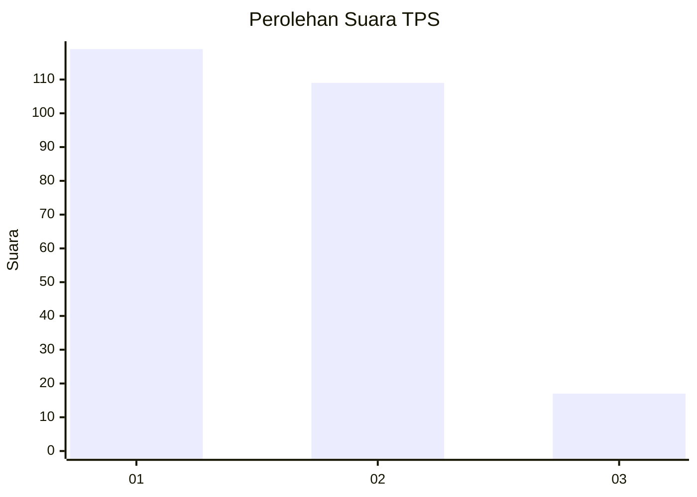
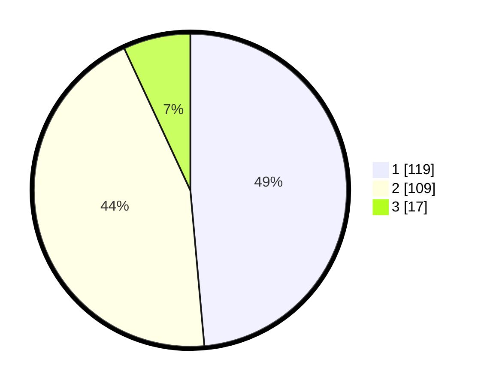

# Hasil

## Grafik

## Tabel

| No. | Nama Paslon    | Suara | Suara (raw) | Persentase |
|:--- |:-------------- | -----:| -----------:| ----------:|
| 1   | ANIES MUHAIMIN | 119   | [119][p-1]  | 48,57      |
| 2   | PRABOWO GIBRAN | 109   | [109][p-2]  | 44,49      |
| 3   | GANJAR MAHFUD  | 17    | [17][p-3]   | 6,94       |

[p-1]: https://github.com/gigit-pemilu/pemilu-2024-32-jawa-barat/blob/main/pilpres/hitung-suara/sub/32-jawa-barat/sub/05-garut/sub/17-bayongbong/sub/2001-bayongbong/sub/001-tps/sub/paslon-1.txt
[p-2]: https://github.com/gigit-pemilu/pemilu-2024-32-jawa-barat/blob/main/pilpres/hitung-suara/sub/32-jawa-barat/sub/05-garut/sub/17-bayongbong/sub/2001-bayongbong/sub/001-tps/sub/paslon-2.txt
[p-3]: https://github.com/gigit-pemilu/pemilu-2024-32-jawa-barat/blob/main/pilpres/hitung-suara/sub/32-jawa-barat/sub/05-garut/sub/17-bayongbong/sub/2001-bayongbong/sub/001-tps/sub/paslon-3.txt

## Foto C Plano

https://sirekap-obj-formc.kpu.go.id/69df/pemilu/ppwp/32/05/17/20/01/3205172001001-20240215-010343--22a14e05-d0da-43f4-b576-8fac1eba248c.jpg

https://sirekap-obj-formc.kpu.go.id/69df/pemilu/ppwp/32/05/17/20/01/3205172001001-20240215-010350--7a702cb7-ca2c-4b8f-bbc1-443e1934cfbd.jpg

https://sirekap-obj-formc.kpu.go.id/69df/pemilu/ppwp/32/05/17/20/01/3205172001001-20240215-010353--5ece0670-6925-41ad-83b8-dec3467fa649.jpg

## Metadata

| Key        | Value               |
| ---------- | ------------------- |
| Time Stamp | 2024-02-16 21:01:00 |

