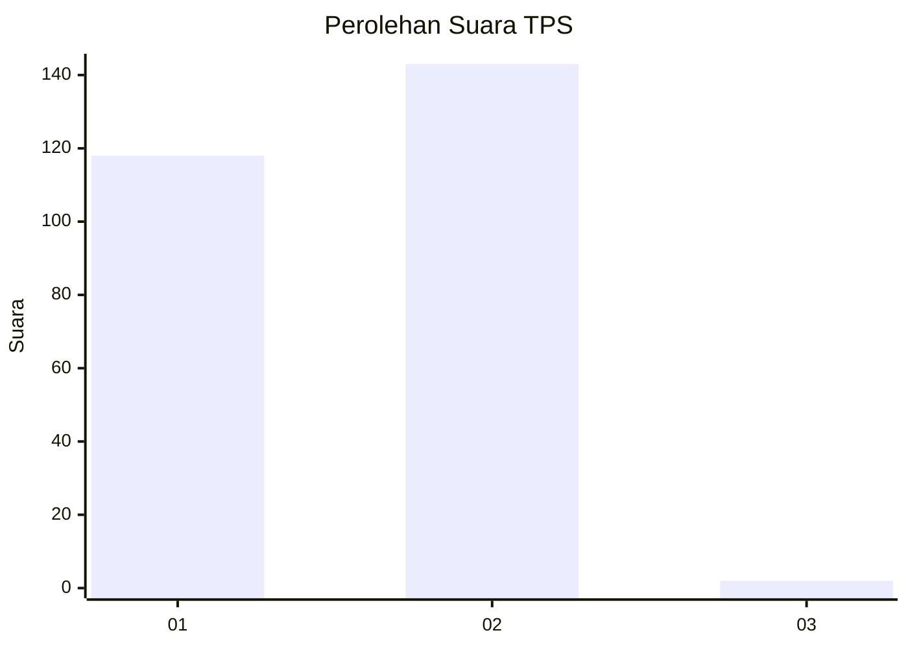
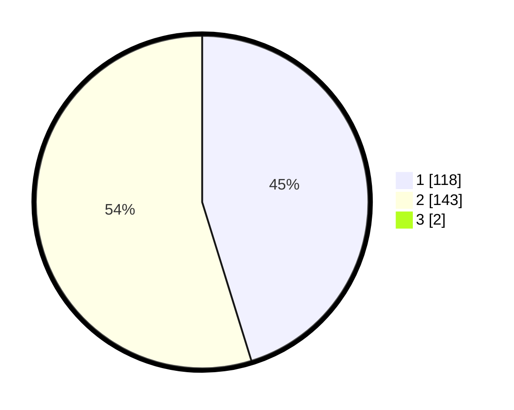

# Hasil

## Grafik

## Tabel

| No. | Nama Paslon    | Suara | Suara (raw) | Persentase |
|:--- |:-------------- | -----:| -----------:| ----------:|
| 1   | ANIES MUHAIMIN | 118   | [118][p-1]  | 44,87      |
| 2   | PRABOWO GIBRAN | 143   | [143][p-2]  | 54,37      |
| 3   | GANJAR MAHFUD  | 2     | [2][p-3]    | 0,76       |

[p-1]: https://github.com/gigit-pemilu/pemilu-2024/blob/main/pilpres/hitung-suara/sub/32-jawa-barat/sub/05-garut/sub/17-bayongbong/sub/2014-mekarjaya/sub/006-tps/sub/paslon-1.txt
[p-2]: https://github.com/gigit-pemilu/pemilu-2024/blob/main/pilpres/hitung-suara/sub/32-jawa-barat/sub/05-garut/sub/17-bayongbong/sub/2014-mekarjaya/sub/006-tps/sub/paslon-2.txt
[p-3]: https://github.com/gigit-pemilu/pemilu-2024/blob/main/pilpres/hitung-suara/sub/32-jawa-barat/sub/05-garut/sub/17-bayongbong/sub/2014-mekarjaya/sub/006-tps/sub/paslon-3.txt

## Foto C Plano

https://sirekap-obj-formc.kpu.go.id/66f7/pemilu/ppwp/32/05/17/20/14/3205172014006-20240215-084723--89ed8ebc-82c9-4f7d-82ba-9adbea153144.jpg

https://sirekap-obj-formc.kpu.go.id/66f7/pemilu/ppwp/32/05/17/20/14/3205172014006-20240215-085038--6932dccd-1c90-41a1-a475-9e559cf6d199.jpg

https://sirekap-obj-formc.kpu.go.id/66f7/pemilu/ppwp/32/05/17/20/14/3205172014006-20240215-085203--4c99a14d-9cd1-4609-8473-ccc12a0f3cd1.jpg

## Metadata

| Key        | Value               |
| ---------- | ------------------- |
| Time Stamp | 2024-02-20 16:00:00 |

