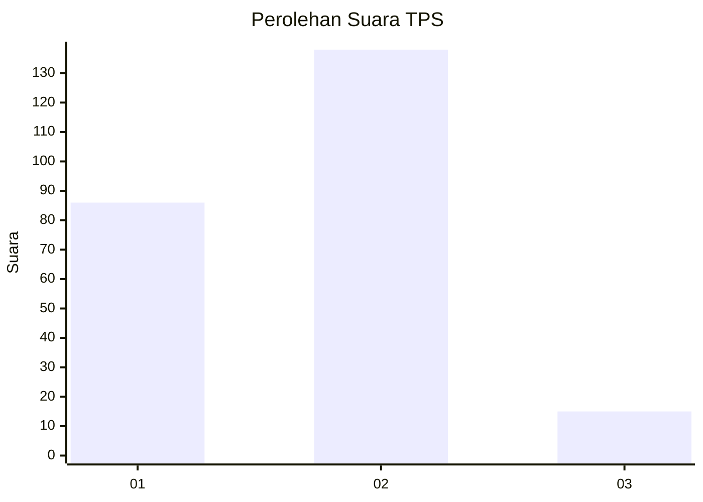
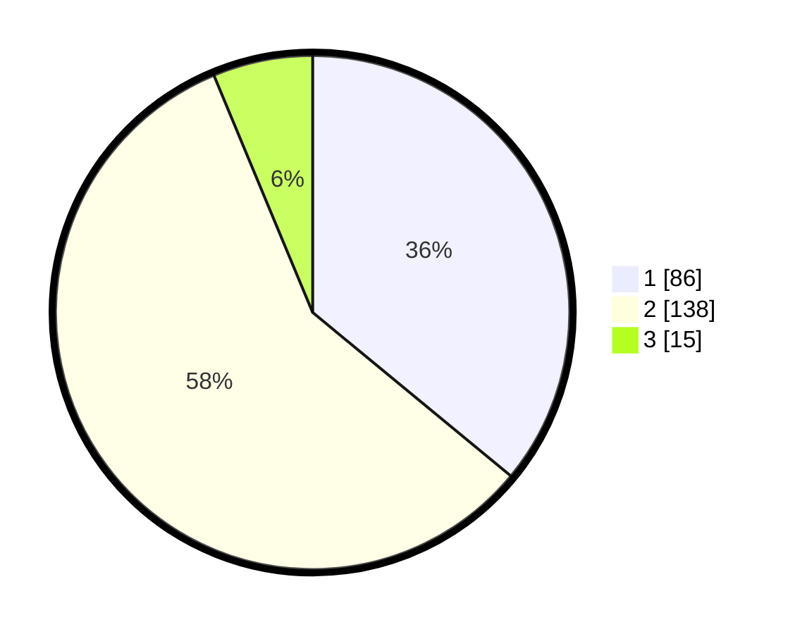

# Hasil

## Grafik

## Tabel

| No. | Nama Paslon    | Suara | Suara (raw) | Persentase |
|:--- |:-------------- | -----:| -----------:| ----------:|
| 1   | ANIES MUHAIMIN | 86    | [86][p-1]   | 35,98      |
| 2   | PRABOWO GIBRAN | 138   | [138][p-2]  | 57,74      |
| 3   | GANJAR MAHFUD  | 15    | [15][p-3]   | 6,28       |

[p-1]: https://github.com/gigit-pemilu/pemilu-2024-32-jawa-barat/blob/main/pilpres/hitung-suara/sub/32-jawa-barat/sub/05-garut/sub/18-cigedug/sub/2001-cigedug/sub/001-tps/sub/paslon-1.txt
[p-2]: https://github.com/gigit-pemilu/pemilu-2024-32-jawa-barat/blob/main/pilpres/hitung-suara/sub/32-jawa-barat/sub/05-garut/sub/18-cigedug/sub/2001-cigedug/sub/001-tps/sub/paslon-2.txt
[p-3]: https://github.com/gigit-pemilu/pemilu-2024-32-jawa-barat/blob/main/pilpres/hitung-suara/sub/32-jawa-barat/sub/05-garut/sub/18-cigedug/sub/2001-cigedug/sub/001-tps/sub/paslon-3.txt

## Foto C Plano

https://sirekap-obj-formc.kpu.go.id/285c/pemilu/ppwp/32/05/18/20/01/3205182001001-20240215-082141--1270cc84-3303-420c-b364-d7c9eb064e17.jpg

https://sirekap-obj-formc.kpu.go.id/285c/pemilu/ppwp/32/05/18/20/01/3205182001001-20240215-014819--8c8c9e38-44c8-4f63-9b7a-27ad5e652179.jpg

https://sirekap-obj-formc.kpu.go.id/285c/pemilu/ppwp/32/05/18/20/01/3205182001001-20240215-015007--ded9075f-23f4-4efd-ab52-75a42d54cf18.jpg

## Metadata

| Key        | Value               |
| ---------- | ------------------- |
| Time Stamp | 2024-02-15 15:00:29 |

