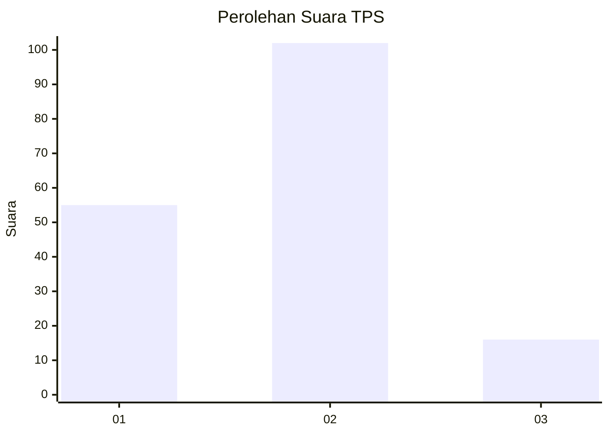
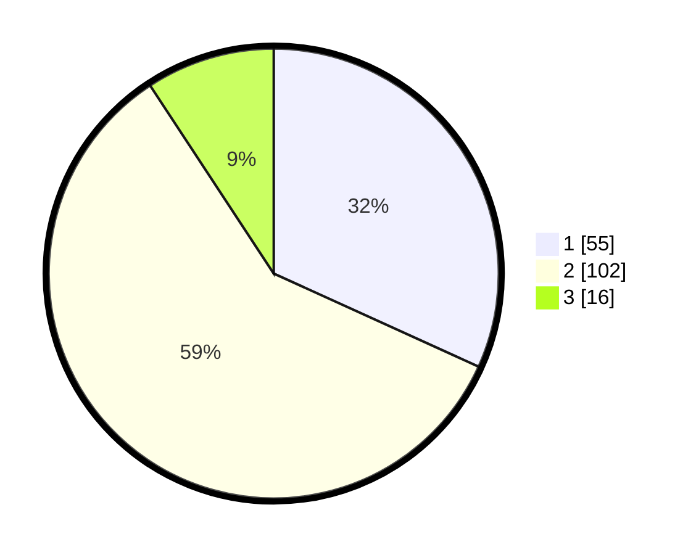

# Hasil

## Grafik

## Tabel

| No. | Nama Paslon    | Suara | Suara (raw) | Persentase |
|:--- |:-------------- | -----:| -----------:| ----------:|
| 1   | ANIES MUHAIMIN | 55    | [55][p-1]   | 31,79      |
| 2   | PRABOWO GIBRAN | 102   | [102][p-2]  | 58,96      |
| 3   | GANJAR MAHFUD  | 16    | [16][p-3]   | 9,25       |

[p-1]: https://github.com/gigit-pemilu/pemilu-2024/blob/main/pilpres/hitung-suara/sub/32-jawa-barat/sub/05-garut/sub/18-cigedug/sub/2001-cigedug/sub/005-tps/sub/paslon-1.txt
[p-2]: https://github.com/gigit-pemilu/pemilu-2024/blob/main/pilpres/hitung-suara/sub/32-jawa-barat/sub/05-garut/sub/18-cigedug/sub/2001-cigedug/sub/005-tps/sub/paslon-2.txt
[p-3]: https://github.com/gigit-pemilu/pemilu-2024/blob/main/pilpres/hitung-suara/sub/32-jawa-barat/sub/05-garut/sub/18-cigedug/sub/2001-cigedug/sub/005-tps/sub/paslon-3.txt

## Foto C Plano

https://sirekap-obj-formc.kpu.go.id/a7ba/pemilu/ppwp/32/05/18/20/01/3205182001005-20240215-121053--b154ba69-7f69-437f-b302-eb8d55016fcd.jpg

https://sirekap-obj-formc.kpu.go.id/a7ba/pemilu/ppwp/32/05/18/20/01/3205182001005-20240215-121229--d17330f4-6d56-4f8e-affe-02b4125bce32.jpg

https://sirekap-obj-formc.kpu.go.id/a7ba/pemilu/ppwp/32/05/18/20/01/3205182001005-20240215-121327--84fe1a6f-577a-4f8a-869b-576828e6ba51.jpg

## Metadata

| Key        | Value               |
| ---------- | ------------------- |
| Time Stamp | 2024-02-16 10:30:29 |

