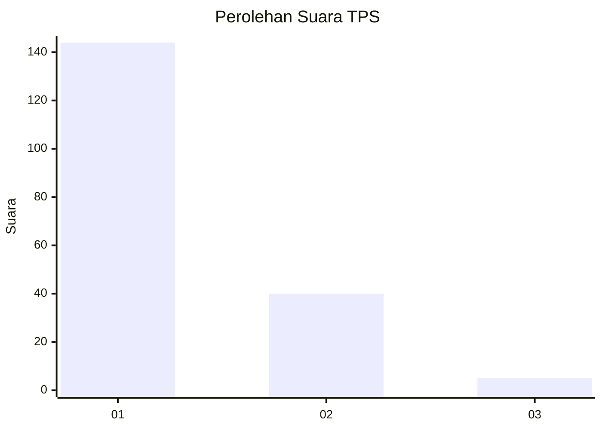
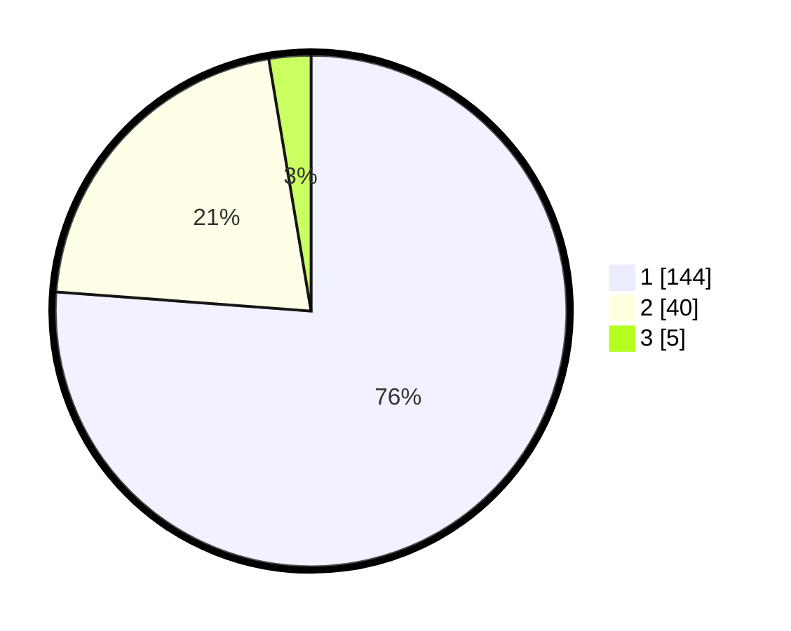

# Hasil

## Grafik

## Tabel

| No. | Nama Paslon    | Suara | Suara (raw) | Persentase |
|:--- |:-------------- | -----:| -----------:| ----------:|
| 1   | ANIES MUHAIMIN | 144   | [144][p-1]  | 76,19      |
| 2   | PRABOWO GIBRAN | 40    | [40][p-2]   | 21,16      |
| 3   | GANJAR MAHFUD  | 5     | [5][p-3]    | 2,65       |

[p-1]: https://github.com/gigit-pemilu/pemilu-2024/blob/main/pilpres/hitung-suara/sub/32-jawa-barat/sub/05-garut/sub/18-cigedug/sub/2001-cigedug/sub/022-tps/sub/paslon-1.txt
[p-2]: https://github.com/gigit-pemilu/pemilu-2024/blob/main/pilpres/hitung-suara/sub/32-jawa-barat/sub/05-garut/sub/18-cigedug/sub/2001-cigedug/sub/022-tps/sub/paslon-2.txt
[p-3]: https://github.com/gigit-pemilu/pemilu-2024/blob/main/pilpres/hitung-suara/sub/32-jawa-barat/sub/05-garut/sub/18-cigedug/sub/2001-cigedug/sub/022-tps/sub/paslon-3.txt

## Foto C Plano

https://sirekap-obj-formc.kpu.go.id/690c/pemilu/ppwp/32/05/18/20/01/3205182001022-20240215-011737--e1871414-62f4-4ca7-90fe-ba76229ba20b.jpg

https://sirekap-obj-formc.kpu.go.id/690c/pemilu/ppwp/32/05/18/20/01/3205182001022-20240215-011909--95dfa69a-5b5e-468a-bea8-4f06f0edae01.jpg

https://sirekap-obj-formc.kpu.go.id/690c/pemilu/ppwp/32/05/18/20/01/3205182001022-20240215-013015--1c8333ba-07ca-48a3-8384-d60099876788.jpg

## Metadata

| Key        | Value               |
| ---------- | ------------------- |
| Time Stamp | 2024-02-16 11:00:29 |

