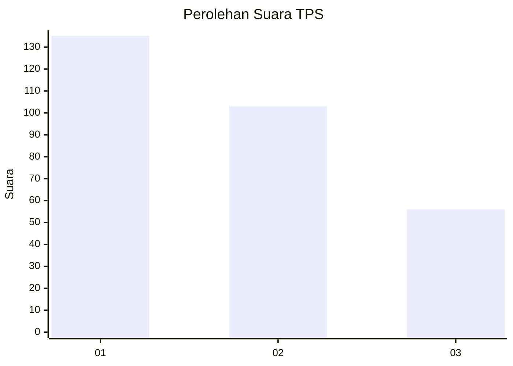
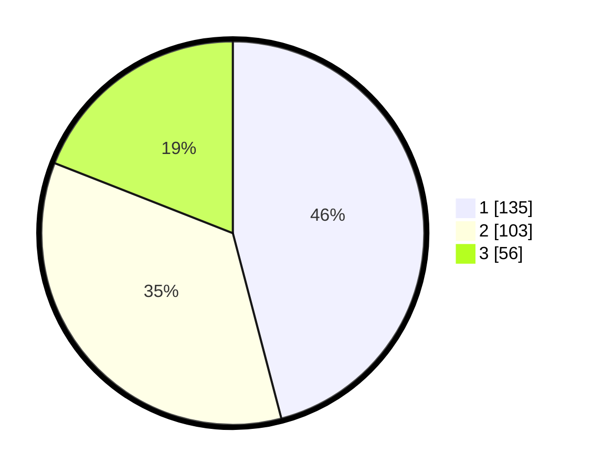

# Hasil

## Grafik

## Tabel

| No. | Nama Paslon    | Suara | Suara (raw) | Persentase |
|:--- |:-------------- | -----:| -----------:| ----------:|
| 1   | ANIES MUHAIMIN | 135   | [135][p-1]  | 45,92      |
| 2   | PRABOWO GIBRAN | 103   | [103][p-2]  | 35,03      |
| 3   | GANJAR MAHFUD  | 56    | [56][p-3]   | 19,05      |

[p-1]: https://github.com/gigit-pemilu/pemilu-2024/blob/main/pilpres/hitung-suara/sub/32-jawa-barat/sub/05-garut/sub/18-cigedug/sub/2001-cigedug/sub/029-tps/sub/paslon-1.txt
[p-2]: https://github.com/gigit-pemilu/pemilu-2024/blob/main/pilpres/hitung-suara/sub/32-jawa-barat/sub/05-garut/sub/18-cigedug/sub/2001-cigedug/sub/029-tps/sub/paslon-2.txt
[p-3]: https://github.com/gigit-pemilu/pemilu-2024/blob/main/pilpres/hitung-suara/sub/32-jawa-barat/sub/05-garut/sub/18-cigedug/sub/2001-cigedug/sub/029-tps/sub/paslon-3.txt

## Foto C Plano

https://sirekap-obj-formc.kpu.go.id/37cf/pemilu/ppwp/32/05/18/20/01/3205182001029-20240215-031446--a2a218e2-005b-4370-9607-b7985ddee9a1.jpg

https://sirekap-obj-formc.kpu.go.id/37cf/pemilu/ppwp/32/05/18/20/01/3205182001029-20240215-031905--bfdda603-d2ca-4740-878c-41319be3c77c.jpg

https://sirekap-obj-formc.kpu.go.id/37cf/pemilu/ppwp/32/05/18/20/01/3205182001029-20240215-032136--b2450fed-d5ce-4a2d-b2d7-373bb2b69804.jpg

## Metadata

| Key        | Value               |
| ---------- | ------------------- |
| Time Stamp | 2024-02-15 15:00:29 |

