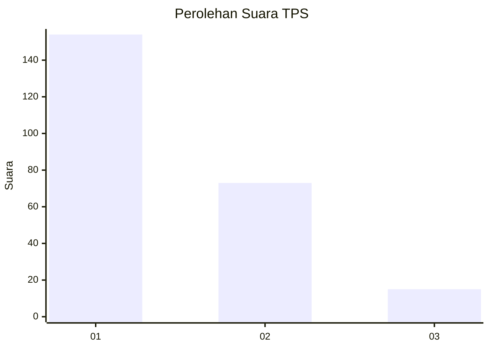
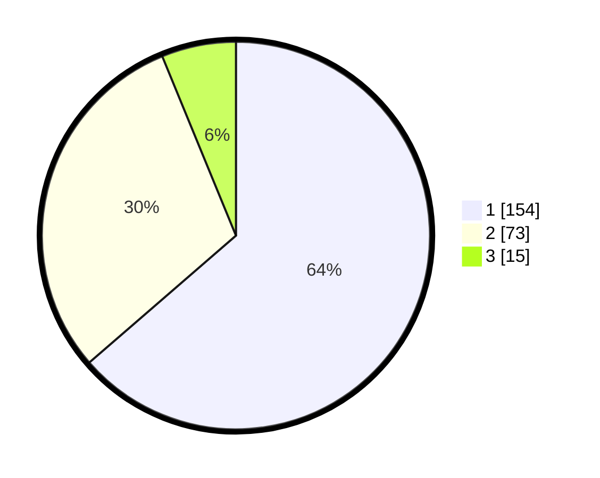

# Hasil

## Grafik

## Tabel

| No. | Nama Paslon    | Suara | Suara (raw) | Persentase |
|:--- |:-------------- | -----:| -----------:| ----------:|
| 1   | ANIES MUHAIMIN | 154   | [154][p-1]  | 63,64      |
| 2   | PRABOWO GIBRAN | 73    | [73][p-2]   | 30,17      |
| 3   | GANJAR MAHFUD  | 15    | [15][p-3]   | 6,20       |

[p-1]: https://github.com/gigit-pemilu/pemilu-2024/blob/main/pilpres/hitung-suara/sub/32-jawa-barat/sub/05-garut/sub/18-cigedug/sub/2005-cintanagara/sub/007-tps/sub/paslon-1.txt
[p-2]: https://github.com/gigit-pemilu/pemilu-2024/blob/main/pilpres/hitung-suara/sub/32-jawa-barat/sub/05-garut/sub/18-cigedug/sub/2005-cintanagara/sub/007-tps/sub/paslon-2.txt
[p-3]: https://github.com/gigit-pemilu/pemilu-2024/blob/main/pilpres/hitung-suara/sub/32-jawa-barat/sub/05-garut/sub/18-cigedug/sub/2005-cintanagara/sub/007-tps/sub/paslon-3.txt

## Foto C Plano

https://sirekap-obj-formc.kpu.go.id/148f/pemilu/ppwp/32/05/18/20/05/3205182005007-20240215-071633--886b9e6b-0142-4c36-86ef-c9b600fa57cb.jpg

https://sirekap-obj-formc.kpu.go.id/148f/pemilu/ppwp/32/05/18/20/05/3205182005007-20240215-072016--6a46f306-c76b-4fc8-afa7-7b9500c4c4d9.jpg

https://sirekap-obj-formc.kpu.go.id/148f/pemilu/ppwp/32/05/18/20/05/3205182005007-20240215-072144--96bd72b3-4815-42f0-a912-fd94531e4aaa.jpg

## Metadata

| Key        | Value               |
| ---------- | ------------------- |
| Time Stamp | 2024-02-16 16:25:10 |

