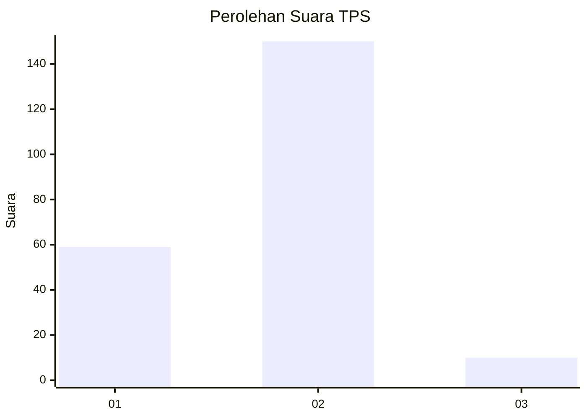
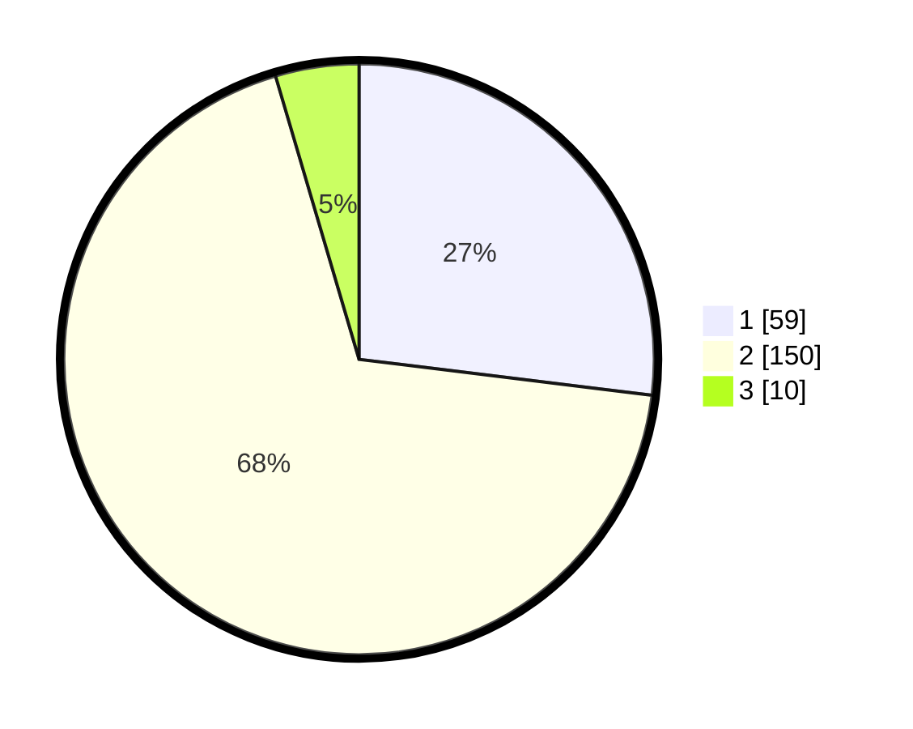

# Hasil

## Grafik

## Tabel

| No. | Nama Paslon    | Suara | Suara (raw) | Persentase |
|:--- |:-------------- | -----:| -----------:| ----------:|
| 1   | ANIES MUHAIMIN | 59    | [59][p-1]   | 26,94      |
| 2   | PRABOWO GIBRAN | 150   | [150][p-2]  | 68,49      |
| 3   | GANJAR MAHFUD  | 10    | [10][p-3]   | 4,57       |

[p-1]: https://github.com/gigit-pemilu/pemilu-2024-32-jawa-barat/blob/main/pilpres/hitung-suara/sub/32-jawa-barat/sub/05-garut/sub/20-cisurupan/sub/2001-cisurupan/sub/002-tps/sub/paslon-1.txt
[p-2]: https://github.com/gigit-pemilu/pemilu-2024-32-jawa-barat/blob/main/pilpres/hitung-suara/sub/32-jawa-barat/sub/05-garut/sub/20-cisurupan/sub/2001-cisurupan/sub/002-tps/sub/paslon-2.txt
[p-3]: https://github.com/gigit-pemilu/pemilu-2024-32-jawa-barat/blob/main/pilpres/hitung-suara/sub/32-jawa-barat/sub/05-garut/sub/20-cisurupan/sub/2001-cisurupan/sub/002-tps/sub/paslon-3.txt

## Foto C Plano

https://sirekap-obj-formc.kpu.go.id/f5e9/pemilu/ppwp/32/05/20/20/01/3205202001002-20240215-033531--047e4d96-d513-4d32-92fc-53b2f2872872.jpg

https://sirekap-obj-formc.kpu.go.id/f5e9/pemilu/ppwp/32/05/20/20/01/3205202001002-20240215-033626--b953b9a8-45e3-4381-9d4f-c49eafb4af17.jpg

https://sirekap-obj-formc.kpu.go.id/f5e9/pemilu/ppwp/32/05/20/20/01/3205202001002-20240215-033900--5e9fb02a-7146-43b3-b203-47ce4f6a5fe4.jpg

## Metadata

| Key        | Value               |
| ---------- | ------------------- |
| Time Stamp | 2024-02-15 12:00:28 |

