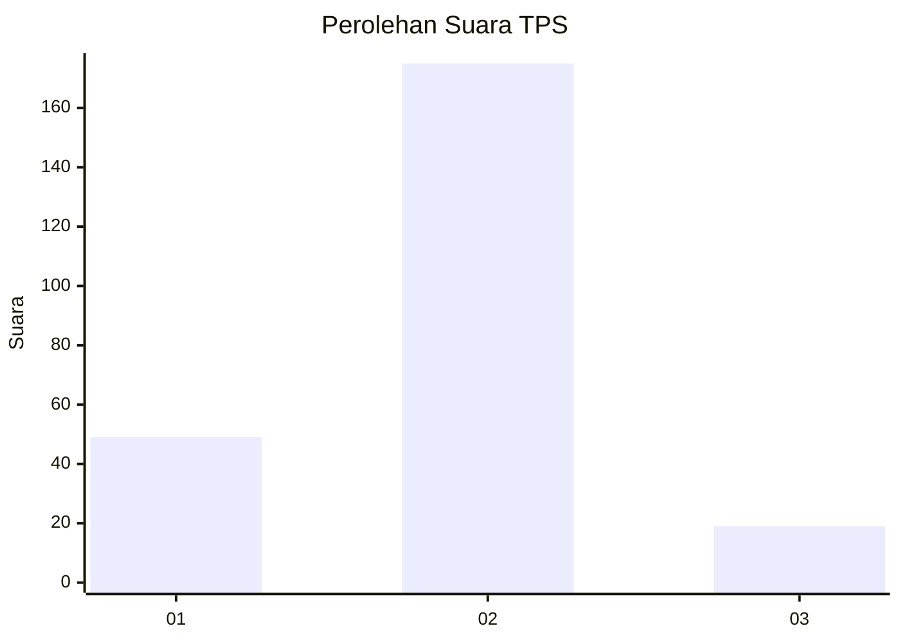
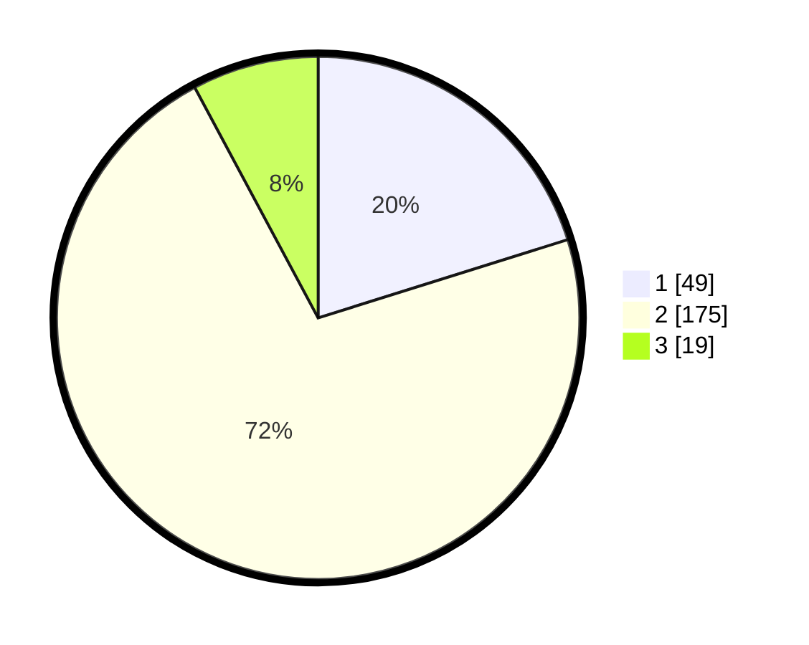

# Hasil

## Grafik

## Tabel

| No. | Nama Paslon    | Suara | Suara (raw) | Persentase |
|:--- |:-------------- | -----:| -----------:| ----------:|
| 1   | ANIES MUHAIMIN | 49    | [49][p-1]   | 20,16      |
| 2   | PRABOWO GIBRAN | 175   | [175][p-2]  | 72,02      |
| 3   | GANJAR MAHFUD  | 19    | [19][p-3]   | 7,82       |

[p-1]: https://github.com/gigit-pemilu/pemilu-2024/blob/main/pilpres/hitung-suara/sub/32-jawa-barat/sub/05-garut/sub/20-cisurupan/sub/2001-cisurupan/sub/004-tps/sub/paslon-1.txt
[p-2]: https://github.com/gigit-pemilu/pemilu-2024/blob/main/pilpres/hitung-suara/sub/32-jawa-barat/sub/05-garut/sub/20-cisurupan/sub/2001-cisurupan/sub/004-tps/sub/paslon-2.txt
[p-3]: https://github.com/gigit-pemilu/pemilu-2024/blob/main/pilpres/hitung-suara/sub/32-jawa-barat/sub/05-garut/sub/20-cisurupan/sub/2001-cisurupan/sub/004-tps/sub/paslon-3.txt

## Foto C Plano

https://sirekap-obj-formc.kpu.go.id/08f9/pemilu/ppwp/32/05/20/20/01/3205202001004-20240215-000558--1c65b591-6533-4fe1-9af4-583a1b6276df.jpg

https://sirekap-obj-formc.kpu.go.id/08f9/pemilu/ppwp/32/05/20/20/01/3205202001004-20240215-104807--cb220870-b2c1-484f-b042-3fe1b4ebfcba.jpg

https://sirekap-obj-formc.kpu.go.id/08f9/pemilu/ppwp/32/05/20/20/01/3205202001004-20240215-001242--54e0c3b4-9ebf-4469-8e40-a8ebb4aa5c48.jpg

## Metadata

| Key        | Value               |
| ---------- | ------------------- |
| Time Stamp | 2024-02-21 17:00:00 |

