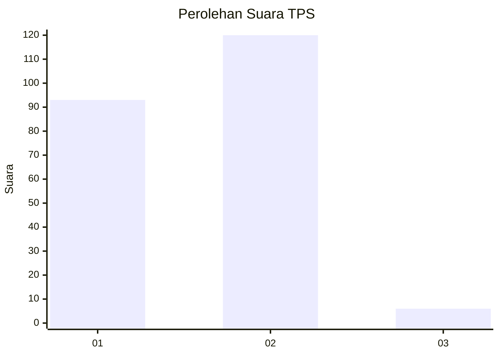
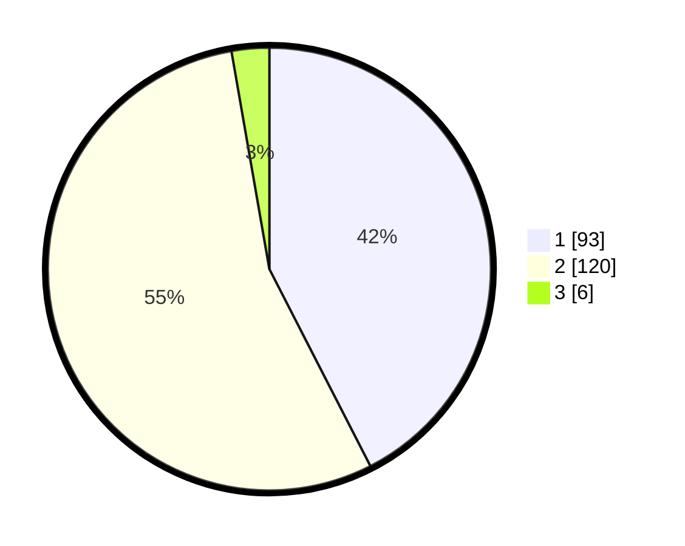

# Hasil

## Grafik

## Tabel

| No. | Nama Paslon    | Suara | Suara (raw) | Persentase |
|:--- |:-------------- | -----:| -----------:| ----------:|
| 1   | ANIES MUHAIMIN | 93    | [93][p-1]   | 42,47      |
| 2   | PRABOWO GIBRAN | 120   | [120][p-2]  | 54,79      |
| 3   | GANJAR MAHFUD  | 6     | [6][p-3]    | 2,74       |

[p-1]: https://github.com/gigit-pemilu/pemilu-2024-32-jawa-barat/blob/main/pilpres/hitung-suara/sub/32-jawa-barat/sub/05-garut/sub/20-cisurupan/sub/2001-cisurupan/sub/005-tps/sub/paslon-1.txt
[p-2]: https://github.com/gigit-pemilu/pemilu-2024-32-jawa-barat/blob/main/pilpres/hitung-suara/sub/32-jawa-barat/sub/05-garut/sub/20-cisurupan/sub/2001-cisurupan/sub/005-tps/sub/paslon-2.txt
[p-3]: https://github.com/gigit-pemilu/pemilu-2024-32-jawa-barat/blob/main/pilpres/hitung-suara/sub/32-jawa-barat/sub/05-garut/sub/20-cisurupan/sub/2001-cisurupan/sub/005-tps/sub/paslon-3.txt

## Foto C Plano

https://sirekap-obj-formc.kpu.go.id/b2ed/pemilu/ppwp/32/05/20/20/01/3205202001005-20240215-004927--5764f699-262e-4894-8c2d-9b8dab517cd0.jpg

https://sirekap-obj-formc.kpu.go.id/b2ed/pemilu/ppwp/32/05/20/20/01/3205202001005-20240215-010605--2dcec5da-ae28-4fe3-b417-72b9391a816f.jpg

https://sirekap-obj-formc.kpu.go.id/b2ed/pemilu/ppwp/32/05/20/20/01/3205202001005-20240215-010834--44a1156c-7eee-43d5-8f7a-efff1e0706b5.jpg

## Metadata

| Key        | Value               |
| ---------- | ------------------- |
| Time Stamp | 2024-02-15 20:30:46 |

