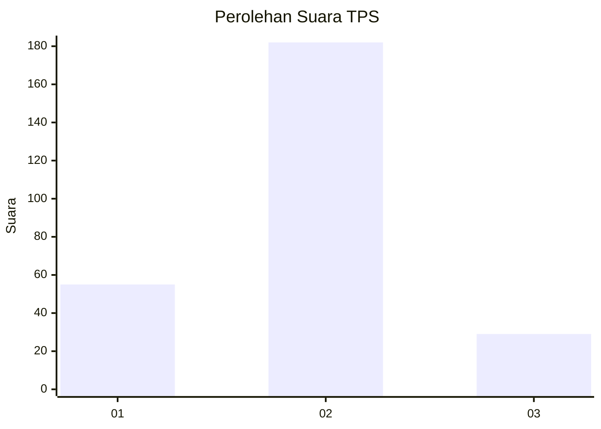
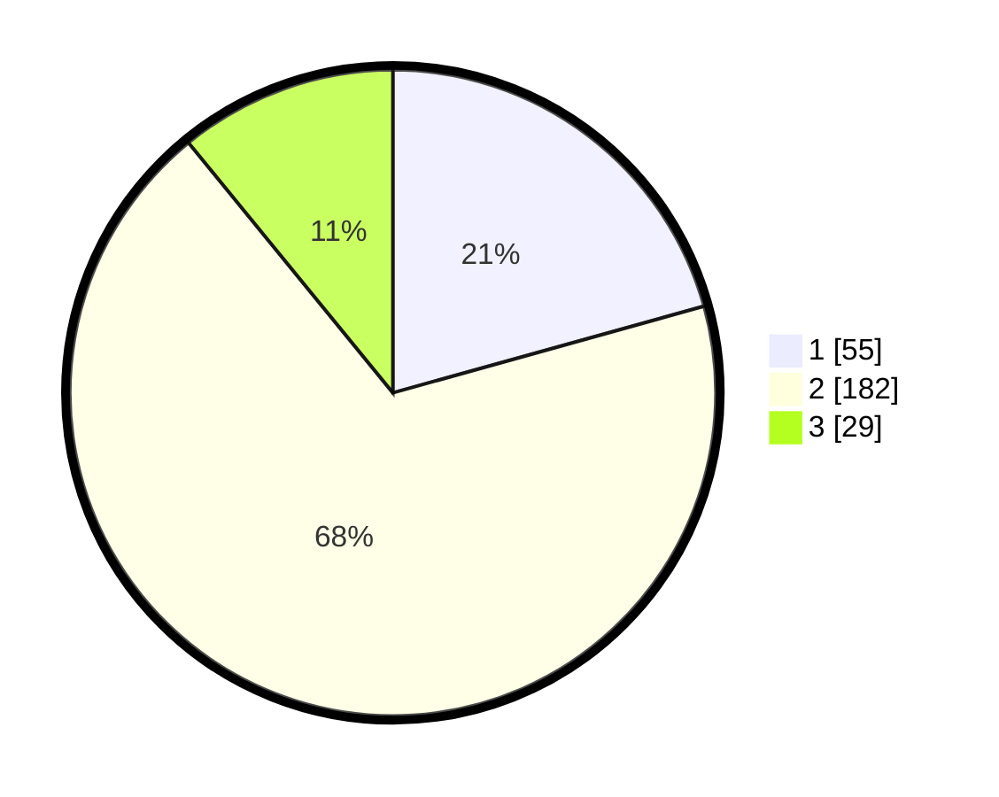

# Hasil

## Grafik

## Tabel

| No. | Nama Paslon    | Suara | Suara (raw) | Persentase |
|:--- |:-------------- | -----:| -----------:| ----------:|
| 1   | ANIES MUHAIMIN | 55    | [55][p-1]   | 20,68      |
| 2   | PRABOWO GIBRAN | 182   | [182][p-2]  | 68,42      |
| 3   | GANJAR MAHFUD  | 29    | [29][p-3]   | 10,90      |

[p-1]: https://github.com/gigit-pemilu/pemilu-2024-32-jawa-barat/blob/main/pilpres/hitung-suara/sub/32-jawa-barat/sub/05-garut/sub/20-cisurupan/sub/2004-sukatani/sub/004-tps/sub/paslon-1.txt
[p-2]: https://github.com/gigit-pemilu/pemilu-2024-32-jawa-barat/blob/main/pilpres/hitung-suara/sub/32-jawa-barat/sub/05-garut/sub/20-cisurupan/sub/2004-sukatani/sub/004-tps/sub/paslon-2.txt
[p-3]: https://github.com/gigit-pemilu/pemilu-2024-32-jawa-barat/blob/main/pilpres/hitung-suara/sub/32-jawa-barat/sub/05-garut/sub/20-cisurupan/sub/2004-sukatani/sub/004-tps/sub/paslon-3.txt

## Foto C Plano

https://sirekap-obj-formc.kpu.go.id/e437/pemilu/ppwp/32/05/20/20/04/3205202004004-20240215-035631--94b93bac-be98-436e-bdee-1a99b578789d.jpg

https://sirekap-obj-formc.kpu.go.id/e437/pemilu/ppwp/32/05/20/20/04/3205202004004-20240215-035820--ce542e54-3c6c-46f5-9ab8-fd75e0042779.jpg

https://sirekap-obj-formc.kpu.go.id/e437/pemilu/ppwp/32/05/20/20/04/3205202004004-20240215-035916--7d84332f-7a92-4a3a-b0d9-bfbd81a6560c.jpg

## Metadata

| Key        | Value               |
| ---------- | ------------------- |
| Time Stamp | 2024-02-15 22:30:27 |

