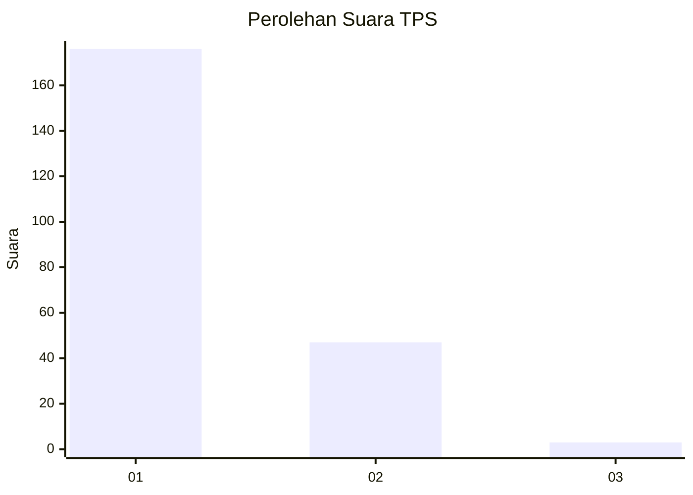
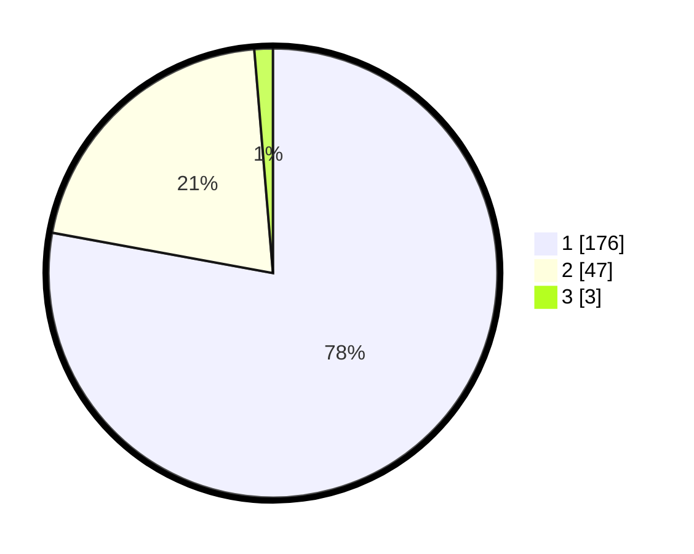

# Hasil

## Grafik

## Tabel

| No. | Nama Paslon    | Suara | Suara (raw) | Persentase |
|:--- |:-------------- | -----:| -----------:| ----------:|
| 1   | ANIES MUHAIMIN | 176   | [176][p-1]  | 77,88      |
| 2   | PRABOWO GIBRAN | 47    | [47][p-2]   | 20,80      |
| 3   | GANJAR MAHFUD  | 3     | [3][p-3]    | 1,33       |

[p-1]: https://github.com/gigit-pemilu/pemilu-2024/blob/main/pilpres/hitung-suara/sub/32-jawa-barat/sub/05-garut/sub/20-cisurupan/sub/2009-cisero/sub/010-tps/sub/paslon-1.txt
[p-2]: https://github.com/gigit-pemilu/pemilu-2024/blob/main/pilpres/hitung-suara/sub/32-jawa-barat/sub/05-garut/sub/20-cisurupan/sub/2009-cisero/sub/010-tps/sub/paslon-2.txt
[p-3]: https://github.com/gigit-pemilu/pemilu-2024/blob/main/pilpres/hitung-suara/sub/32-jawa-barat/sub/05-garut/sub/20-cisurupan/sub/2009-cisero/sub/010-tps/sub/paslon-3.txt

## Foto C Plano

https://sirekap-obj-formc.kpu.go.id/6a14/pemilu/ppwp/32/05/20/20/09/3205202009010-20240215-002602--9faf1b6f-7471-4b18-a913-d9774e28f74d.jpg

https://sirekap-obj-formc.kpu.go.id/6a14/pemilu/ppwp/32/05/20/20/09/3205202009010-20240215-002758--5a25f921-96f9-46b5-9d2b-6fe564370649.jpg

https://sirekap-obj-formc.kpu.go.id/6a14/pemilu/ppwp/32/05/20/20/09/3205202009010-20240215-000947--e94f71bd-6a06-4f0a-a9b9-2d7793a1d43d.jpg

## Metadata

| Key        | Value               |
| ---------- | ------------------- |
| Time Stamp | 2024-02-20 21:00:00 |

