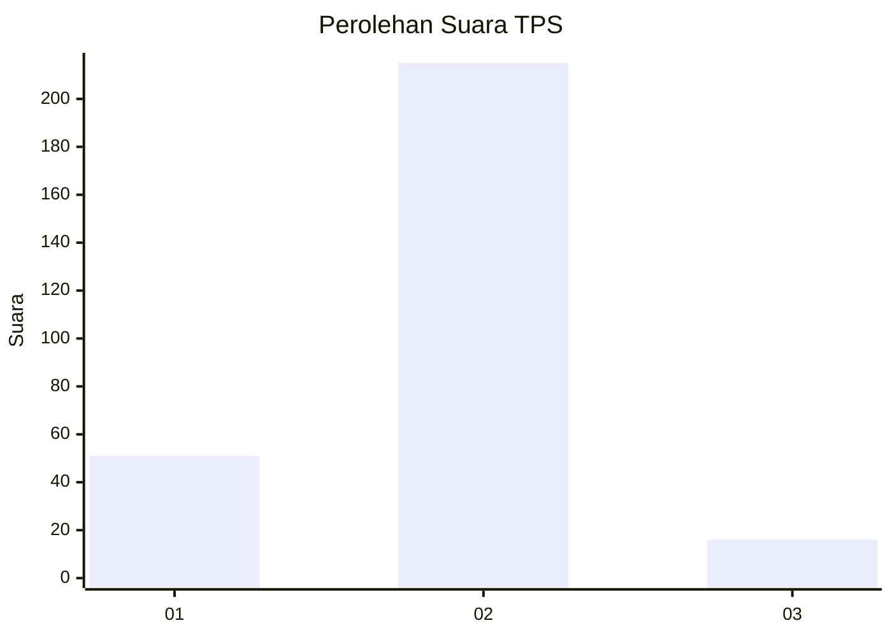
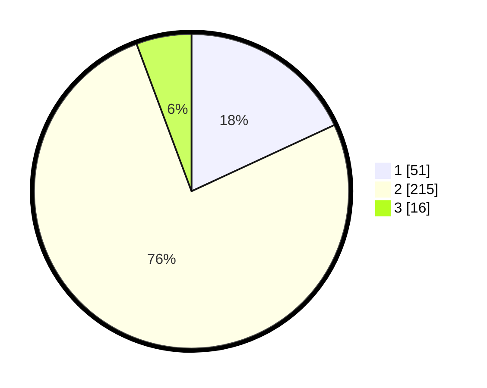

# Hasil

## Grafik

## Tabel

| No. | Nama Paslon    | Suara | Suara (raw) | Persentase |
|:--- |:-------------- | -----:| -----------:| ----------:|
| 1   | ANIES MUHAIMIN | 51    | [51][p-1]   | 18,09      |
| 2   | PRABOWO GIBRAN | 215   | [215][p-2]  | 76,24      |
| 3   | GANJAR MAHFUD  | 16    | [16][p-3]   | 5,67       |

[p-1]: https://github.com/gigit-pemilu/pemilu-2024-32-jawa-barat/blob/main/pilpres/hitung-suara/sub/32-jawa-barat/sub/05-garut/sub/20-cisurupan/sub/2010-karamatwangi/sub/004-tps/sub/paslon-1.txt
[p-2]: https://github.com/gigit-pemilu/pemilu-2024-32-jawa-barat/blob/main/pilpres/hitung-suara/sub/32-jawa-barat/sub/05-garut/sub/20-cisurupan/sub/2010-karamatwangi/sub/004-tps/sub/paslon-2.txt
[p-3]: https://github.com/gigit-pemilu/pemilu-2024-32-jawa-barat/blob/main/pilpres/hitung-suara/sub/32-jawa-barat/sub/05-garut/sub/20-cisurupan/sub/2010-karamatwangi/sub/004-tps/sub/paslon-3.txt

## Foto C Plano

https://sirekap-obj-formc.kpu.go.id/1382/pemilu/ppwp/32/05/20/20/10/3205202010004-20240215-015125--449dcb0e-5ed2-4c1d-9a9c-5660d37bfe7f.jpg

https://sirekap-obj-formc.kpu.go.id/1382/pemilu/ppwp/32/05/20/20/10/3205202010004-20240215-021716--f125e2d0-1a1e-43cf-9a6e-bae2d37e334e.jpg

https://sirekap-obj-formc.kpu.go.id/1382/pemilu/ppwp/32/05/20/20/10/3205202010004-20240215-015259--bd975546-31eb-4678-95a5-5d621d5b72c6.jpg

## Metadata

| Key        | Value               |
| ---------- | ------------------- |
| Time Stamp | 2024-02-20 21:00:00 |

