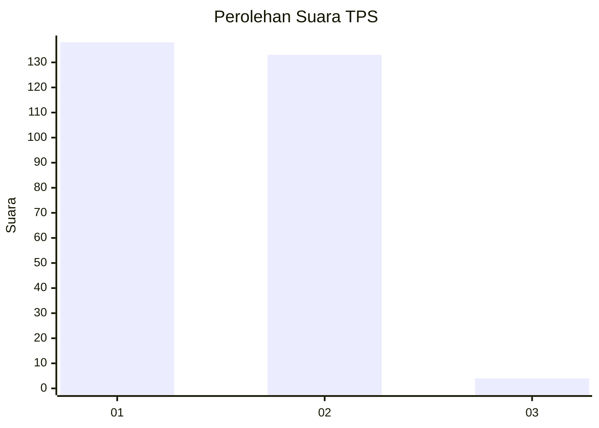
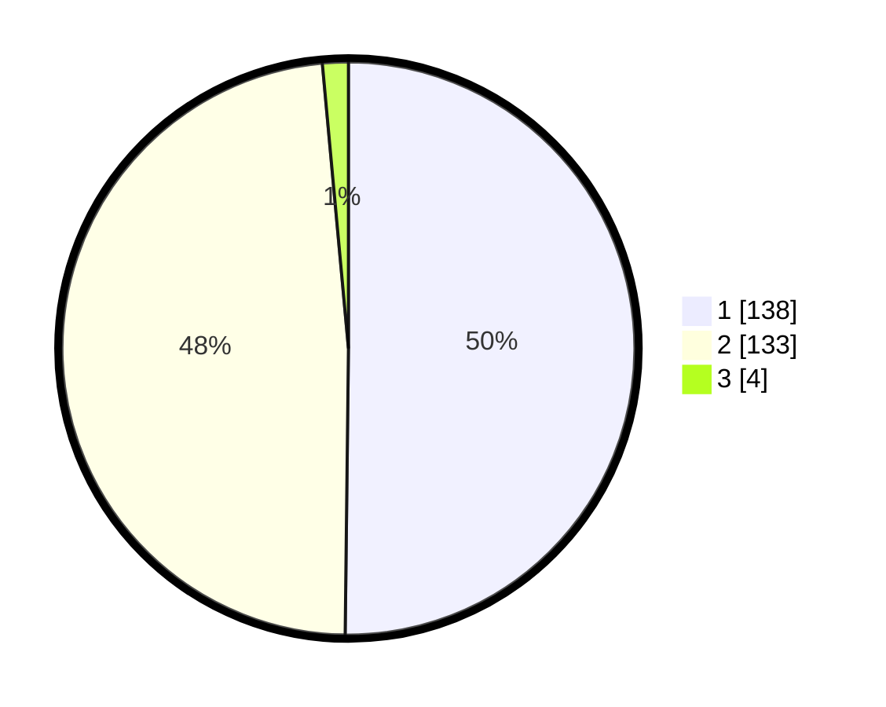

# Hasil

## Grafik

## Tabel

| No. | Nama Paslon    | Suara | Suara (raw) | Persentase |
|:--- |:-------------- | -----:| -----------:| ----------:|
| 1   | ANIES MUHAIMIN | 138   | [138][p-1]  | 50,18      |
| 2   | PRABOWO GIBRAN | 133   | [133][p-2]  | 48,36      |
| 3   | GANJAR MAHFUD  | 4     | [4][p-3]    | 1,45       |

[p-1]: https://github.com/gigit-pemilu/pemilu-2024/blob/main/pilpres/hitung-suara/sub/32-jawa-barat/sub/05-garut/sub/20-cisurupan/sub/2011-cipaganti/sub/003-tps/sub/paslon-1.txt
[p-2]: https://github.com/gigit-pemilu/pemilu-2024/blob/main/pilpres/hitung-suara/sub/32-jawa-barat/sub/05-garut/sub/20-cisurupan/sub/2011-cipaganti/sub/003-tps/sub/paslon-2.txt
[p-3]: https://github.com/gigit-pemilu/pemilu-2024/blob/main/pilpres/hitung-suara/sub/32-jawa-barat/sub/05-garut/sub/20-cisurupan/sub/2011-cipaganti/sub/003-tps/sub/paslon-3.txt

## Foto C Plano

https://sirekap-obj-formc.kpu.go.id/d6ca/pemilu/ppwp/32/05/20/20/11/3205202011003-20240215-103956--d9f44ce0-1e6d-4097-a1fd-2ed9c0779fd4.jpg

https://sirekap-obj-formc.kpu.go.id/d6ca/pemilu/ppwp/32/05/20/20/11/3205202011003-20240215-012721--6ec7e05d-342f-4a16-ad4a-3f09d84259a0.jpg

https://sirekap-obj-formc.kpu.go.id/d6ca/pemilu/ppwp/32/05/20/20/11/3205202011003-20240215-012741--6e427925-14bb-4197-b559-ee0cd1db0f4e.jpg

## Metadata

| Key        | Value               |
| ---------- | ------------------- |
| Time Stamp | 2024-02-20 21:00:00 |

