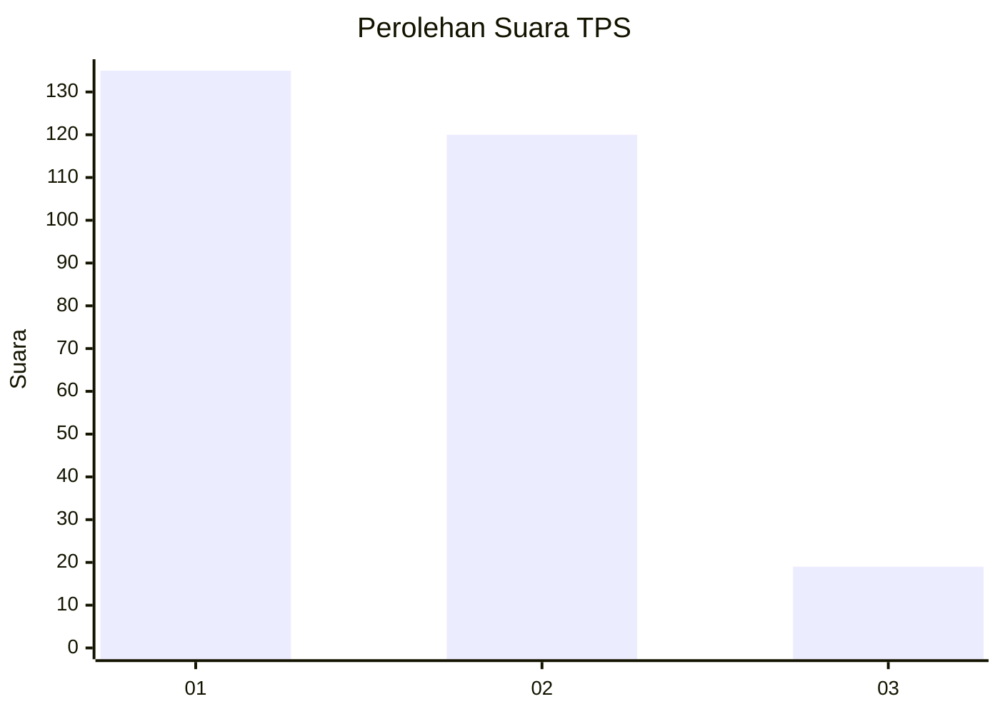
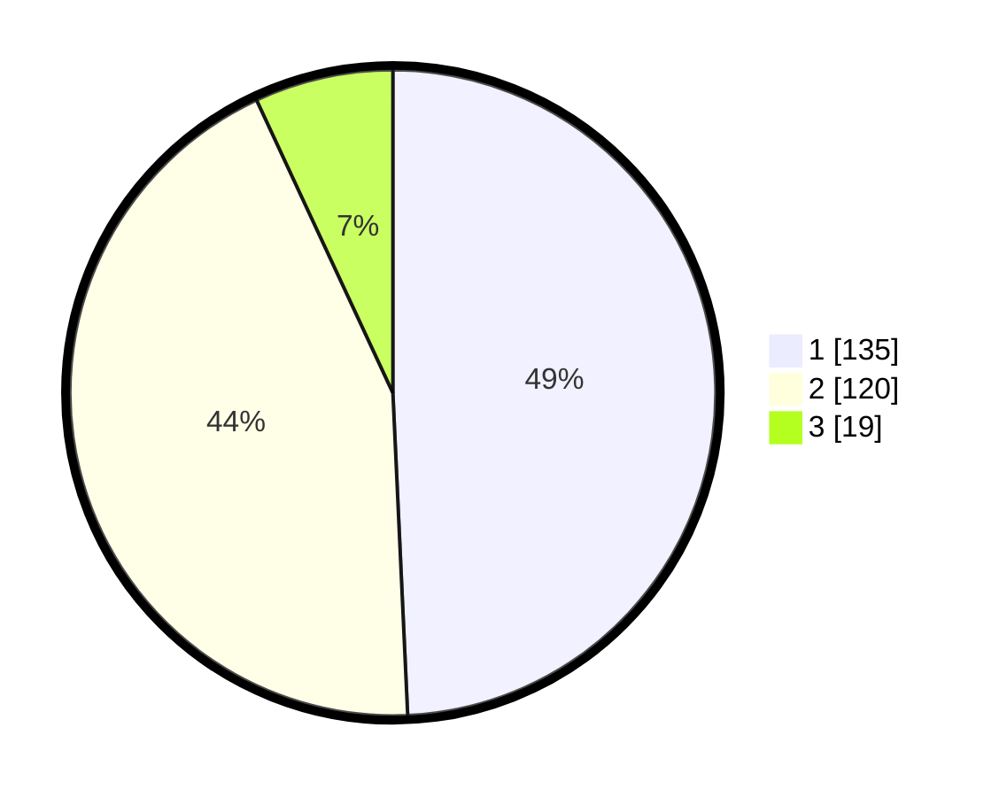

# Hasil

## Grafik

## Tabel

| No. | Nama Paslon    | Suara | Suara (raw) | Persentase |
|:--- |:-------------- | -----:| -----------:| ----------:|
| 1   | ANIES MUHAIMIN | 135   | [135][p-1]  | 49,27      |
| 2   | PRABOWO GIBRAN | 120   | [120][p-2]  | 43,80      |
| 3   | GANJAR MAHFUD  | 19    | [19][p-3]   | 6,93       |

[p-1]: https://github.com/gigit-pemilu/pemilu-2024/blob/main/pilpres/hitung-suara/sub/32-jawa-barat/sub/05-garut/sub/20-cisurupan/sub/2011-cipaganti/sub/008-tps/sub/paslon-1.txt
[p-2]: https://github.com/gigit-pemilu/pemilu-2024/blob/main/pilpres/hitung-suara/sub/32-jawa-barat/sub/05-garut/sub/20-cisurupan/sub/2011-cipaganti/sub/008-tps/sub/paslon-2.txt
[p-3]: https://github.com/gigit-pemilu/pemilu-2024/blob/main/pilpres/hitung-suara/sub/32-jawa-barat/sub/05-garut/sub/20-cisurupan/sub/2011-cipaganti/sub/008-tps/sub/paslon-3.txt

## Foto C Plano

https://sirekap-obj-formc.kpu.go.id/53ce/pemilu/ppwp/32/05/20/20/11/3205202011008-20240215-094442--a45e04c5-04d4-407b-830a-c80db06b2465.jpg

https://sirekap-obj-formc.kpu.go.id/53ce/pemilu/ppwp/32/05/20/20/11/3205202011008-20240215-093516--d9d79e0c-203e-4df0-96ef-6e17e8d7214b.jpg

https://sirekap-obj-formc.kpu.go.id/53ce/pemilu/ppwp/32/05/20/20/11/3205202011008-20240215-093519--e0a8fcd2-48cd-48f2-a3b6-feaa669f3453.jpg

## Metadata

| Key        | Value               |
| ---------- | ------------------- |
| Time Stamp | 2024-02-20 21:00:00 |

