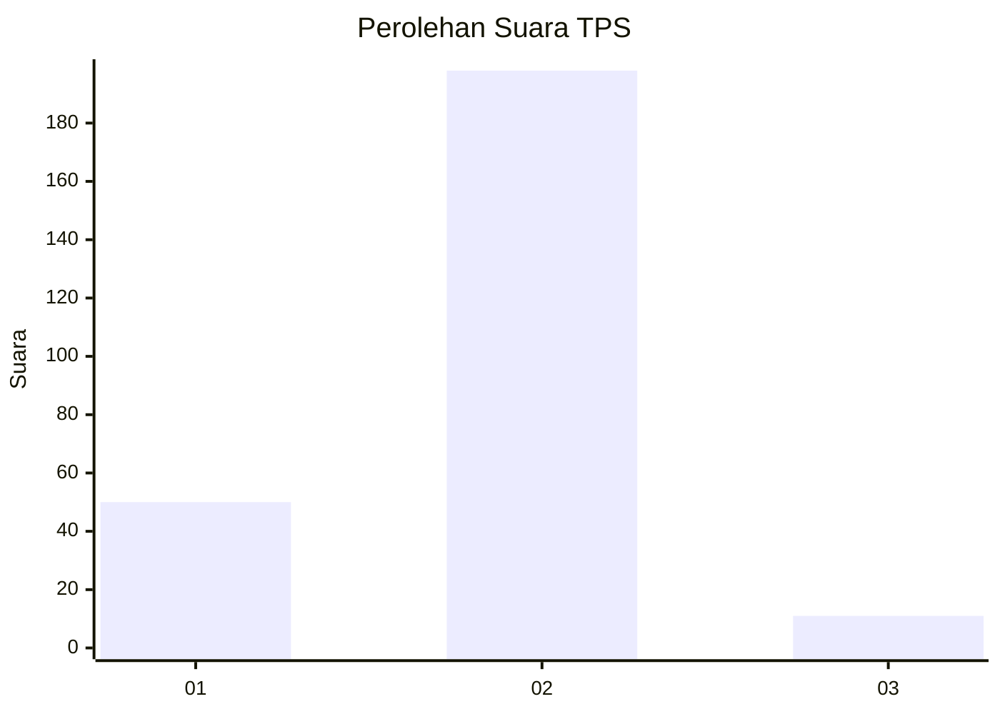
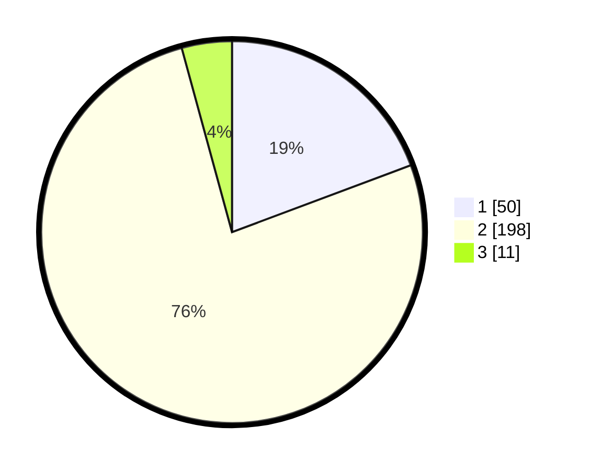

# Hasil

## Grafik

## Tabel

| No. | Nama Paslon    | Suara | Suara (raw) | Persentase |
|:--- |:-------------- | -----:| -----------:| ----------:|
| 1   | ANIES MUHAIMIN | 50    | [50][p-1]   | 19,31      |
| 2   | PRABOWO GIBRAN | 198   | [198][p-2]  | 76,45      |
| 3   | GANJAR MAHFUD  | 11    | [11][p-3]   | 4,25       |

[p-1]: https://github.com/gigit-pemilu/pemilu-2024/blob/main/pilpres/hitung-suara/sub/32-jawa-barat/sub/05-garut/sub/20-cisurupan/sub/2012-pamulihan/sub/006-tps/sub/paslon-1.txt
[p-2]: https://github.com/gigit-pemilu/pemilu-2024/blob/main/pilpres/hitung-suara/sub/32-jawa-barat/sub/05-garut/sub/20-cisurupan/sub/2012-pamulihan/sub/006-tps/sub/paslon-2.txt
[p-3]: https://github.com/gigit-pemilu/pemilu-2024/blob/main/pilpres/hitung-suara/sub/32-jawa-barat/sub/05-garut/sub/20-cisurupan/sub/2012-pamulihan/sub/006-tps/sub/paslon-3.txt

## Foto C Plano

https://sirekap-obj-formc.kpu.go.id/e4ac/pemilu/ppwp/32/05/20/20/12/3205202012006-20240214-210552--bd437975-d338-449e-b45b-84c9c64da8d7.jpg

https://sirekap-obj-formc.kpu.go.id/e4ac/pemilu/ppwp/32/05/20/20/12/3205202012006-20240214-210255--bd4e55a8-df41-4942-aa68-b15cb143c027.jpg

https://sirekap-obj-formc.kpu.go.id/e4ac/pemilu/ppwp/32/05/20/20/12/3205202012006-20240214-211059--1cdbc9a2-9fe6-4fee-9f2a-a1174c686d3c.jpg

## Metadata

| Key        | Value               |
| ---------- | ------------------- |
| Time Stamp | 2024-02-20 22:00:00 |

